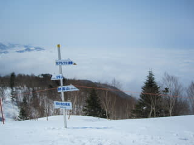

# 4月2日志賀高原スキー場速報

📅 投稿日時: 2011-04-02 17:19:39

🏷️ カテゴリ: [2011スキー滑走日記](ca488c98cfb9169941c3e73770dcefb56.md)

ということで．

いつもどおり志賀高原に来ています．

…驚くことに．

宿は満室です．

まぁ，春休みですから，関西や中京方面からいっぱい

お客さんが来ているようで．

…関東からは少ないですね～．

しかし，お客さんが戻ってきた感じがします．

スキー場には…

朝5時ごろの関越道は相変わらずがらがらでした．

まったくの渋滞知らずです．

さて．

本日，天気は晴れ．道路はスキー場までほとんどドライ．

…数100m凍ってるところがあったので，スタッドレスは

必須ですけど．

朝のうちのゲレンデは，ちょっと固め．

アイスバーンというより，ちょいとカリカリするなぁ…

という斜面にジャガイモ氷がところどころばら撒かれている感じ．

気温は0度をちょっと割り込む程度．

昨日まで雪だったらしく，日が差さなくて雪が溶けなかった

ところはやわらかいままでした．

天気が比較的よかったので，午前10時ごろにはちょっと

緩めの雪になってきましたねー

でも，気温はプラス2－3度ってところですかね．

それほど高くないです．

でも，強い日差しで雪が緩み，

南斜面はところどころ張り付く雪になっています．

でも，どぼどぼ雪になるまでには至らず，

まぁ4月とすればよいほうのコンディションではないでしょうか．

人はちょっと増えてきましたが，焼額第2ゴンドラが

最高5分も待っておらず，平均1－2分待ちだったので

それほどひどくないかな．

でも，ゲレンデにちょっと活気が戻ってきたというか，

人が増えてきた感じがありますね～

天気もよかったし，4月と考えれば，

まぁまぁのコンディションですね．

