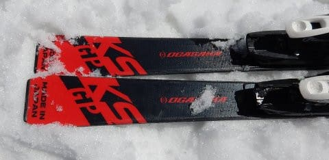

# 2020シーズンモデルのスキー板，試乗レポート…OGASAKA編その2

📅 投稿日時: 2019-05-25 02:03:51

🏷️ カテゴリ: [スキー板試乗](c0bd8048615710cee890e403a36cc9a2b.md)

というわけで．

読者の皆様におかれましては．

明日，Skier_Sはかぐらに滑りに行くと

お思いでしょうが．

今週末は，日曜日帰りなんですね～…

土曜は家でおとなしく仕事してます（涙）

しかし．

やっぱりこの土日．

志賀もかぐらも，異常なほどの

高温になりそうです…（泣）

晴天＆高温で一気に雪が解けそうなので．

ホントは一日でも早い土曜の方が雪は

良さそうなんですが…

まぁ，今回はかぐらファイナルの日曜に

かぐら出没予定です～！

ってことで．

本日はスキー試乗レポート，オガサカ編です．

では，どうぞ～！

○OGASAKA Keo's GP FL585 165cm

基礎オールラウンド．

Keo'sにはシェルトップ構造と，ツインキール構造の

2種類のラインアップがあり．

毎年どちらか一方がモデルチェンジするのですが…

今年はシェルトップ構造の方がモデルチェンジ

する年ですね．

シェルトップ構造の板は，

GP，GX，GZの3種類ありますが．

そのシェルトップ構造の最上位モデルが，

このKeo's GPになります．

ちなみに，Keo's GPは，赤と黒の2色が

選べるようで．

今回の赤色が，Keo's GP RD，

黒色がKeo's GP BKと記載されるようです．

プレートは，このモデルでは強いGRプレートが選べず．

FL585かFM600プレート（あるいはプレート無し）を

選択することになりますが．

試乗したのは，2種類のうち強いほうになる，

FL585プレート付き．

つまり，Keo'sのシェルトップ構造で，

最上位モデル＆強めのプレートの組み合わせになります．

長さ165cmでR=15mと，ショートでもロングでもない，

まさしくオールラウンドなサイドカーブをもつ

この板ですが．

今回は，朝の比較的締まったコンディションで

試乗することができました．

で．

滑り出すと…

いや．

さすがオガサカ．

ずらした時のコントロール性が，異常に高いですね…

かといって，ズレズレな板ではありません．

この板とFLプレートとの組み合わせ．

私が普段履きにしている，ATOMICのBluester 

SX並みの張りの強さがあるように感じます．

だもんで，硬い斜面でもしっかりエッジグリップして，

予想以上に，かなりガッツリカービングで切って

いけます．

リアルトップスピードまで攻めると，

ちょっと板がこらえきれなくなるかな？

と思う時もあるものの．

普通のゲレンデでは，おそらくほとんど

出すことが無いスピード域での話で．

常識的なゲレンデでの滑走スピードなら，

しっかりとエッジグリップして，

旋回性も高く．

比較的早い返りがあり，板がすっと

抜けていきます．

R=15よりも，もう少し小さいのでは？

と思うくらい良く回って，返りの早さも

あるので，小回りもやりやすいです．

荒れてる斜面でも，板がそこそこ軽いので，

自由に動かしやすく．

ずらして行った時も板がきれいに回っていき．

ずらした時のコントロールがいいので，

荒れた斜面でも楽に滑っていけます．

試乗し終わった後の感想が．

「安心感」

という感じのこの板．

どんな斜面に行っても，どんなターン弧でも．

そこそこのスピードまで，安心して攻めて

いけるこの板．

それほど攻撃的に滑らないけど，

いろんな斜面をきれいに，うまく滑りたい…

という人にはすごくいいんじゃないでしょうか．

## 💬 コメント一覧

### 💬 コメント by (麗美)
**タイトル**: Unknown
**投稿日**: 2019-05-25 10:54:42

オガサカの板はとても良く出来ていると思います。整地、不整地、斜面の緩急問わず滑りやすく雪面からの返りも良い。

ただし、それは購入後 使用開始直後の話で早ければそのシーズンの終わり〜次シーズン途中でヘタってベントも著しく減少します。この「ヘタリが早い」という致命的な欠点が2020年モデルでどの程度解消されているか楽しみです。

### 💬 コメント by (Skier_S)
**タイトル**: ＞麗美さま
**投稿日**: 2019-05-25 22:11:21

オガサカの板は確かによくできてます．

私は人生かつて一度だけオガサカオーナーに

なったことがあるのですが．

寿命は…確かにちょっと短かったかもしれませんね．

でも，某ATOMICのSXのように（全然某になってない…）

実質4か月で死んでしまう板もあるし．

レース用のサンドイッチ板も，OGASAKAに限らず

全体的においしい期間は短いですよね…．

しかし，板は高い買い物なので．

寿命が短いというのは辛いですね（涙）

