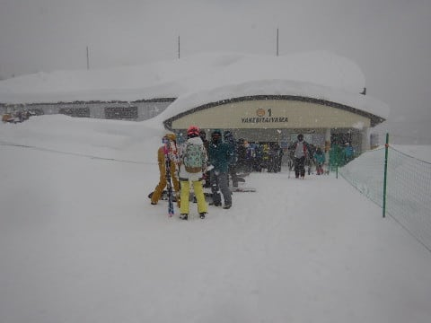

# 2019/1/27(日)の志賀高原，焼額山スキー場の詳細レポート！…朝は大雪で営業開始は遅れたものの，今シーズンNo.1のディープパウダー！午前は吹雪気味だったけど，午後は雪が止んだよ

📅 投稿日時: 2019-01-29 06:29:49

🏷️ カテゴリ: [2019スキー滑走日記](c3e4496fc0fb7f9c17ff21214a35b1ace.md)

えー．

日曜の詳細レポートですが．

…今日はご無体時間になっちゃったので．

写真たっぷり，コメント短めでお送りします…

土曜の夜から延々降り続けた雪は．

日曜朝には60cmほど積もったようで…

朝，駐車場を見てみると．

ひ，一晩でこんな積もったのか！！

こんな状態の車を．

必死の発掘作業で掘り出し．

焼額へ向かいますが…

大雪のため，ゴンドラスタートが遅れ．

『9時オープン予定』

とのアナウンス．

でも．

実際は8:50にオープンしました！

ちなみに．

この日は奥志賀はほぼ全滅だったので．

オープン時には，奥志賀からも人が流れてきたのか．

焼額ゴンドラは結構並んでました…

山頂に出ると．

朝の気温は-13℃．

（写真ちょっと見にくいけど…）

そして…

山頂に出ると…

圧雪コースもブーツ～脛パフ！

文句なく，今シーズン一番の積雪！！！

だもんで．

パフパフを狙って，いつもの

オリンピックコースへ，Go!

…そうです．

今日は久々の太い板の出番です！

（この写真だと，太い板って分からないけど…）

だけど，

オリンピックコースへ入ろうとすると．

いきなりパウダーが深くなり…

みんなスタックしてます．

オリンピックコースは，

金曜段階での修正予想

　日曜朝は脛パフ．

　うまくいけば膝～太ももパフ

の，うまくいけば…方になってくれた

ようで．太ももパフ！

今シーズン一番の，浮遊感のある

ディープパウダーだ！

パフパフっ！

最高っ！

いや，太い板買ってよかったっ！！

…と，3本ほどはシアワセだったけど．

じき，新雪に慣れてない人もいっぱい

入ってきちゃったので…

1時間ちょっと経つと，オリンピックコースは

新雪に苦労する人だらけになっちゃって．

美味しいところは終わっちゃいました…

だもんで．

GSコースに出てみますが．

視界が悪くて凸凹が見えないのに，

コースは新雪が蹴散らされた，かなりの荒れ気味

コースで．

午前中は人も多く，ちょっと楽しくないコンディション．

まぁ．

オープンから2時間近くたっても．

まだコース上ところどころ新雪が積もってる

感じなので．

かなりの積雪だったんだなぁ…

午前中はコース上の視界はずっと悪く．

コース上の人もちょいと多めで．

ゴンドラも時々，ゲートギリギリくらいまで

人が並んでたけど．

リフト待ちは完全に0．

…まぁ，昼間の最高気温も-10℃と寒く．

リフトに乗ってたら凍死しそうだたので．

リフトがガラガラなのはうなずける…

…なのに．

こんなにくそ寒いのに．

なぜか，ゲレンデでは，

ガリガリ君絶賛無料配布中．

この寒さでアイス食べたら死んじゃうよ…(笑)

ただ．

午後になると，雪は止んできましたよ…！

そして，午後2時ごろになると．

いつも通り，人がほとんどいなくなって

来ましたよ…！

さらに．

3時ごろになると．

雲も薄くなり，晴れてはいないけど，

コースの凸凹が見えるほど明るく

なってきましたよ…！

オリンピックコースの凸凹も

良く見えるようになってきました！

ってことで．

夕方のリフト営業終了直前の数本は．

雪も柔らかかったし．

視界も比較的良かったし．

人もガラガラなコースを

日が暮れるまで，気持ちよく

すべりつづけ．

今日も約束通り，営業終了まで滑り倒したのでした…

とりあえず．

久しぶりのディープパウダーが楽しめて，

満足な一日でしたが…

昨日の，営業終了繰り上げ＆ナイター無し

というひどい仕打ちほどではなかったけど．

今日も営業開始が遅れ．

さらに，営業終了直前になって，

もう帰らなきゃならない頃から，

嫌がらせのように天気が良くなって

くるってのは…

やはり，何か日ごろの行いが悪かったのか…(涙）
