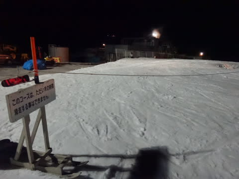

# 11月15日，日曜のイエティの詳細レポート…雨が止んだ午前中は最高！

📅 投稿日時: 2015-11-18 01:34:45

えー．

昨晩，ちょっと書きかけの記事を間違って投稿していて．

今朝，幻のモアルボアル記事を見た方がいるかと思いますが．

…あれは，幻ですので．

読んでしまった方は，「まだ見ていない」ことにしておいてください…

ということで．

昨日はちょっと悲しいニュースを挟んでしまって，

一日遅れになりましたが．

先週日曜イエティの，詳細スキーレポートです…

えー．

まず．

朝は．

かなり悲しい本降りの雨でスタートです（涙）．

でも，しっかり8時に営業開始！

当然，こんな日に滑ろうと思う人は，

何かの基準がズレた，大馬鹿モノだけですので．

…ゲレンデは，ガラガラっ！

＃雨に濡れるけど（涙）

そして，リフトも…

ガラガラっ！！

＃雨に濡れるけど（涙）

人がいない，ガラガラゲレンデを，貸し切り状態で

かっ飛ばせるよ！

＃雨に濡れるけど（涙）

ガラガラなのはいいけど．

朝のゲレンデは，硫安が効いて固い部分と，

雨で雪が溶け気味の柔らかい部分がまだらに

入り混じった状態で．

フラットバーンじゃなかったのが，ちと惜しかった…

しかし．

ここは，やはり，私の日ごろの行いの良さのおかげで．

オープンから1時間半，朝9時半には…

雨が止んで，日が射してきましたよ！

そして…

見事な雲海が見えてきたと思ったら…

太陽が顔を出し，ゲレンデに日差しが！

…気温も，ウェアのジャケットを着てられないくらいに

上がってきましたよ…

日差しが当たる，気持ちよいゲレンデなのに．

人が少なく．

トップスピードで気持ちよく飛ばせましたよっ！

朝10時半には，もうこんな感じで，

富士山も顔を出す，すっきり晴れ！

…だのに，リフトはこんなにガラガラで．

この時期と考えれば，かなり恵まれた

コンディションではっ！？？

と，思っていたけど．

天気はこのあとも，時々曇がかかり，

霧雨っぽくなることも…

んで，昼頃までは空いてたけど．

昼を過ぎると…

あーーー．

残念．

ちょっと混んできちゃったかな…

でも，午後3時ごろまでは，最大待ち時間も2分程度で．

並行したペアリフトを動かすほどの混みようではなく，

ゲレンデの人は終日少な目．

11月と思えないほど気温が高かったので，

雪が溶け気味で，ゲレンデは雪が薄くなって

きたところもあったけど…

穴が開きそうになったら，人海戦術で埋めてくれるのは，

Yetiのいいところ．

しかし，だ．

このスキー場．

なぜか，3時を過ぎてから．

異常に混み始めてくるのだが…

午後3時以降は，なぜかリフト5分待ち近くに

伸びたんですが！？？

なぜ？？

って思っていると…

午後4時からのゲレンデ整備タイムとなりました…

…が．

ここで終わらない．

先週に味を占めた，ナイターへ出動っ！！

先週よりは暖かいものの…

やはり，昼間より気温は下がった分，

スキーは良く滑る！

スピードが出せるよ！

…でも．

なぜ？

なぜ，昼間営業より，ナイターの方が混む？？

午後8時ごろまでの3時間，リフトは約7分待ちで．

1時間4本しか滑れないのですが…（涙）．

コースの人も，結構多いんですけど…

とはいえ．

夜9時近くになってくると．

おぉ！ガラガラ！

ってことで．

このスキー場は．

午前中と，営業終了前1時間が一番おいしいのかな～．

って感じで．

夜10時がやってきて…

コースクローズとなり，本日は終了！

…

うむ．

なぜか．

なぜだか．

朝8時にイエティに到着して．

ナイター終了の10時まで滑り続けてしまった気がするが．

…

朝からナイター終了まで

ひたすらひたすら一本だけのリフトで，

廊下状態のゲレンデを滑り続けるなんていう，

そんなバカなことを自分がするわけがないので．

…たぶん，このナイターの写真は．

夢か幻に違いない…

## 💬 コメント一覧

### 💬 コメント by (はなげ親分)
**タイトル**: なるほど・・・
**投稿日**: 2015-11-18 01:47:03

心のどこかにある何かが念写されたのですね

ところで、今年の焼額のナイターは前のように圧雪後のスタートとなったようです

ガッカリが多かった今年のニュースの中で、嬉しい一報です！！

### 💬 コメント by (Skire_S)
**タイトル**: はなげ親分さま
**投稿日**: 2015-11-18 02:03:50

そうです…念写です，これは（笑）．

しかし，

焼額のウェブをさっき見て，私も初めて

知りました…

圧雪ナイターになったんですね！

これはうれしいっ！！！

…でも．

圧雪ナイターやめてもいいから，

GWまで営業してほしい…（切望）

