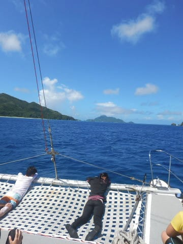

# 2019年8月，座間味で小6の娘と親子ダイビング！その7…ダイビング2日目の1本目

📅 投稿日時: 2019-10-27 02:14:41

🏷️ カテゴリ: [ダイビング日記](ce3a7a8d424d112fce83ee85c81a0e344.md)

ということで．

本日は都合でYetiに行けませんでしたが．

明日，イエティにてシーズンインの予定です！

天気も曇りのち晴れと，まぁまぁの天気

みたいなので．

厳かに，シーズンインの儀式を執り行ってきます…

って感じで，スキーシーズンが始まろうというのに．

まだ続く，座間味ダイビング旅行記．

…結局，この夏に座間味，モアルボアルと

2回遠征に行ったうち．

1回目に行った座間味旅行記の前半部分で

スキーシーズンに突入してしまうことに

なってしまい．

また，来年に一年遅れのダイビング旅行記を

書くことになりそうな予感…

ってなことで．

座間味ダイビング旅行記へ，Go!

--

で．

本日1本目のダイビングが始まった

わけですが…

いやーー．

やっぱり晴天だと，海の中が

明るくていい！！

もう，海面を通して

空と雲がきれいに見えて．

きれいです…

そして．

日差しが入ると．

いつもの逆光アングルの写真も，

きれいに写りますね！！

バックの青を深く落としても，

輝く太陽が入るので，写真が

どんより暗くなりません…！

そして，空と雲のコントラストも

映りこむし．

太陽光が差し込む浅瀬は，

日差しで色もきれいに出るし．

いや…

やっぱり，晴れの日のダイビングは，

いい！！

娘も同じ気持ちなのか．

いつも通り，謎ポーズをとって

喜びを全身で表していますね…

このポイントでは，深度12mを超える

ところにキンメモドキがごっちゃり

群れている根があるのですが．

…12m以上に行けない娘と私は

浅瀬でお留守番．

ガイドが深場の根に行っている間，

私は娘に付き添い，二人でしばらく

浅瀬の珊瑚の上を漂っていましたが…

これでも，十分な癒し！

ということで．

ダイブタイム45分で，船の下に

戻ってきました…

そして，安全停止のあとは

Exit．

昨日とはうって変わって，

たっぷりの日差しが注いだ，

明るい海を楽しめた１本だったの

でした…！

そして．

1本目を終えると．

ボートは直ちに，2本目のポイントへ

移動を開始しますが…

晴れた日は，いつもの特等席が

最高の日光浴場所．

特等席から，南国の海を眺めつつ

ぼーっと過ごしていると…

10分もかからずに2本目の

ポイントへ到着！

…でも．2本目スタートまで，

水面休憩時間がまだ30分ほど

ありますね…

ってことを確認したら．

さっそく子供たちは，海へ向かって

飛び込んでます…！

…まぁ，ホントに．

この船に乗る子供たちは，

海が好きなことよ…

ダイビングを終えたばかりで，

次のダイビングを控えている

娘も．

みんなと一緒に，海に飛び込んで

遊んでいたのでした…
