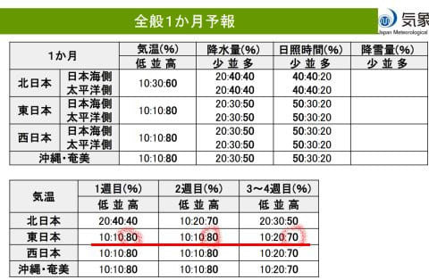
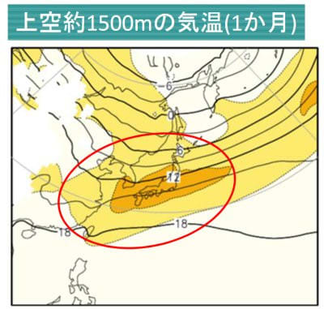
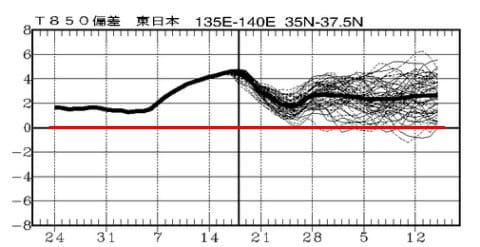

# これからイエティのオープン前後の10月20日までの1か月平均気温，平年比+2℃くらいの異常高温が続きそう（涙）

📅 投稿日時: 2024-09-20 03:16:04

えー．

いろいろクリティカルな状況が続いてます…（泣）

よく生きてるな…

とりあえず，長い記事を書くパワーがないので，

ちょいと短め更新！！

本日木曜（もう日付が変わって金曜になってるけど…）は，

このBlogの読者ならご存じの，[気象庁の
1か月予報](https://www.sunny-spot.net/chart/FCXX92.pdf)の発表の日です！

そして．

今回の一か月予報は，10月20日まで．

このころはイエティのオープン時期に

近づくので…

イエティの造雪が順調に進むかどうかに

影響する時期の予想になってきました…！！

ということなので．

果たして，これ～1か月．

9月上旬まで続いた狂乱高温期間は

終わるのか？？

10月に入ったら冷える…

あるいはせめて平年並みに戻るのか？？

1か月予報を見てみましょう…！！

さーて．

さすがに来週あたりから気温が冷える

予想になっているんじゃないかな～…

…

…

…

ダメじゃん，こりゃ（激涙）

1週目が高温になる確率80％，

2週目が高温になる確率80％，

3-4週目が高温になる確率70％って…

1か月通してここまでひどい高温予想，

これまでに見たことがないレベル

なんですけど…っ！！！！！（激泣）

いや．

ちょいと待ってくださいよ．

本州から九州まで，850hPa気温が

オレンジの平年比+2℃の領域に

すっぽり入ってますが…

1か月の平均気温が平年比+2℃って，

異常気象レベルの高温ですね（泣）

そして．

850hPaの気温推移を見ても…

これまでの1か月間，ずっと平年比

+2℃近くからそれ以上を維持して．

それも9月7日ごろから今まで，

平年比+2℃を越えて+4℃の異常高温（泣）

さらには9月18日以降の予想も，

ずっと平年比+2℃前後で推移しそう…

我が人生で，850hPaの気温偏差が

2か月間マイナスに行かないってのも

記憶にないレベルだし…

それどころか，2か月ほぼずっと平年比

+2℃が続くというのは，人生これまで

見たことがないレベル（涙）

…これは，10月に入ってからのイエティの

造雪はちょっと苦労しそうな予感…（泣）

とりあえず．

気象庁の予報が正しければ．

これから10月20日まで，おかしいくらいの

高温がひたすら続きますので，

覚悟のほどを…

しかし．

なんでここまで高温になるかなぁ…

冷え冷え踊りに対抗する，暑くなれ踊りを

全力で踊っている人がどこかにいるんじゃ

なかろうか…

早急に見つけ出して排除しないと，幸せな

スキーシーズンは来なさそうなので．

皆さんからの暑くなれ踊りの踊り手の

目撃情報を募集します（嘘）

まぁ．

10月に冷えすぎるとその反動で11月が

冷えなかったりするので．

10月に異常に冷えるというのは求めてないけど．

せめて平年並みには戻ってほしい…
