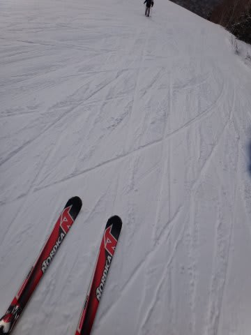

# Nordica Dobermann GS proのエッジを磨いた結果は？？？

📅 投稿日時: 2013-02-15 02:12:53

えー．

ちょっと一日，天気予想を挟みましたが．

[前回](ef8991843c7166fd4ba3b38021ed98deb.md)の続きをば…

っつーことで．

凶器レベルのエッジに仕上げたNordica Dobermann GS proを，

焼額に持ち込んだわけですが．

果たして．

ヘタったと思った板が，エッジの仕上げで復活したのか？

早速確かめてみましょう…

まずは，

比較対象のVolkl Platinum CDで滑ってみること，数本．

うむ．

快適な食い込みで，気持ちよく曲がってくれるぞよ．

気持ちいいですな．

そして．

板をチェ～ンジっ．

殺人エッジのNordica，出動だっ！

滑り出してみると…

…う，うむっ？

…こ，これはっ…

分かる．分かるぞ．

…滑り出して，わずか100mで分かるぞっ！

違いが分かるっ！

…

…

この違いは，

笑ってしまうほど．

笑ってしまうほど，ダメだ～っ！！！！！！この板（涙）．

Volklとの違いが明確すぎる…．

ぜんっぜんグリップしない．

笑ちゃうほど，グリップしないよ．

エッジを凶器レベルに仕上げても，トップとテールがずるずる(涙)．

まぁ，あれですね．

私は普段から，4-5日滑ったら板のエッジを立て直している訳だし．

いまさら，いつもよりがんがんにエッジを立てたところで．

板の性能は復活しないだろうなぁ…

って．

分かっていたけど．

分かっていたけど．

ちょっとは期待していたので．

なんとなく，がっかり．

…しかしまぁ，ATOMIC BLUESTER DEMO SXを買っていなかったら，ヘタったことに気づかず，

おそらく未だにこの板を履き続けていたんだろうなぁ…

ってことで．

めでたく(?)，Nordica Dobermann GS proの引退が正式に確定したのでした．

＃そのほかのヘタった板たち（OGASAKA KC-RV17，ATOMIC D2 DEMO Type-A，

＃SALOMON DEMO X3）はすでにドナドナ済みだったりする…

## 💬 コメント一覧

### 💬 コメント by (ひろりん)
**タイトル**: Unknown
**投稿日**: 2013-02-15 15:06:37

きっと、エッジはあんまり立てない（グリップさせない）方が板は持つ・・・のかな・・・

でもエッジないと怖いし。。。

ウチのオガのエッジ、現在凶器レベル（というか紙くらいならすっぱりｗ）なんですが、この板使うとハイスピードターンで気持ちいいんですが、

代償として体力をもってかれますｗｗｗｗ

基礎体力低下は如何ともしがたく(汗)

### 💬 コメント by (Skier_S)
**タイトル**: ひろりんさま
**投稿日**: 2013-02-15 21:53:02

うーん．

やっぱりエッジがない板は怖いですよ～．

昨年履いていた，KC-RV17はルーズ目に

仕上げたほうが調子良かったので，

あえてルーズ目に調整してましたが．

エッジの仕上げでそこそこ板の乗り味を変えられるので，

自分でエッジが調整できると便利ですよ…

私は昔ビベル少な目(0.5度程度)，ひっかかり気味が好きでしたが，

最近はビベル1度程度の，動かしやすい感じで仕上げてます…

