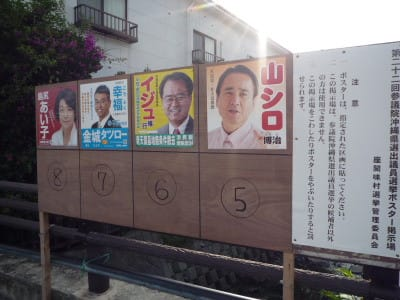
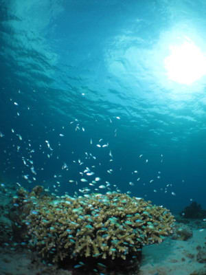
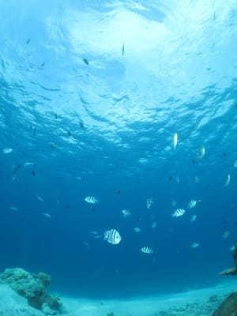

# 2010年7月，2歳の子連れで座間味でダイビング！その12…ダイビング中の写真が消えたよ！(涙)

📅 投稿日時: 2021-10-12 01:39:27

🏷️ カテゴリ: [ダイビング日記](ce3a7a8d424d112fce83ee85c81a0e344.md)

ってなことで．

土曜の夕方にワクチン2回目接種を

受けたわけですが．

接種当日の土曜は大事を取って早めに

寝たおかげか，日曜の昼ごろまでは

大した副反応もなく，

「腕が痛いなぁ…」

程度で済んでいたのですが…

午後にちょっと頭痛が始まって，

37度ちょい位まで熱が上がり．

さらに眠くなってしまったので，

ついついBlog更新せずに，夜9時前と

いう，お子ちゃまが寝る時間に

寝ちゃいました…

そして，そのまま朝までぐっすり．

…やらなきゃいけないことを

全くせずに寝てしまった…（泣）

まぁ，副反応で38℃とか出した人に

比べればマシな状態だったということで．

今日は無事復活！

…しかし，

以前は，Side effectは副作用って言ってた

けど．

なんでワクチンに対しては副反応って

言ってるのかな？

という前フリのあとは，本題へ．

今日も10年前のダイビング日記です～！

ーーー

なんということか…！！

ダイビング終了後にカメラを確認したら，

ダイビング中の写真がほとんど残っていない

という衝撃の事実に出くわしたわけなの

ですが…．

いろいろ確認すると，ダイビング

開始して，ハゼ撮影にかかった直後

くらいまでの写真は残っているけど，

それ以降の写真が完全に消えている

ことが判明(泣）

（かろうじて残っていた最初の方の写真）

…ほかのダイビングならまだしも，

そうそうチャンスがない，貸切ハゼダイブの

写真が消えたとは…

痛すぎ！！！（涙）

どういうことだ？？？？と，いろいろ

試してみると…

撮影した写真は，カメラの電源を

切るまではちゃんと確認できるけど…

一旦電源を切ると，読み出せなくなって

しまうようで．

撮影直後は，プレビューも出るし写真も

読み込めるので気づかなかったけど，

一旦カメラの電源を切ると読めなくなってしまう

という現象のようです．

カメラからSDカードを取り出して，

PCで読みだしてみてましたが…

やっぱり写真は残ってません（激涙）

カードの全手の写真を合わせた容量は

700Ｍほどなのに，カード使用量は

1.8Ｇほどと表示されており．

どうやら，破壊されたファイルで，カードが

1.1Ｇ近く消費されているようです．

…これが，私の消えちゃった映像なのね…

うがーーー！！！！

よりによって，シアワセのハゼダイブの

写真が消えちゃうとは！！！！！！

だめだ！

だめだよ！

このカメラ！！！ （涙）

…と．

ダイビング直後，かなり落ち込みながら．

最終ダイビング終了後，夕食まで

時間があるので，気分転換に

家族で座間味の街中をちょっと

散歩してみました…

ひらがなやカタカナ表記が多い

沖縄独特の選挙ポスターを見たり…

途中の売店で売っていた，白玉ぜんざい

かき氷とかいうエキサイティングな

かき氷を食べたりしながら…

いろいろうろついていると，夕食タイム．

宿に戻って，夕食です．

…しかし．

せっかくのハゼを満喫したダイビングの

写真がすべて消えていたことに落胆

しながらのお散歩＆夕食だったので．

自分的にはイマイチ盛り上がらない

感じ（涙）

とりあえず，予備でもってきた

別のSDカードを使えばちゃんと写真が

撮れることは確認したので．

明日はSDカードを入れ替えて．

気分も入れ替えて，ダイビングを楽しもう…

と．

気分リセットのため，早々に寝床に

ついたのでした…

…で．

ここからは後日談になるのですが．

帰宅後，ファイル救済ソフトでなんとか

ファイルを復活させてみました．

何種類か試してみてダメだったんだけど．

testdiskとかいうファイル救済ソフトで，

なんとか全部の写真が救済出来ました～！！

ハゼは写ってたけど．

まともに写ってるやつが無かった（涙）

でも，ワイドの景色は意外ときれいに

写ってたなぁ…

## 💬 コメント一覧

### 💬 コメント by (ozuriski)
**タイトル**: 副作用と副反応
**投稿日**: 2021-10-12 10:29:59

コロナで”副反応”という言葉を頻繁に耳にするようになって、はじめは「”副作用”は言葉のイメージが悪いから言い換えるようにしたのかな？」と思ったのですが、調べてみたら、薬の場合は”副作用”でワクチンの場合は”副反応”という使い分けだそうです。

### 💬 コメント by (Skier_S)
**タイトル**: ＞ozuriskiさま
**投稿日**: 2021-10-13 00:19:30

なるほど…ワクチンと薬の違いですか．

薬は飲んだ瞬間から本来の作用を果たすように作られているけど．

ワクチンはあくまでウイルスに対する抗体を作るだけのもので，

直接病気の症状に作用するものではないので，副反応…ということですか．

知らなかったです…

英語ではどちらもSide effectで一緒なんですけどね…

