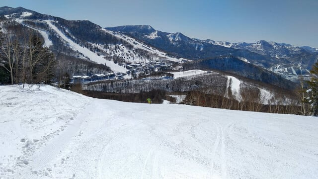
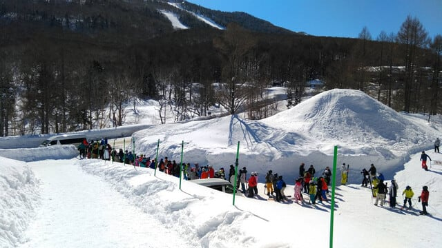

# 私は滑りに行けなかったけど．3月1日(土)の志賀高原スキー場，特派員情報！…一日晴れ，気温は上がったけど混まず，雪も意外とよかったみたい

📅 投稿日時: 2025-03-02 04:09:08

ということで．

本日は土曜というのに志賀高原に行けず，

朝から夜12時まで，仕事をこなしつつ

娘の勉強を見るという父親業も果たし…

そして，夜12時に娘の勉強を見終えたら，

すぐ寝ればいいものを…

こんな日じゃないと時間が取れない！！

…と．

スキー板の手入れを始めてしまい．

気づいたら，もう夜の4時過ぎ…(泣)

でも，昨晩は布団に入ったのが

深夜4時半近くだったけど．

朝はさすがに平日やスキーに行った時

よりはのんびり寝てられて，

10時過ぎまで，5時間半以上寝られたので…

いつもより睡眠時間がとれたので良かった

としておこう…

…でも，せめて7時間は寝たい…←だったらスキー板の手入れなんてせずにすぐ寝ようよ

今日もこれから速攻でシャワーを浴びて

寝ようと思うけど，また寝るのが4時半

くらいになりそうで．

明日は9時から娘の勉強を見る約束

なので…

やっぱり平日と変わらない，睡眠4時間半か（泣）←Blog書いてないで早く寝ようよ…

ということで．

週末スキーに行かなくても，結局睡眠時間が

取れなかったこの週末．

どうせ寝られないなら，スキーに行きたかった…

という気分であふれてますが．

私が行けなかった，今日の志賀高原．

みそ汁は降らなかったようです．

…それどころか，すごい良かったみたい

ですね…（涙）

…良かったみたいです…

くそーーー．

かなり強い怨念を，某K奈川県方面から

送り続けていたのに…

とりあえず．

特派員からの情報によれば…

ふぎゃーーーーーーーー！！

うおおおおーーー！！

目の毒だ！！！

なんだかすごい天気が良いじゃないですか！！

朝のうちは見事な快晴で，昼間は時々

雲が出たものの，一日晴れの

いい天気だったようです…！

みたところ，バーン状況もよさそうじゃ

ないですか！！！

ただ，朝は9時前の段階で，早くも気温が

-1℃まで上がっていたようですが．

これまでしっかり冷え込んでいて，地面が

暖まっていないからか．

雪はそれほど悪くなることはなかった

ようですね…

で．

昼間は予想の+7-8℃まではいかなかった

ものの，山頂で+5℃を越えるまで気温が

上がって，予想通り暑いほどの一日

だったようです…

雪は日が当たったところが，

ダマダマっぽく湿って固まった

雪になったところもあったようですが…

でも，

晴れて気温が上がったわりにはバーンの

雪はザブザブになることはなく，

比較的いい雪質をキープして…

そして，意外と混まなかったので，

バーンはラストまでそれほど荒れなかった

ようです…

うぎゃーーーー！！

良さそうじゃないですか！！

滑りたい～！！！！！

で．

本日も故障で動かなかった第2高速ですが．

第2高速乗り場から複数台のバスで

第1，第2ゴンドラ側へピストン輸送を

していたので．

バスに乗れば白樺や唐松コースも

滑れたみたいで…

ほとんど滑る人がいない白樺や

唐松，すごくよかったみたいですね…

…ただ，バス待ちの人はちょっと多かった

のかな？？

とりあえず．

気温がぐんぐん上がったのに，予想より

雪質が比較的良いままキープした今日は，

所々にボソボソのバーンはあったものの，

暖かい日差しの中，かなり空いている

いい雪のゲレンデを滑れたみたいで…

これって，かなり恵まれた一日じゃないか

と．

みそ汁が降る呪いが効かず，むしろ

いい一日だった報告を聞いて，

家で悶絶する一日を過ごしたのでした…

…今日滑れた人，うらやましい…

明日の日曜も，昼間の気温は結構

上がりそうで，さらに昼前後から

雲が増えていきそうだけど，

リフト営業中はたぶん液体が降らずに

ギリギリもってくれそうだし．

朝は日が射してそうだし，

朝イチは締まったシマシマバーンが

滑れそうだし．

意外とよい一日になりそう…

…いや．

それだと悔しいので，

明日は志賀高原にコーラが降るように

念波を送ってみようかな…

とりあえず．

明日も志賀高原で滑る人は，私の分も

楽しんできてください…（涙）

## 💬 コメント一覧

### 💬 コメント by (カンタロス)
**タイトル**: Unknown
**投稿日**: 2025-03-02 11:19:26

エスさま、こんにちは。

ご存知かもしれませんが、パラフィンワックスのかわりにスーパー無双を使用する事により、板の手入れが劇的に楽になります。

温度がバチッと合ったパラフィンワックスには勝てないかもしれませんが、レジャー（？（笑））で滑るには十分以上の滑走性。

耐久力はパラフィンワックスの遥かに上を行きます。

削ったゴミもパラフィンワックスと違い、粘っこくないので掃除も楽ですし。

スキーのために睡眠時間削るエスさまにピッタリかと…（笑）

個人的にとてもオススメです。

### 💬 コメント by (レインボー77)
**タイトル**: Unknown
**投稿日**: 2025-03-02 11:43:35

日曜日の志賀高原情報

残念ながら今日はエス様の勝ち。

朝の蓮池+2℃。奥志賀ゴンドラ8時00分スタート。小雨が降ってる！今日も三高保養所でリハビリ。ところが徐々に霧が追い討ち。無風なので霧はおさまりそうにない。とうとう全く見えなくなったので撤退。ダウンヒルは二壁まで霧。二壁からは視界はいいものの雨が大粒に。たった１時間での撤退でしたが、どう考えても撤退しか答が見つからない日でした。エス様の怨念に完敗です。

それから明日からヤケビの二高が動くそうです。でも明日は朝からかなりの雪予報で休場かも？

### 💬 コメント by (Skier_S)
**タイトル**: 久しぶりの滑らない週末
**投稿日**: 2025-03-03 01:20:21

＞カンタロスさま

実は最近，エキップさんチューンの板に乗るようになってから，そんなに高頻度に

ワックスを塗らなくても板が滑るし，ベースバーンが出てくるようなこともないので…

今シーズンのメイン板も，まだシーズン中1-2回しかワックスを塗ってません（笑）．

ワックス塗ったのも，まだ滑るけど気になるので塗りなおしている程度で，

これでもエッジ側の滑走面の毛羽立ちも全くなく滑っているので，実は最近はありがたいことに

ワクシングの手間はほとんどかけてません．

時間がかかるのは，エッジの手入れなんですよ…（泣）

＞レインボー77さま

私の怨念が雨を呼びましたか…

ただ，意外とゲレンデの状況は良かったみたいですね．

### 💬 コメント by (富山県民)
**タイトル**: Unknown
**投稿日**: 2025-03-06 11:52:01

こんにちは。

お久しぶりです。

3月1日は志賀高原も晴れていたのですね。

私は3月1日は野沢温泉スキー場に行きました。

3月1日は野沢温泉スキー場も快晴でした。

妙高山や北アルプス、越後山脈などが綺麗に見えました。

ただ雪質はやまびこゲレンデ以外は春の雪質でした。

やまびこゲレンデのみかろうじてパウダーが残ってました。

今シーズンやっと野沢温泉に行くことができました。

今週末は3月8日にネコママウンテン（福島県）、3月9日に妙高杉ノ原に行く予定です。

