# 2月4，5日の週末の志賀高原の天気は？…そこそこ冷えて2日とも曇り～晴れ，締まった圧雪のいい感じのスキー日和！

📅 投稿日時: 2023-02-02 03:43:15

🏷️ カテゴリ: [スキー天気予想](c6554f5c3c106093b511a8daae23757e8.md)

ってなことで．

本日も，志賀高原に忠誠心が高い

特派員から写真が送られてきました～！

いつものおこみん特派員は，今日も

奥志賀だったようで…

見事な晴天！！

昨晩からの積雪は全く無く，

バーンは見事なシマシマ！！

…う―ん．滑りたい…

あさイチの気温は，今日も-10℃を

下回ったようで，冷え冷え！

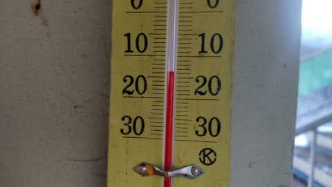

そして．

焼額の特派員からは．

あさイチの最高シマシマバーンの写真が…！

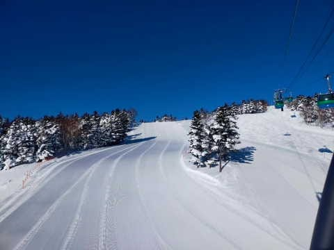

これは…

うぎゃーーーーー！！！

滑りたい！！

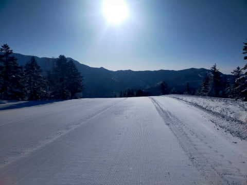

こんな天気＆雪で滑れる特派員が

うらやましすぎる…

私が滑れない平日は，スキー場に

怨念を送りつけてみようかな？

と思ったところ…

どうやらその怨念が届いたのか．

焼額第1ゴンドラは強風で減速運転．

第2ゴンドラも運休ギリギリだった

みたいです…

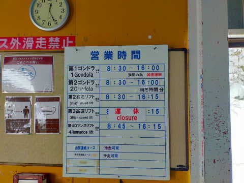

そして．

西舘山特派員からも写真が送られて

きましたが…

こちらもあさイチは最高シマシマ！！

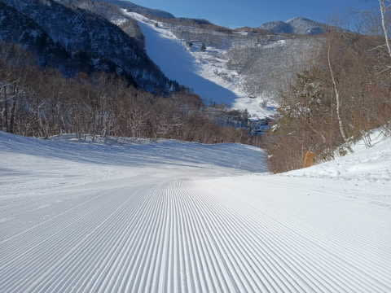

…ただし．

私の怨念が届いたのか．

だんだん雲が増えていき…

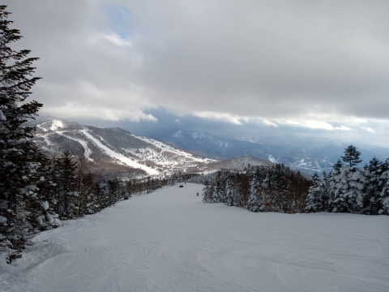

昼過ぎには完全に曇り空になり．

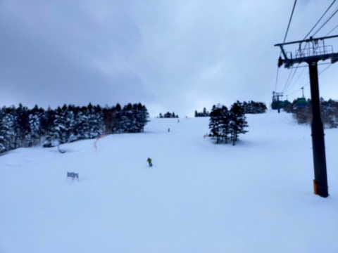

そして，午後2時過ぎには雪が降り始めて

来たようです…！

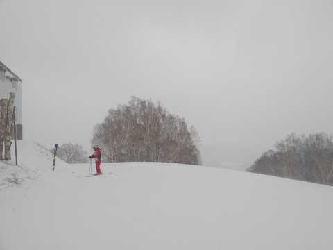

ふはははは．

私が滑らない日に終日晴天など，許さぬ！！←心が狭い

ってなことで．

今日も冷え冷えの一日だったみたいですが…

これから週末にかけて，果たして雪の

積み増しはあるのか？

あるいは晴れるのか？？

いつも通り，天気図を見て占ってみましょう…

まず，2日(木)の850hpa図を見ると．

水色の-9℃線が志賀より南にあり，

-12℃線が近づいているレベルなので…

志賀は激冷えですね．

朝は-15℃クラス．

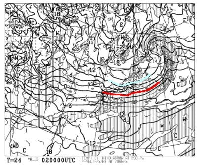

地上天気図を見ると，わずかに志賀に

降水量がかかっているかどうかなので…

まぁ，朝はうっすら1-2cm程度

積雪があるかも…

朝のうちは雪がぱらつき，午前は曇り

そうだけど…午後に回復していくかな？

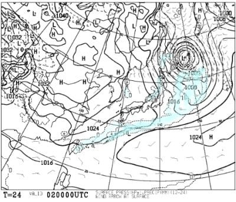

で，3日(金)の850hpa図を見ると．

この日は志賀に近づくのは水色の-9℃線．

2日より気温が上がりそうだけど，

あさイチは-10℃を下回るので

十分な冷え込みです．

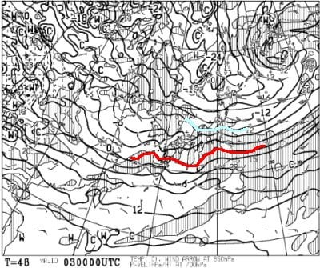

そして地上天気図は…

うーん．わずかに富山～新潟付近，降水量が

かかっているけど．

志賀は晴れ時々曇りくらいかな…

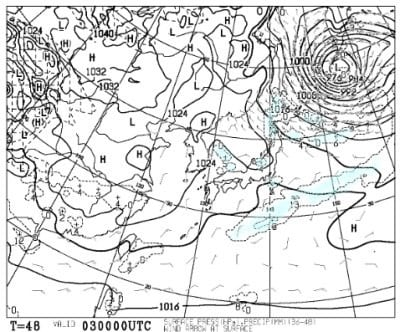

そして，週末の4日(土)ですが．

850hpa気温は，水色の線は-6℃線．

これが志賀より北に上がるレベルなので…

気温は平年よりちょい高めかな．

それでも，最高気温は-3℃くらいで

十分冷えそうですが．

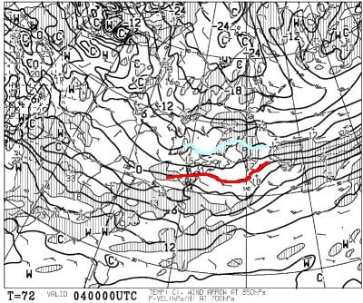

この日の地上天気図を見ると…

日本海側の陸地に降水量がかかってないので．

朝からの積雪は無く．

晴れそうな一日ですね…！

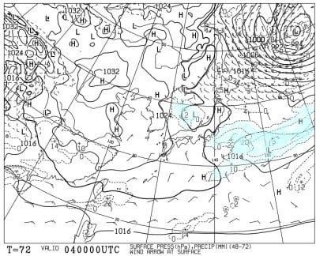

で．

5日の日曜の850hpa気温を見ると．

この日も志賀は-6℃線がかかる程度

なので，土曜と同じくらいの気温．

志賀なら昼間もマイナスだけど，

平年よりちょっと暖かめかな．

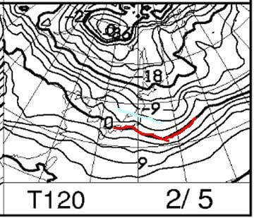

そして，地上天気図を見ると…

この日はすっぽり高気圧に覆われて

晴れそう！！

…ってなことで．

まとめると．

2日(木)：朝は1-2cm程度の軽い積雪．

　あさイチの気温は-15℃！

　早朝は雪がぱらつき，朝は曇りか…

　昼には晴れていくかな？

　曇り～晴れの天気．

　昼間も-10℃をちょいと超えるくらい

　までしか上がらず．冷え冷えバーン！

　結構いいスキー日和になりそう

3日(金)：朝イチの積雪は0，気温-10℃．

　この日は時折うっすら雲が広がる

　昼間は-5℃くらいまで上がるか

　もしれないけど，晴れ！！

　一日中締まった圧雪が滑れそう．

4日(土)：この日もほぼ積雪はなさそう．

　あさイチの気温が-8～9℃と平年より高め．

　天気は曇り～晴れ．

　気温は上がるが昼間もマイナスキープ，

　バーンは終日締まった圧雪バーン，

5日(日)：朝は雲が残る可視もしれないけど，

　基本的に晴れそう．

　気温は土曜と同程度で，あさイチは

　-10℃近くまで冷えるかもしれないけど，

　日も射して暖かく感じる一日．

　でも，昼間もマイナスキープ

　天気は朝から締まり気味の最高シマシマ．

　終日雪質はよく絶好のスキー日和

ってな感じでしょうか…

この週末も，コンディションは良さそうですよ～！！

## 💬 コメント一覧

### 💬 コメント by (レインボー75)
**タイトル**: Unknown
**投稿日**: 2023-02-02 11:46:47

水曜日の志賀高原情報

朝の上林-6℃　蓮池-5℃。逆転現象てす。

昨日の新雪が圧雪されて、今日は最高の条件。

パノラマの壁はファーストゲット。唐松も最高。

オリンピックがベスト。夢のようです。

奥志賀もまた最高。別の特派員曰く「シーズンベストかも」

バスでやけびに戻って西館でステーキ。ここまでは幸せの絶頂期でした。

帰宅後、愛車ヴォクシーの故障が発覚。ミッション故障で、なんと40万。ショックで立ち直れない。今は中古車は高いし新車は一年待ち。

夜はひたすら呑んだけど、これでストレス解消。あーあ！

### 💬 コメント by (モイストシルバー)
**タイトル**: Unknown
**投稿日**: 2023-02-02 11:57:50

オープン第2週以来、久しぶりに焼額に来ました。子供の休みに合わせて昨日から来ましたが、昨日は暖かく、雪質もまずまずでしたが、今日はヤバいですね。レインボーさんの仰る通り、-10℃の雪質は文句なく、久々にオリンピックコースの新雪を堪能しました。晴れてきたので、もう少し滑ります。

### 💬 コメント by (Skier_S)
**タイトル**: 今週末も雪は良さそうだけど…
**投稿日**: 2023-02-03 03:12:44

＞レインボー75さま

意外と今日は新雪が積もったみたいですね…

冷えたし昼ごろには晴れたし，コンディションは良かったでしょうからうらやましい…

と思ったら，車が故障ですか．それも修理費40万！！

痛いですね…

＞モイストシルバーさま

久しぶりの志賀高原ですね！

午後からは晴れて，楽しかったのではないでしょうか…

明日もいいコンディションだと思いますよ～！！

### 💬 コメント by (富山県民)
**タイトル**: Unknown
**投稿日**: 2023-02-03 06:28:11

私も土日しか休めないので平日が晴れて土日が天気が悪いと腹が立ちます。

今年は平日が晴れて土日が天気が悪いパターンが多いです。

今週末こそは晴れてほしいです。

### 💬 コメント by (Skier_S)
**タイトル**: ＞富山県民さま
**投稿日**: 2023-02-04 02:24:21

ですよね～．

土日しか行けないと，平日降って土日晴れてほしいですよね～…

今週末は志賀は晴れそうですが，富山県付近は，曇りか雪，時々晴れ間もって

天気になりそうで．

すっきり晴れにはならなさそうです．

### 💬 コメント by (富山県民)
**タイトル**: Unknown
**投稿日**: 2023-02-10 17:53:13

今シーズンは平日ばかり晴れて土日が天気が良くないパターンが続きましたが今週末は晴れそうです。

長野県北部の天気ですが土曜日は曇りのち晴れ、日曜日は晴れでした。

やっと週末に晴れてくれそうです。

特に日曜日は快晴が期待できそうです。

私は今週末は土曜日は飯綱リゾート、日曜日は八方尾根に行きます。

日曜日は快晴の八方尾根を満喫したいです。

飯綱リゾートも初めて行くので楽しみです。

土曜日は午前中は飯綱リゾートで滑走して午後は飯山雪まつりを見物します。

### 💬 コメント by (Skier_S)
**タイトル**: ＞富山県民さま
**投稿日**: 2023-02-11 03:19:02

今週末は晴れますよ～！

日曜，ちょっと気温が上がりますが…

飯綱リゾート，私は結構好きです．

今週末は楽しんできてください！

