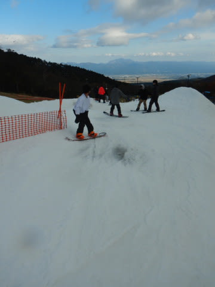

# 2021/10/30(土)のイエティ詳細レポート！…2021/2022シーズンオープン1週間後の週末はかなり混雑（涙）リフトもゲレンデも混んだよ

📅 投稿日時: 2021-11-01 00:07:09

ということで．

本日は，昨日速報したイエティの

詳細レポートをお送りするわけですが…

いや．

昨日の速報でも書きましたが．

混みましたね．

まず．

朝9時の営業開始前，8:30頃の第2駐車場が

ほぼいっぱい．

…先週は，営業が始まったピークでも

第2駐車場はいっぱいにならなかったのに．

この時点ですでに，今日は混みそうな気配…

そして．

リフト券購入はそれほど待たなかったけど．

ゲートオープン待ちが長い列になっていて．

さらに確実に，今日はかなり混みそうな

気配にあふれてます…（涙）

先週のレポートでも書いたように，

昨シーズンまでは，9時営業開始と同時の

ゲートオープンだったけど．

今シーズンは，開始の10分ちょい前に

ゲートが開いて，ゲレンデ前でオープンを

待つ形になっていて…

9時ぴったりにゲレンデオープン！

あさイチのシマシマへ，Go！！

晴天で，日差しが強かったので，

朝から雪はちょい緩めだったけど．

でも，人が少ないクリアラップで

気持ちよく飛ばせます！！

いやーーー．

やっぱりスキーは楽しい…！！

と，気持ちよかったのは，残念ながら

1本目だけ（涙）

2本目から，すでに人も増えて，

さらに雪が柔らかいのであっという間に

凸凹になっちゃって…

そして．

3本も滑ると…

え？まだ9時半なのに，先週のピークより

リフト待ちが伸びてますよ！？？

そして．

まだ営業開始から1時間も経ってないのに．

ゲレンデ上の人口密度もすごいことに

なっていき…（涙）

リフト待ちも…

何だかコースの上の方にまで伸びちゃって

るんですけど！？？？

10時前の時点で，クワッドリフト10分待ち

なんですけど！？？（泣）

ただ，10時ぴったりに，クワッドと並行する

ペアリフトが動き出して．

リフト2本体勢になると，クワッドのリフト

待ちはこの程度まで短くなりました…

ちょっと歩かなきゃならないペアリフトは

それほど混まず，ほぼ飛び乗り！

リフト待ちに関しては，これでちょっと

マシになったんだけど…

でも．

リフト2本でゲレンデに人を送り込むって

ことは，ゲレンデ上の人口密度が

上がるということで．

ところどころ，アイスクラッシュの雪山で

コースが狭くなっていることもあり…

コース上は，朝の品川駅をほうふつとさせる

人口密度になってきました（涙）

まぁ，逆走する人がおらず，みんな上から

下に降りていくだけなので，ある程度

秩序はありますが←ゲレンデを下から上に逆走する人がいたら怖い

リフト待ちはクワッドでもこの程度で，

ペアリフトはほぼ待ちなしなので．

そこはまだ救いようがあるのですが…

でも．

コース上のこの人口密度はちょっと

厳しい（泣）．

結局，この日は一日中ずっと，この程度の

人口密度が続きました…

ただ，午後になると曇ってきて，

日差しが弱まってきたのと．

風が比較的冷たかったので，

雪は多少荒れたものの，ザブザブに

なるほどひどくは無く…

コース上の雪が薄くなったり，

ちょっと穴が開いたところもせいぜい

1-2か所程度．

それもすぐにスタッフが埋めてくれたので．

例年のように，ひどい穴が開いて土が

出てるようなところはなかったのが

救いかな…

雪も，ひどい滑りが悪い雪じゃなく，

そこそこ滑りは良かったですよ！

ってなことで．

午後4時のコース整備前まで，

リフト待ちはずっとこの程度が続き．

ゲレンデ上の混雑は結局最後までずっと

解消されないまま，16時のコース整備

タイムでコースクローズとなったのでした…

あぁ…

先週のガラガラ天国は，やはり

一瞬の夢だったんだな…（涙）

もう，来週以降はずっとこんな感じかな…

…ヘタすると，来週はこれより混むの

かも？？？

つまり，

人がいなくて気持いいのは．

コースオープン直後のみ．

となると…

当然，17:00のコース整備後のコース

オープンを狙わなくてはならないわけ

ですね．

ええ．当然．

というわけで…

今日も17時の営業開始を待って，

コース整備直後のシマシマバーンへ

飛び込む！！

うひゃーーーー！

整備直後のシマシマ，最高っ！！

目の前に人がほとんどいない，

クリアなバーン，最高っ！！

…と．

快楽の1本を滑ったわけですが．

2本目以降は，あっという間に人口密度が

上がり…

雪は昼間より締まっていて，滑りやすくて

いいんだけど．

薄暗くて見にくい中，この人口密度は

まともに滑れる状況とはいいがたい…（泣）

というよりも…

なんだ？

このリフト待ちは！？？

ペアリフトが動かないナイタータイム

なのに，昼間とほとんど変わらない

くらいの人が滑っていたので…

クワッド1本に人が集中して．

17:30には，とてもじゃなけど耐えられ

ないリフト待ちになってしまい（激涙），

…これはいくら何でも耐えられない

と．

私としては珍しい，18時前に退散したの

でした…

ってな感じで．

先週とはうって変わって，この土曜は

かなり混雑したイエティだったわけですが．

おそらく，来週以降はもっと人が増える

だろうから．

…コース幅が多少広がったとしても，

すごいことになるんだろうなぁ…

…いっそ，雨でも降ってくれた方が

混まなくていいのかも？？←危険な発想だ
