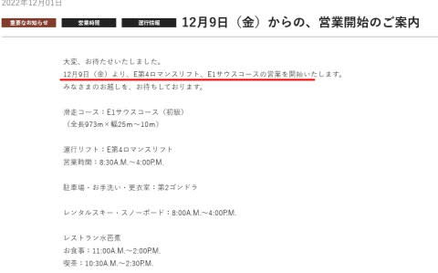
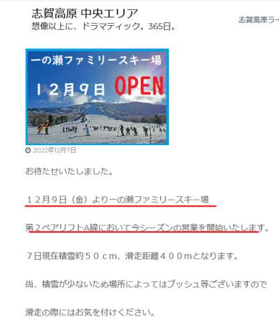
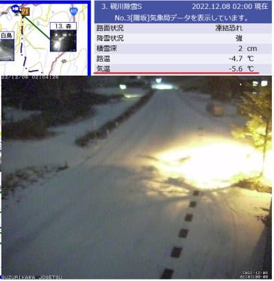

# 12月9日（金）から志賀高原焼額山スキー場と一の瀬ファミリースキー場オープン！焼額は第4ロマンスのみ，高天ヶ原オープンは未定

📅 投稿日時: 2022-12-08 04:55:55

🏷️ カテゴリ: [日記](cc4b5682fb7b8b144980957a978653fb0.md)

やばい…

もうこんな時間（涙）

ダメだ…仕事が終わらん（泣）

本来なら水曜夜だから週末天気予想の

記事を書くはずだけど，長い記事を

書いている暇がないので手短に．

まず．

わがホームゲレンデ，焼額山．

12/9(金)のオープンが決まりました！

週末より1日早い，金曜オープンです！

（[焼額山スキー場ホームページ](https://www.princehotels.co.jp/ski/shiga/informations/20221207/)より）

…でも．

第4ロマンスのペア1本だけか…（涙）

そして，一の瀬ファミリーも同じく金曜から，

ペアリフト1本で今シーズン営業が

始まるようです！！！

やっと…やっとか…

でも．まだ，高天ヶ原のオープン日程は

未定のようです（泣）

志賀高原は，昨晩から今朝にかけてもうっすら

積雪があったようですが…

これから週末まで，ほとんど天然雪は

積もらなさそう（涙）

（[北信建設事務所道路気象情報カメラ](http://hokushin.pref-nagano-roadcamera.jp/)より）

ちなみに，週末の志賀高原の天気は．

土曜は曇り．時々晴れくらいかな？

前日からの積雪はほぼ0．

日曜は…朝から雪が降りそう！！

ドサドサ積もるほどではないけど，

一日雪がぱらつく天気になりそう．

また明日，詳細天気予想します～！

焼額がオープンするから，今週からは

本気で予想しないと…

しかし．眠い…

この状況でBlogを書いている自分，

偉い！！！←いつも通り自分でほめておく

## 💬 コメント一覧

### 💬 コメント by (レインボー改めブラボー75)
**タイトル**: Unknown
**投稿日**: 2022-12-08 13:05:40

木曜日の熊の湯情報

朝の蓮池-3℃。熊の湯は９時半まで雪。新雪10センチ。ほんまモンの雪です。こんな幸せってあります？すっごく気持ちいい。これだよ。半年間待ち続けたものは！

気持ち良く滑ってたら、仲間の一人が早すぎる休憩。私らも追従してラーメン食べたところで、今日が初滑りの隊員が「おれ、もういいよ」

エス様には到底考えられない暴挙ですよね。

湯田中の借家に帰ってくると、なんとスキーの師匠から「蟹さま」が届いているではありませんか。幸せ！これから、蟹さま、能登牡蠣、鮎などの豪華夕食、いただきます。

### 💬 コメント by (Skier_S)
**タイトル**: ＞ブラボー75さま
**投稿日**: 2022-12-09 01:28:09

10cmとはいえ，新雪が積もったんですね！！

でも．もう少しガッツリ積もってほしい…

その久しぶりの新雪のコンディションで，昼上がりとは勿体ない！！

そして，ゼイタクな夕食…うらやましい．

金曜日には初志賀に行きますので，よろしくです！！！

