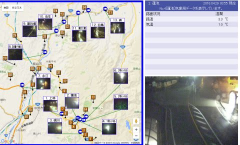
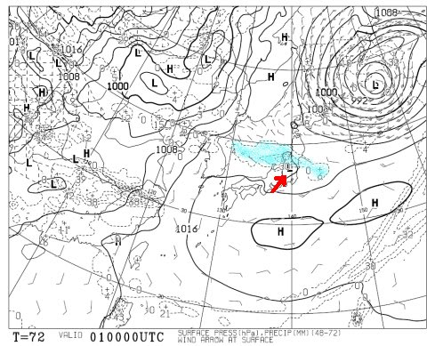

# GWの志賀高原，残るは熊の湯下半分のみ…（涙）

📅 投稿日時: 2016-04-29 04:26:41

えー．

本日もとんでもない時間に帰宅してしまい．

GW初日のスキーをあきらめた，Skier_Sです．

で．

予想通り，28日は一日中激しい雨となってしまい．

熊の湯は，本日リフト運休だったようで…

さらに．この壊滅的雨のおかげで．

29日から短いトリプルで営業再開予定だった

高天ヶ原も，営業をあきらめたようです…

…まぁ，ここまでは想定の範囲内なのですが．

しかし．5月1日まで営業予定だった

渋峠も営業終了となりました…（涙）．

ってことで．

志賀高原で．

GWまで生き残ったのは，

熊の湯第2ペア1本，それも下半分のみ

という…（泣）．

まぁ，まだ滑れるだけありがたい…

＃熊の湯スタッフの執念が，ここまでコースをもたせたんだと思う…

志賀高原，かぐら以外で，

関東圏から行けるスキー場で，GWまでもったスキー場は…

・丸沼

・たんばら

・野沢

・八方

・栂池

・五竜

くらいでしょうか…

はたして．

このうち，どのくらいのスキー場が，

5月1日以降までもつのやら…

で．志賀高原ですが．

29日早朝4時では．

まだ雨のようです…（涙）．

おそらく，志賀高原では，明け方には

チラチラと舞う雪に変わると思うのですが…

路面は凍結しそうなので，草津越えは一時通行止め

になるかも？？

そして，29日は終日チラチラと雪が舞います．

…かぐらだと，下は雨，山頂付近でみぞれっぽい重い雪…

って感じかな．

で．30日は昨日の予想通り晴れて．

朝は気温が低いけど，昼間にぐんぐん気温が上がるパターン．

そして，3連休最後の5月1日ですが…

ええ？？

矢印で示したところに，プチ低気圧が発生しており．

水色の降水域が，微妙にかぐらや志賀に掛かるエリアに

広がっています…

これは，このプチ低気圧の動きによっては．

1日の昼間，雨が降るかも知れません…（泣）．

ってことで．

悲しいほど壊滅的なこのGW．

私は前半3連休は，中日の30日に，

日帰りで熊の湯へ滑りに行く予定です…

あぁ…せっかくの10連休なのに…（涙）．

## 💬 コメント一覧

### 💬 コメント by (黄色い人)
**タイトル**: 積もってます
**投稿日**: 2016-04-29 16:53:53

初めまして、黄色い人と申します。

今日１４時に奥志賀に到着しました。滑れない奥志賀高原のゲレンデは一面真っ白です（苦笑）。路面もライブカメラにで映っていない橋の上やトンネルに入口が積雪しています。気温は14時でサンバレーで０℃、ファミリーで－２℃でしたので明日朝は凍結が予想されます。いらっしゃる方は気を付けて。

### 💬 コメント by (Skier_S)
**タイトル**: 黄色い人さま
**投稿日**: 2016-04-29 22:23:08

初めまして！

コメントありがとうございます…

ゲレンデ，やはり真っ白でしたか．

滑れないのに，勿体ない雪ですね(笑)

明日，熊の湯日帰り予定です．

草津越えはオープンしているんでしょうか…？

しかし，奥志賀に到着って…

スキーに行かれたのではないのでしょうか？？

### 💬 コメント by (黄色い人)
**タイトル**: Ｒｅ
**投稿日**: 2016-04-30 08:00:56

こんにちは、青空と白い雪の奥志賀です。

昨日は電光掲示板には凍結のため志賀草津道路通行止めって出てましたよ。５日後は草津温泉に行くのですがそれまでには開通するでしょう。ちなみに雪がなくても滑れなくてもＧＷは奥志賀で過ごしています（滑れなかった年は今年が初めてですが）。最後に熊の湯レポート楽しみにしていま～す。

### 💬 コメント by (Skier_S)
**タイトル**: 黄色い人さま
**投稿日**: 2016-04-30 23:59:35

今朝まで通行止めだったみたいですね…

ということで，今日は信州中野から

上がってきました．

帰りは草津越え，オープンしてました．

しかし…

滑れない奥志賀って，何をして過ごされたのでしょうか？？

### 💬 コメント by (黄色い人)
**タイトル**: Re
**投稿日**: 2016-05-01 17:01:00

熊の湯はコンディション良かったみたいですね。

僕はオフトレです。滑れないゲレンデを登ったり、プールで泳いだり、スキービデオを見てイメトレしたり・・・そんな感じですかね。僕も一年中スキーのことばかり考えているので（笑。ここは雪がないとはいえゲレンデの目の前にあるので気分だけは真冬です。

### 💬 コメント by (Skier_S)
**タイトル**: 黄色い人さま
**投稿日**: 2016-05-01 23:06:45

28～29日にかけての冷え込みで，

意外と良かったですよ～．

しかし，雪のないスキーで，

ビデオでイメトレですか…

私はオフシーズンにスキーのトレーニングを

全くやらない人なので…

＃その代り，雪がある限り滑り続ける

オフトレ頑張ってください～！

