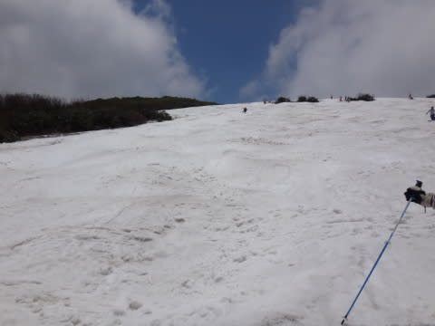

# 6月14日の月山詳細…まだリフトは滑れたけど，そろそろ終わりげな感じ…

📅 投稿日時: 2015-06-16 01:13:04

はい．ということで．

週末に行ってきた月山ですが．

本日は，詳細レポートをば…

えー．

まず．

速報でもある程度お知らせした，雪の量ですが．

例年のこの時期より少なく…

特に．

ここ3年ほど雪が多かったので．

それに比べると，2週間から3週間早い感じ…（涙）．

6月の第2週ってことで．

まだ，リフトは低い位置にかけ変っておらず．

まだ，高い位置にある時期だというのに…

リフト降り場には完全に雪は無く．

リフトを降りてから，こーゆー足場の悪いところを歩いて…

リフトを降りてあるくこと，約5分．

板を担いでひいこらひいこら，

ここまで歩いて，初めて雪の上に立てるという状況です…

で．

リフト乗り場にも，当然スキーを履いて滑りこむなんてことは

できず．

スキーを履いて滑りこめるのは，ここまで…

このあとは，こんな感じで．

こういう足場の悪い泥道を…

上に見えるリフト小屋までひいこら登って，

リフト乗り場までいかねばなりません…

ってことで．

リフト乗車時間10分強．

リフト乗り場での登り，リフト降りてからの登りで合わせて10分弱．

さらに．

大斜面までのトラバース時間で数分…

（上の写真の右端がリフトを降りて雪の上に出るあたり．

　上の写真のラインが，下の写真のラインに続く）

（板を履いてから，大斜面までひたすらこんな感じでトラバース）

…ということで．

リフト1本30分以上コースです（涙）．

…ここまでやって．

気持ちよく滑れるのは，大斜面のわずか数分…

…

だけど．

こんな状況というのに．

大斜面には，こんなに人がいっぱいいて…

はたして，なにが．

一体，何が，これだけのスキーヤーを

駆り立てているのだろうかっ！！？？？

と．

激しい疑問を思わずにいられない状況です←お前もそのうちの一人でしょ！（自己突込み）

まぁ．

大斜面の人はそこそこいたけども．

これは，沢コースが滑れなくなった，ってのも

あるのかな．

リフト待ちはほぼ0でした．

あー．

そのかわり．

リフトの上のTバーは，歩かなくてもいいということもあり．

かなーり混んでたように見えました…

＃私はリフトしか滑ってないので，待ち時間は不明

とりあえず．

唯一まともに滑れる，大斜面ですが．

いい感じの全面コブです．

一番狭い部分は，こんな感じで，コブライン2本くらいになっちゃってるけど…

（一番狭い部分を上から見るとこんな感じ）

まだ生き残ってるラインはコブ溝にブッシュも出ておらず，

とりあえず．

今週末はまだ楽しめましたね～．

日曜も，天気は晴れたり曇ったりで．

カンカン照りだと暑すぎて死にそうになるところ．

この日は，適度に曇ったので，暑くなりすぎず

快適だったかな！

ってことで．

リフト乗り降りは，「これって，何かの修行？」って感じでしたが．

大斜面は適度に楽しめたので．

まーまー良かったかな！！

…ということで．

滑り終わった後．

無事，シーズン終わりの儀式も済ませてきたので．

…これをもって，長いようで短かった，

私の2015シーズン，終了です…

## 💬 コメント一覧

### 💬 コメント by (komu)
**タイトル**: もう一回行っとく？
**投稿日**: 2015-06-16 12:29:16

苦行の道を板を担いで列を成しているスキーヤーって葉切蟻みたいと思ってしまいました。

で、本当にシーズン終われますかね？

も一回行けるカモよ？

### 💬 コメント by (Skier_S)
**タイトル**: komuさま
**投稿日**: 2015-06-17 00:32:05

いやー．

まだ，なんだか．

シーズン終わりって納得できてませんが．

高速の休日割引額も減って，月山往復交通費が

ガソリン代＆高速代で2万5千円もすることを

考えると…

経済的に，辛いです（涙）．

コストパフォーマンスを考えると，ちょっと行けないです…

