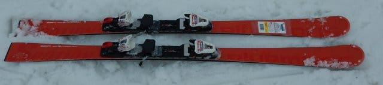
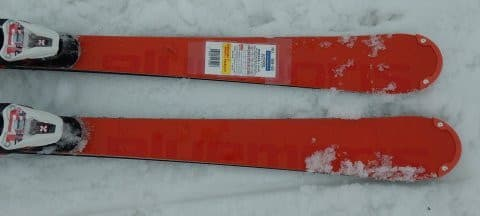
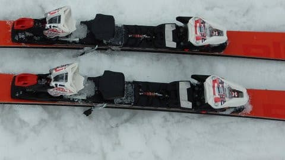
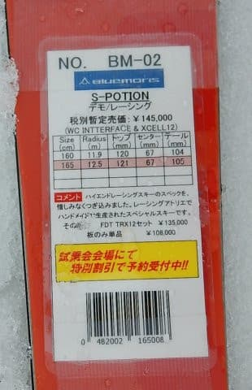

# 2020シーズンモデルのスキー板，試乗レポート…BLUEMORIS編

📅 投稿日時: 2019-06-08 01:04:12

🏷️ カテゴリ: [スキー板試乗](c0bd8048615710cee890e403a36cc9a2b.md)

ってなことで．

本日も2020シーズンモデルのスキー板の

試乗レポートなのですが．

今回試乗したのは，私が初めて履くブランド．

青森が誇るブルーモーリス！

来シーズンモデルは，なんだか評判が

良かったので，試しに履いてみました．

では，どうぞ～！

○BLUEMORIS　S-POTION

SL競技用＆基礎小回り用

長さ165cmでR=12.5，純粋なサンドイッチ構造という，

正統派小回り板のプロファイルをもつこの板．

試乗の順番がなかなか回ってこないほどの人気で，

履いた人からは

「かなりいい」

という報告を受けていたので，

試しに履いてみようか…

と，かなり順番を待って，

まさにラストになってやっと履けたこの板．

今回試乗した板は，MARKERのWC PC Interface

ピストン付きプレートが載ってました．

で．

滑り出すと．

…うわ．

これ，正統派サンドイッチ板だわ．

かなり歴史的な，

「手間とお金をかけて，サンドイッチ板

作りました！」

というような感じで．

最近履いてないけど，昔履いたKEI-SKIの板

なんかに共通するテイストを感じます…

何か尖った，分かりやすい個性があるのではないけど．

高いレベルでバランスが取れている感じ．

すごい素直な反応をする板です．

コア材の厚みのコントロールで，

しっかりフレックスバランスが調整されていて．

板全体のしなりの出方がきれいな感じ．

メタルや補助材の厚みや形の調整とか，

板自体の形状でフレックスバランスを

取っているのではなく．

しっかりコアの厚みでフレックスバランスを

調整していて．

板全体がきれいにたわんで，

エッジだけが頑張るんじゃなく，

板を面でしっかり抑えて行ける感じ．

面でしっかり板を抑えていけるので，

どんな斜面でも，板が動かしやすい．

トップだけ，テールだけ引っかかるとか，

そういう事が無く，素直にスムースに

板が動かせるので．

どんな雪でも，板を動かしたいところに

動かせます．

重い雪や荒れた雪でも，板を動かして

狙ったラインを滑って行けます．

斜面が硬めになると，しっかりがっつり

グリップして，たわんで切れていきます．

ッそれも妙にエッジが頑張るのではなく，

板の面全体で抑えて行っている感じ．

センターポジションに乗っていけば，

きれいに回っていきます．

フレックス自体は，プレートが入っているけど

柔らかめ．

だもんで，ホントの超高速域だとちょっと

弱く感じるかもしれないけど，

オールマイティー性が高くて．

ガチのSL板というより，反応の素直な，意のままに動かせる

斜面状況を選ばずに，狙ったラインを滑って行ける，

小回りベース板…

という感じ．

かなりの優等生．

プロの道具っぽい感じ．

ただ，あまりにも優等生過ぎて，

個性が無いのが欠点…

というのは，この板には酷すぎるかな．

## 💬 コメント一覧

### 💬 コメント by (ほっぽ)
**タイトル**: ブルーモリス
**投稿日**: 2019-06-08 10:56:44

Ｓさん

試乗されたんですね。私も興味あったのですが、

3/25のASAMAでは空きがありませんでした。

Ｓさんには個性が少なく物足りない感じと見受けましたが、

板自体の完成度はすごく高そうですね。

型落ちで安売りする板じゃないので、私は買えないですが、

オガサカ以外の国産メーカーとして頑張ってもらいたいです。

### 💬 コメント by (Skier_S)
**タイトル**: ＞ほっぽさま
**投稿日**: 2019-06-08 20:28:49

いや，結構いい板でしたよ．

試乗会で人気が出るだけのことはあります…

正統派のサンドイッチ板が欲しい人にはズバリ

刺さるんじゃないでしょうか．

ただ，ちょっとお値段が…（涙）

### 💬 コメント by (おおすぎ)
**タイトル**: Unknown
**投稿日**: 2019-06-13 14:38:30

月山いいですね～

むか～し、むかし、まだ学割というものが使えたころ、月山に行った記憶がありますが、滑って楽しかったという記憶がなく（スミマセン！）ただただ過酷だったという思い出がありまして・・・

日帰りなんてもうムリっす！！！

S様の気力・体力・行動力に脱帽です！！！！

あと、１日１０００Kｍ走行、素晴らしいです（うちの嫁車、年間走行1948kmでした・・・要らないのでは！？）

### 💬 コメント by (Skier_S)
**タイトル**: ＞おおすぎさま
**投稿日**: 2019-06-14 00:28:53

いや，月山は楽しむというより，修行の場ですから…

普通のスキーヤーが行って楽しめる場所ではないと思います(笑)．

ただ，滑らないと死んじゃうので，やむなく行ってる感じです…

そして，我が家はGWだけで3000kmとか走っちゃったりするので，

車の消耗は激しいです（涙）

### 💬 コメント by (高橋　信行)
**タイトル**: Unknown
**投稿日**: 2020-03-16 15:32:13

私は今シーズンＢポーション167センチを購入しました。コブ用にと思って購入しましたが、なかなかどうして整地も良いですね。

エッジだけでなく板全体でというのも共通してます^_^。

ご試乗されたのはフレックス4.5ですか？

来シーズン購入検討中です。

現在ショートターン用はフィッシャーのwc SＬ165センチですがトーション強すぎて少し手にあまるもので。

### 💬 コメント by (Skier_S)
**タイトル**: ＞高橋　信行さま
**投稿日**: 2020-03-17 02:13:28

S-Potionって，フレックスが何種類かあるんですか？？

すみません…全く知らなかったので，フレックスがいくつかは分からないです…

FISCERのWC SLは，重くて強いけど，よく回るいい板ですよね…

ただ，重すぎて一日滑るにはつらいかも．

BluemorisのS-POTION，エッジで滑るWC SLとは対極にあるかも…

### 💬 コメント by (高橋信行)
**タイトル**: Unknown
**投稿日**: 2020-03-17 23:42:25

コメントありがとうございます😊

フレックスは硬い方から4.0.4.5.5.0の三種類あるそうです。

しかし、前評判の割にはゲレンデではブルーモリス見ませんね笑

板全体で捉える、という感覚に共感出来ましたので来シーズンSポーション購入の決断ができました。

### 💬 コメント by (Skier_S)
**タイトル**: ＞高橋信行さま
**投稿日**: 2020-03-18 01:53:57

そうなんですね…フレックス3種類から選べるんですね！

で．

私も，この板を履いている人をゲレンデで見かけたことはありません…

でも，すごい真面目に作りこんである，職人の逸品っぽい

いい板ですよ！

