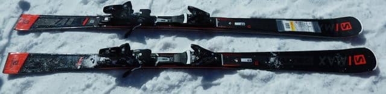
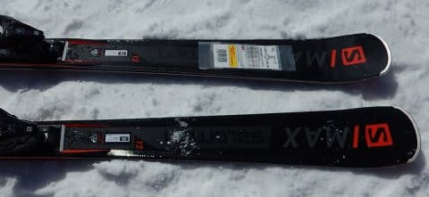
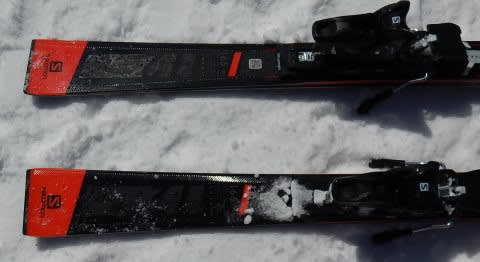
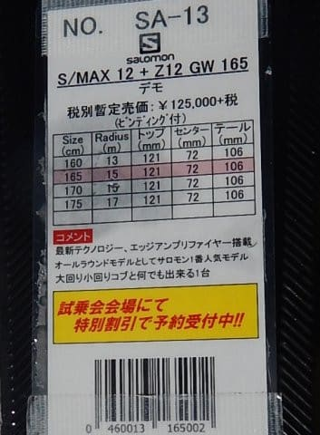

# 今週末のかぐらは土日とも晴れそう…そして2020シーズンモデルのスキー板試乗レポート…SALOMON編その2

📅 投稿日時: 2019-05-16 02:20:25

🏷️ カテゴリ: [スキー板試乗](c0bd8048615710cee890e403a36cc9a2b.md)

えー．

もう，GWから一週間が過ぎちゃったけど．

まだ雪が残ってるスキー場がいっぱいあって．

営業終了するなんて勿体ない

と思ってしまう今シーズンですが．

先週末で，熊の湯，奥只見も営業を終了し．

残るは

・月山

・かぐら・みつまた

・志賀高原 横手山・渋峠

という，いつもの定番メンバーが生き

残っているという，サバイバル状況ですが．

雪が多い年でも，いつもと同じスキー場しか

滑れないって，なんだか寂しいですね…

でも．

かぐらや横手山は，例年より雪は多めながら．

どうやら月山は，例年並みくらいの

積雪みたいですね…

うーん．

今シーズン，7月まで滑れるのか？？？

…ってことで．

本日は，今週末のかぐらスキー場の

天気予想でもやろうと思ったんですが．

今週末は土日とも

　基本的に晴れ．

　ちょっと雲が出るタイミングも

　あるかもしれないけど，雨は降らなさそう．

　気温は平年並みで，朝から暑いくらいの

　一日

という，面白くもなんともない予想で．

これだけで記事1本にするのは辛いので．

本日は，スキー試乗レポートの続き，行きます．

今日はサロモン編．

では，どうぞ～！

○SALOMON S/MAX12 165cm

基礎オールラウンド

一応，説明書きの分類には「デモ」と書かれてますが…

どちらかというと，センター幅やら性能やらを考えると．

オールマウンテンに近い，ゲレンデ履きオールラウンド

かと思います…

まず．

履いてみた感じ．

結構足元にどっしり来る板です．

2シーズン前までのX-MAXが，

異常に軽い板だったのと対照的です．

履いた板の長さは165cmですが．

R=15mというとこもあり，小回りというより，

板なりに滑っていくと長めのミドルターン

程度で回っていく板です．

比較的板のトーションもあるので，

ある程度のスピードを出して，板なりに

サイドカーブに乗って滑って行けば，

谷回りからエッジがしっかりグリップして，

自動的にターンして行きます．

ただ，どうしようもないほどの

強烈エッジグリップというよりも，

雪がそこそこ柔らかければ

板を動かす自由度が結構ある感じなので．

板を動かしての小回りもできますし．

スピードを出してたわませていけば，

カービング小回りっぽいところまで

もっていけます．

ガッツリ攻めて滑るわけでないけど，

そこそこの腕に覚えがあって，

ある程度のスピードも出すし．

そこそこのロングクルージングもしたいし…

という人には，

板なりに滑って行けば，足元の

しっかり感と重さがあって，

かなりのスピードまで板なりに

オートマチックに滑れて行けるので．

重い板が嫌じゃなければ，

候補として残してもいい板かな…

と思いました．
