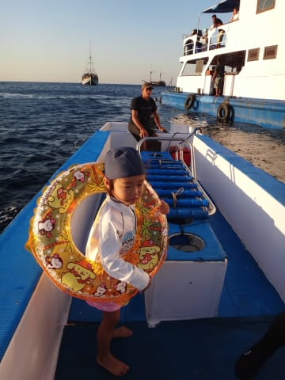
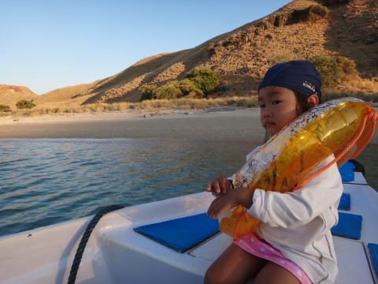
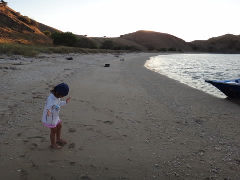
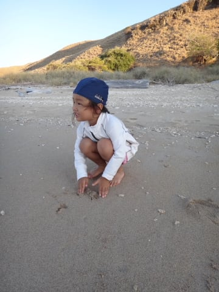
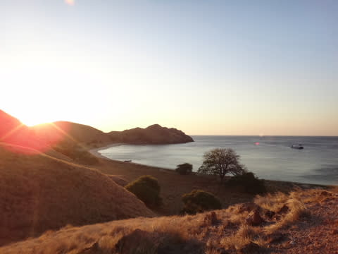
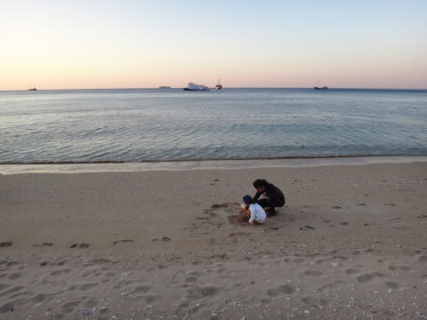
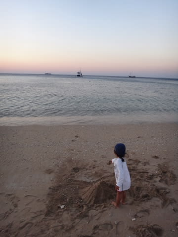
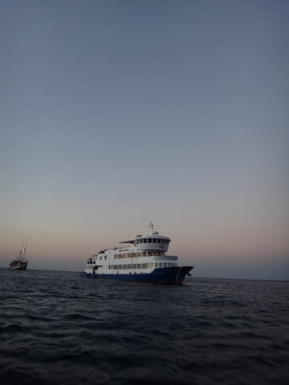
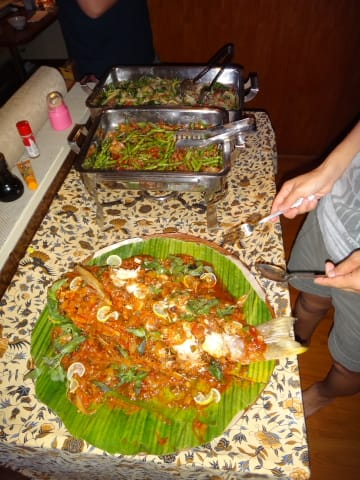
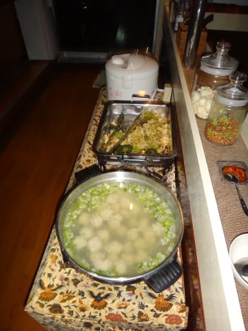

# 子連れコモドダイビングクルーズagain　その28　夕日を見ながら砂遊び

📅 投稿日時: 2011-09-30 01:08:11

さて．

昨日は久々のスキー情報でしたが．

またコモドダイビングクルーズ旅行記が続きます…

-------------

という感じで．

今日予定されていた，4本のダイビングが全て終わりましたが．

最後のダイビングが終わっても，まだ5時ですね～．

で．

今日もなんだかんだ言って，娘は3本お留守番してくれたので．

＃一番行きたかった1本は潜りにいかせてもらえなかったけど…(涙)

K村さんにお願いして，またご褒美砂遊びのスペシャルボート

出してもらいましょ～．

向かったのは，船が停泊している目の前に見えるビーチです．

砂遊びができるということで，ワクワクの娘と一緒にボートでビーチへ．

上陸したとたん，キラキラおめめで，待ちかねたように砂遊びを始める娘．

必死に砂山をこしらえてます．

で．

ちょうど夕日が沈むタイミングだったので，また娘を肩車して

高台へ．

コモドの海に沈み行く夕日のきれいなこと…

…娘よ．

コモドの高台で，肩車されて，こんなきれいな夕日を見たってこと．

これからも忘れるなよ．

高台からおりて．

私「日が沈んだから帰ろうよ～」

娘「まだ遊ぶの～！！」

日が暮れ始めても，なかなか帰ろうとしなかった娘．

…娘よ．

コモドの夕暮れの中，こんなきれいな無人島の貸切ビーチで砂遊びしたってこと．

これからも忘れるなよ．

本船へ戻ると…

夕食タイム．

今日は魚ですな～

この，魚のつみれみたいなのが入ったスープが絶品！

夕食後は…

隣に停泊している船から，K澤さんが遊びに来てくれます．

ということは．

当然濃いぃ飲み会が始まるわけで．

日付が変わるまで．

がっつり飲みが続いた，しまじの夜が更けていったのでした…
