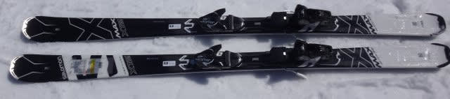
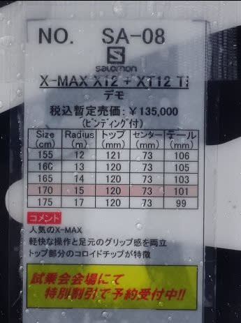
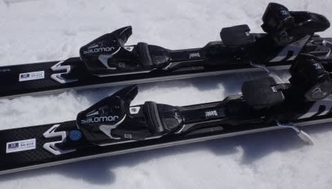

# ついに開始！2018シーズンモデル，スキー試乗レポート第1回…SALOMON編その1

📅 投稿日時: 2017-04-07 02:15:25

うーむ．

本日の志賀高原．

雨は降らなかったものの，気温は結構あがったみたいで．

…かなり春の雪になっちゃったようですね（涙）

おそらく，明日はそれほどひどい降りではないけど，

雨が時折ぱらつき．

…土曜はやはり，水を吸った重い雪でスタートになりそう…

という感じですか．

ということで．

今シーズンも，前回予告の通り，いろんなスキー板を

試乗してきましたので．

ついに今回から，レポート開始です～．

えー．

まず．

いつもの注意事項から…

この試乗レポートを書いているのは，

テククラも指導員資格も一切持っていない，

単なるお気楽レジャースキーヤーです（笑）．

私が「これ，いい！」とホメた板でも，他の人には

「なぜ，この板を誉める…」ってのもあるでしょうし．

その逆に，私が気に入らなかった板でも，他の人には

すごくいい板もあると思いますので．

あくまで，プライズも指導員ももっていない，

素人レジャースキーヤーの個人的感想ということで…

ちなみに，私は

・体格的には，中肉中背

・比較的滑走スピードは高い方だと思う…結構張りの強い

　板をたわませて滑るのが好き

・だもんで，グリップが強め，すっとたわむけど，

　比較的強い返りがある，ばね感の強い板が好み

・どちらかというと，小回りの板をメインで使っている

という感じなので，ご参考までに．

この板を試乗した日は，雪質もそこそこ良く，

4月にしてはかなりいい条件で試乗できています．

では，今シーズン第1回目の試乗レポート，どうぞ～！

○SALOMON X-MAX X12 170cm

エキスパートオールラウンド

SALOMONのエキスパート向けのX-MAXシリーズは，X8，X10，X12，X14とありますが．

今回履いたのは，上から2番目のモデルのX12です．

X8，X10は昨年から一部変更したようですが．

X12は基本的に，昨年度と変わっていないようです…

履いてみたところ．

いや．

軽い！！

で．

軽い板は，安定感がなかったり，グリップに粘り感が

感じられなかったりしますが．

この板は，異常に軽いのに，ガッツリグリップして．

そして，板がきれいにたわんで．

トップからテールまでのエッジに乗って，かなりの

ハイスピードターンができます．

その軽さからは想像もつかない高速耐性の高さ．

軽い板にありがちな，板が雪に叩かれてふらふらする…

ということはなく，雪面の荒れた感じを吸収するかのように，

ショックアブソーバーが雪面と板の間についているかの

ごとく，滑らかに雪面の上を滑っていけます．

板の荷重ポイントは，テール側．

かかと付近をしっかり押し込んでやれば，

R=15というよりかなり小さめの半径まで，しっ

かりエッジをグリップさせたカービングのまま，

しっかり小回りっぽいターン弧まで作っていけます．

張りは十分強いので，それほど仕掛けなければ，

R=15の170cmの板なりに，エッジに乗って気持ちよく

切れていくハイスピードロングターンも行けます．

たわみ量でターン弧を自由にコントロールできる，

かなりコントロール性の高い板．

異常に軽いのに，ガッツリエッジグリップ系で

きれいにたわんでいき，スピード耐性も強いので．

板の軽さを求めるけど，そこそこ攻撃的な滑りを

したい…

という人には向くかと…

軽いので，コブでも全然OKだと思います．

## 💬 コメント一覧

### 💬 コメント by (Unknown)
**タイトル**: 仕掛ける？
**投稿日**: 2017-04-07 11:11:25

「仕掛ける」とは具体的にどのタイミングで何をすることを指しているのでしょうか？

足元を切り返す？横に重心を動かす？体の向きを変える？斜め前に重心を動かす？

### 💬 コメント by (Skier_S)
**タイトル**: Unknownさま
**投稿日**: 2017-04-08 01:52:12

あ，仕掛けるってのは確かにわかりにくいですね．

外力に対抗する以上に板に何らかの力を積極的に加えて，たわみを増やす方向の動作を指します．

タイミングは谷回りでも山回りでも，

内力を使って「板を押す」（脚の進展を利用した板への働きかけ）

あるいはポジションを落として角づけを積極的に増やしてたわみを増していく，などの行為をひっくるめて

「板に仕掛ける」と言っています…

いや，私はあまりスキー技術論が分からないので，

スキー技術を語らないようにしているのですが（汗）．

### 💬 コメント by (なっちゃん)
**タイトル**: 買いました
**投稿日**: 2017-09-14 21:42:43

日頃から拝見しています。今更ですけど、レビューありがとうございました。

参考にさせていただいて、最近この板買いました。

今からスキーシーズンが楽しみです。志賀でお会いできますよう

### 💬 コメント by (Skier_S)
**タイトル**: なっちゃんさま
**投稿日**: 2017-09-15 00:13:23

コメントありがとうございます～！

何かの役に立ったなら幸いです…

この板，私も結構気に入った板なので，

満足できると思いますよ～．

志賀高原はどのくらいの頻度でいらっしゃるのでしょうか…？

週末の焼額に来れば100%会えると思いますので，

また私を探してみてください．

これからもご愛読お願いします～

