# 3月22日金曜日の志賀高原は…晴天＆春の陽気

📅 投稿日時: 2013-03-22 22:11:39

ってことで．

予告どおり，平日にもかかわらず志賀高原に来てます．

ふふふふ．

久しぶりの平日スキーなのだっ！

今日の天気は…

朝からすっかりドピーカン！

気温も高く…

トンネル内のごく一部を除き，路面にまったく雪がなかったという…

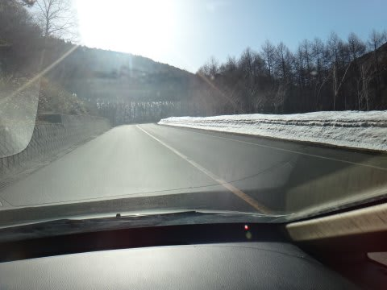

うーん．

春だねぇ…

ゲレンデに出ると…

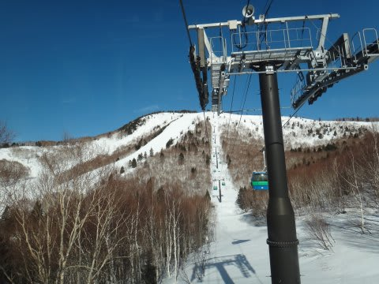

うひょう！快晴！！！

そしてゲレンデは…

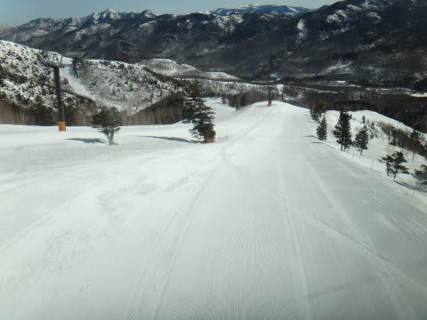

うほほほほほっ！シマシマだっ！

気温は一応，朝イチはマイナス．

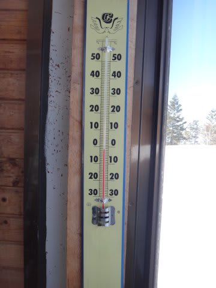

カリカリの硬いバーンを覚悟したけど…

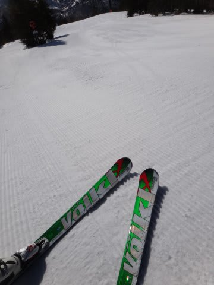

うむ．やはり，日ごろの行いがよい人間には，良いバーンが出迎えてくれるぞよ．

…

…これは．

これは．

最っっっ高！！！！

なんですけどっ！！

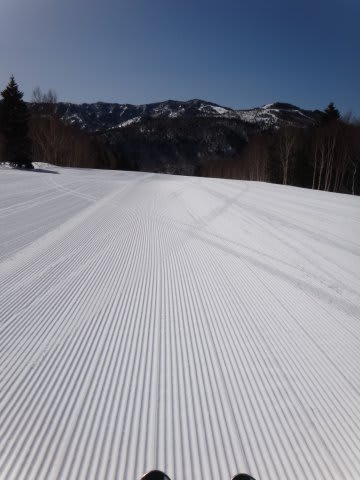

うはははは．

パウダーではないけど，そこそこ締まっていて，かつアイスバーンじゃない

ちょうど良い春の雪だっ！

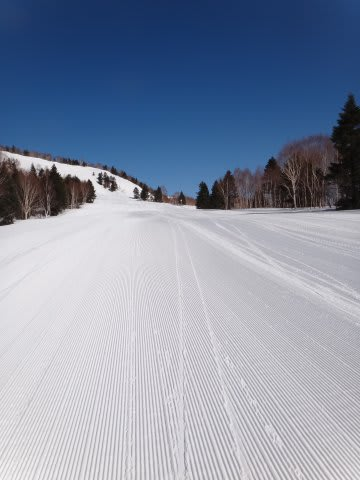

貸切で誰もいないんですけどっ！

このシマシマバーン，好きなラインとり放題なんですけどっ！！

そして，天気は快晴だし．

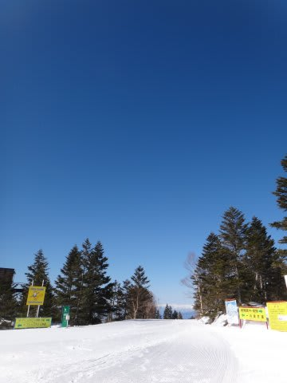

見晴らしもよく…

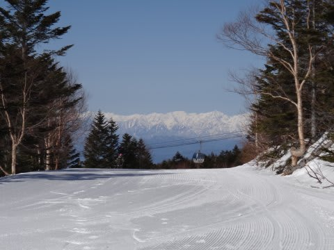

ゴンドラ待ちも終日この程度で，まったく待ちなし．

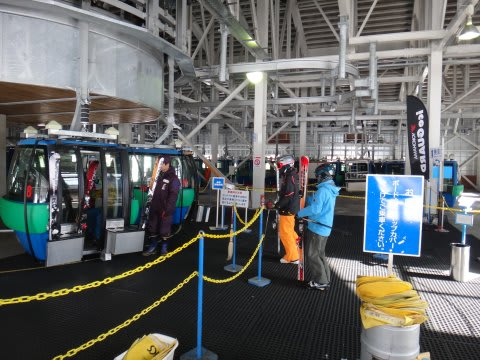

ああ．．．

生きてて良かった…

さすがに昼前になると，気温もプラスに上がって暑いくらい．

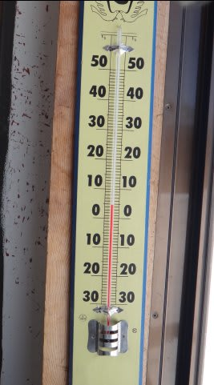

ちょっとやわらかめのざらざらした雪になってきたけど…

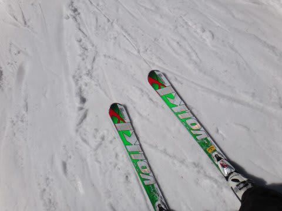

それでも雪が板に張り付くとか，板がもぐりこんでしまうこともなく，

気温がプラスと考えればかなり上出来な雪．

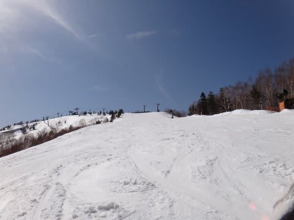

いやーーー．

さすが平日．ホントに誰もいないよ．

昼間でも，すき放題なラインで大回りしたい放題だし，

人が少ないから，雪がやわらかくても荒れない！

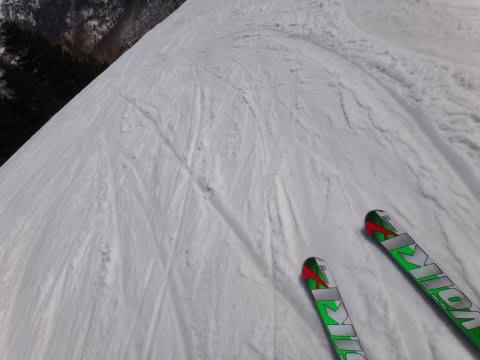

いいの？

こんな幸せで，いいの？？

南斜面は，一部張り付き気味の雪の部分も無くはなかったけど…

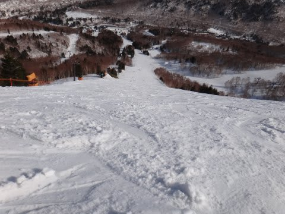

んでも，人が少なかったから．

リフトストップでも，この程度の荒れ具合．

いやーーーー．

たっぷり滑ったっ！！

ビバ，平日スキー！

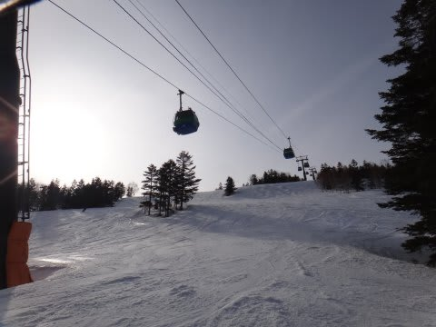

最高だねっ！！

＃毎週平日に来たくなってしまった…←仕事をやめるということか？(自己突っ込み)

でも．ナイターはちょっと硬めだったかな～

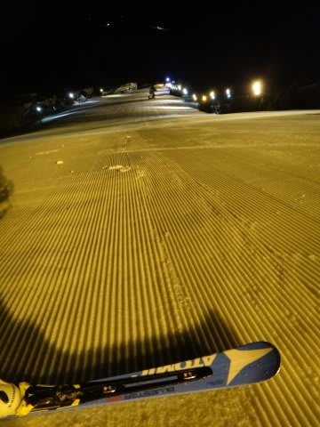

明日も良いコンディションだといいなぁ…

＃少なくとも今晩はまったく降らなさそうです

## 💬 コメント一覧

### 💬 コメント by (mari)
**タイトル**: いいなあ
**投稿日**: 2013-03-22 23:14:50

うちは明日から入って月曜までです。有休取りました。実は水曜日も行ってたのですが、薄曇りだったので、明日は晴れるといいなあ。晴れたら熊の湯で日没前後に夕日観賞会あるし。笠岳の向こうに沈む夕日、綺麗なんですよ。

### 💬 コメント by (Skier_S)
**タイトル**: コメント，早！！
**投稿日**: 2013-03-22 23:22:52

>mariさま

むちゃくちゃコメント早いですね…

明日はスカッと晴れてくれるとうれしいけど，

もしかすると朝のうちはちょっと雲が出るかも…

気温も今日よりはちょいと冷えて，朝は硬いかな～．

まぁ，昼前には晴れて雪もやわらかくなると信じてますが．

…しかし，月曜までですか．

いいですね～．平日スキー．

また平日滑りたくなっちゃいました．

### 💬 コメント by (ゆうこ)
**タイトル**: スキーなら寒くても平気なのに
**投稿日**: 2013-03-23 07:06:53

平日スキー楽しいですよね。

今頃、みんなは仕事してるはずなのにと思うとますます楽しく思います。

私は中欧旅行してましたが、結構寒くて一日中氷点下の日も結構ありました。

スキー場だと最高気温が氷点下でも全然平気なのに、ここでは全く耐えられません。

こっちでは、スキーウェアを普通に街中できてる人がたくさんいます。

それだけ寒いんですね。

いよいよ明日帰国でさみしいのと、またスキーしたいのと半々です。

志賀高原楽しんでください。

### 💬 コメント by (aqura)
**タイトル**: 幸せそう！
**投稿日**: 2013-03-23 10:59:36

うーん、平日スキー、幸せそうですねぇ～。うらやましい。年度切り替えで、しばらくは休めそうもありません😓

楽しんでください。

### 💬 コメント by (Skier_S)
**タイトル**: 楽しんでます！
**投稿日**: 2013-03-23 22:38:25

>ゆうこさま

中欧旅行ですか…いいなぁ…

私も日曜から水曜まで，外国だったんですが，

仕事でしたので…（現地滞在1日ちょっと，ひたすら仕事）．

しかし，この時期でもそんなに寒いんですね～．

帰国したら，スキーですよっ！

まだ来週からGWまで，長いですよっ！

>aquraさま

いやーーー．

平日スキー，最高でしたよっ！

私も先週仕事が一山超えたのと，

日曜＆水曜が仕事でつぶれたので代わりに

休んだ，ってのとで．

無理やり休みました(笑）．

また来シーズン，平日スキーチャレンジしてみてください．

