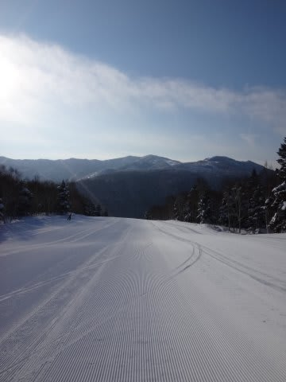
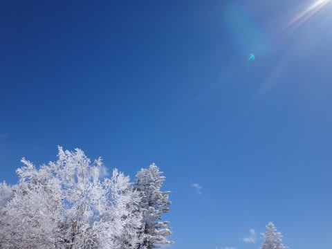
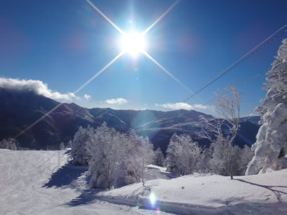
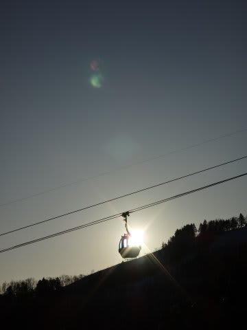

# 2014シーズン終了…恒例のシーズン総括をやってみた

📅 投稿日時: 2014-07-01 01:29:38

ってことで．

予期せぬ月山のリフト故障により，

2014シーズンが予定より早く終わってしまったわけですが．

シーズン終了時恒例の，2014シーズンの総括を…

○シーズン滑走日数　64日

去年より2日減ったなぁ…

おととしより4日減ってる…

でも．

まぁ．

社会人として滑走日数60日超えたら，

ちょっとおかしな人ですよね＞[たむらぱんさん](http://blog.goo.ne.jp/suma_shikao/e/a8266b1d19933339ff158b1d2a1c387b)にメッセージを送ってみる

○行ったスキー場

志賀　53日（うち1日ナイターのみ）

Yeti　4日

アサマ2000　2日

かぐら 3日

菅平　1日

白馬五竜　1日

月山　1日

…偏ってますね．今年も．

まぁ，シーズン券を持っている人間の

宿命でしょうか．

今シーズンは，新しいスキー場開拓を全くせず，

行ったことがあるスキー場だけになっちゃったのが

ちょっと残念かな～．

○ナイター滑走日数

19日．

…今年は悪天候でナイター中止の日が多く．

何回かナイターに行けなかったのが悔やまれる…

でも．

今年は焼額の第3高速ナイターが復活したので，

良かったかな．

○早朝滑走日数

7日

去年より3日減りましたか…

去年は，土曜から早朝営業に間に合うように

スキー場に来てたけど，今年はそんな元気が

無かった…

○トータル滑走標高差

647000m

あら？

昨シーズンより滑走日数が減ったのに．

昨シーズンより，滑走標高差は40km増えたんだなぁ…

娘が結構滑るようになったからかな～．

でも．650kmって．

東京-青森の直線距離が577kmらしいので．

それより遠い…

東京-広島くらいの距離に匹敵する高さまで

駆け上って，そこから滑り降りたくらい

ですか…

ちなみに，滑走標高差のうち，

576kmが志賀高原．

志賀高原以外は，70kmほどですか…

○自動車走行距離

約21000km

あれ？

去年より2割ほど少ない．

…まぁ，今シーズンは月山に1回しか行ってないのと，

GWの移動距離が，[去年の無謀プラン＠3500km](e7e7a813656d187ce6047c67d3b81588e.md)に

比べると，志賀高原2往復だけだったので，

GWだけでも移動が去年に比べて2000km以上減ってるのが

大きいか…

○転倒回数

5回．

確実に増えてます．

毎年，増えてます．

…でも，これだけ滑って5回なら，少ないほうかな～…

○かかったお金

ぱこぱこ（電卓をたたく音）

…

…

…

うぎゃーーーっ！！！！！

ってことで．

本日にて.

長きに渡った冬モード，終了です．

## 💬 コメント一覧

### 💬 コメント by (たむらぱん)
**タイトル**: ちょっとぉｗ
**投稿日**: 2014-07-01 20:52:50

おかしな人って誰よぉ？ σ(^_^)

君にだけは言われたくないなぁｗｗ

### 💬 コメント by (Skier_S)
**タイトル**: たむらぱんさま
**投稿日**: 2014-07-02 03:38:26

おかしな人って…

うふふ．

シーズン滑走日数60日超える人ですよ（笑）．

…当然，私も含まれてます（自爆）

### 💬 コメント by (komu)
**タイトル**: 62日…
**投稿日**: 2014-07-02 08:24:43

すみません、わたしも超えてしまいました…

月山日帰りもしてしまいました…

おかしな人でしょうか…

### 💬 コメント by (Skier_S)
**タイトル**: komuさま
**投稿日**: 2014-07-03 02:58:00

あぁ…

もうダメです．

終わってます．

終わってますね…．

十分，おかしな人認定ですっ！！！（笑）．

