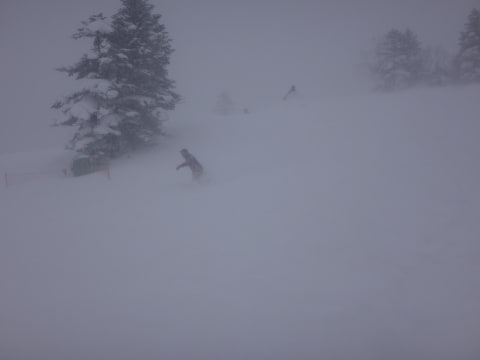
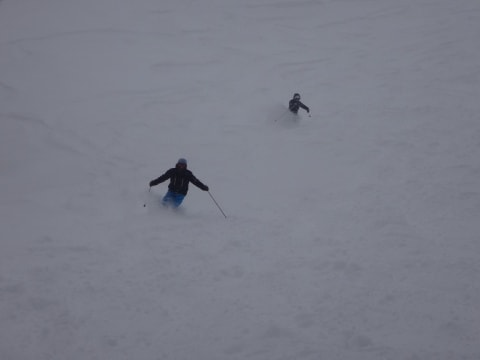

# 1月24日志賀高原詳細…一日でかなりの積雪だったけど…1月30日は壊滅的な雨になりそう（涙）

📅 投稿日時: 2016-01-26 02:33:21

えー．

日曜の志賀高原の，詳細レポートに行く前に．

…なぜ．

なぜ，こんなことに…

そう．

この週末なんですが…

はぁ？金曜の850hpa気温，0℃線が志賀高原より

北にまで上がっちゃってるよ！？？？

…そして．

30日は…

え…？

…

し，志賀高原に，+6℃線がかかってるんですが？？（震える声で）

これは…昼間に降れば，確実に雨なんですけど？？？

で．

30日の地上天気図を見ると…

…

どかーーーん！！！

…

…低気圧に覆われて．

日本全域に，降水域の網掛けが…

…これは，今週末，30日の土曜日は．

一日中雨が降る

ということかっ！！？？（止まらない涙）．

そもそも．

そもそも，だ．

なんなんだ，この850hpa気温傾向はっ！！！

赤矢印で示す30日．

平年比+12度の，グラフの上限を突き抜けてるし．

青矢印で書いた福岡なんて．

冷え冷え祭りの24日の平年比-10℃から，

29日の+12度まで．

わずか5日間で22度も気温が上がってるんですが！？？

…先週一週間が．

わずかばかりのボーナスのような冷え込みだったということか…（涙）．

今週末は…ダメだ．

ダメだよ…（涙，涙，涙…）

とりあえず．

スキーヤーの皆さん．

これから今週末まで．

ひたすら休むことなく，

気温が冷える踊りを踊り続けましょう！←なんのこっちゃ

…と．

あまりものショッキングな天気図に，冷静さを

失ってしまった報告のあとは．

とりあえず，昨日，1月24日の志賀高原，焼額の詳細レポートをば…

＃ここまでで，普通のBlogの記事くらいの長さがある気がするが…？

で．

予想では，夜の間に雪が降り積もり，

脛～ひざパフになるはず…

という，日曜の朝．

宿の外に出てみると…

…え？

これは…

積雪10cm以下！？？．

…予想，外したか…（涙）．

悲しみにくれながら，ゲレンデに出ようとすると…

それまで穏やかな天気だったのに．

なぜか，突然．

朝8時前から激烈な吹雪になってきたんですが！？

…なぜ．

なぜ，夜中に降らずに．

リフト営業開始直前から狙ったように，

吹雪になるかな～（泣）．

おかげで，焼額第2ゴンドラ，奥志賀ゴンドラは運休（涙）．

第1ゴンドラは動いたけど…

ゲレンデの視界は最悪（涙）．

そして，朝の気温は-15度と激寒！！

朝イチの1本目は，雪の降り始めだったので，

それほどの積雪ではなかったけど…

激しい雪が降り続けるので．

9時過ぎには，ブーツパフの新雪になっていき…

そして，10時ごろには．

をを！

ああ！

うはぁっ！！！

圧雪されてないコース脇は，すごいパウダーだよ！

ひざパフだよっ！

午前中は，人が多かったのもあって，

コース上の雪は踏まれて，そんなにパフパフには

ならなかったけど…

でも．

あれれ？

終日雪の予想だったのに…

10時半ごろには，うっすら日が射してきましたよ！

風も弱まり…

うはぁ！

快適！

そして．

第2ゴンドラが止まっているので．

新雪が積もって，第2ゴンドラが止まった時の

黄金パターン．

第1ゴンドラを使って，第2ゴンドラ側のパノラマコースを

滑るのだ！

第2ゴンドラが止まっていると，

パノラマコースはこの写真のように，

ガラガラなのだ！

なので…

うははは！

10時半を過ぎても，まだパウダーが残っているのだ！！

第2ゴンドラが運休した時は，この手が

使えるのだ！

…そして．

今日は，悪天候で出てくる人が少なかったからか．

第2ゴンドラが運休で，第1ゴンドラに人が集中するはずなのに…

第1ゴンドラの待ちは，ほとんどなかったのだ！

それで，日が射すタイミングもあり，

これでパウダーも楽しめるし．

いや，

予想外にイイじゃないか？？

そして，昼間の気温も-15度と．

朝からちっとも気温は上がってませんな．

冷え冷えです！

雪質最高！

…あ，そうそう．

天気が回復した11時過ぎには，第2ゴンドラも運転開始してました．

ちなみに．

朝イチに駐車場に止めた車．

昼食時に見に行くと…

うはぁ．

朝8時半から12時までで，15cmほど積もったのかな？？

だが．

だがしかし．

時折日が射し快適だったのは，

10時半～1時半の，3時間だけ．

1時半からは…

ま，また吹雪いてきたよ…（涙）．

-15度の容赦ない風が吹き付けます（泣）．

でもそのかわり．

コース上の人が全くいなくなったってのもあり…

（ほぼ無人のゲレンデ）

…コース上，圧雪エリアも，

完全にパウダー化してきてるんですが！？？

滑っても滑っても，エンドレスパウダー供給状態

なんですが？？

（とても圧雪バーンとは思えない…）

だもんで．

コース脇は，夕方になってもひざパフっ！

…吹雪で視界も悪く，凍死するかと思ったけど．

この日も，ゴンドラストップまでたっぷり滑って．

パフパフをおなかいっぱい楽しみ続けたのでした…

…そして．

昼間に一回きれいに除雪した，我が車．

また雪だるま状態に…（涙）．

午後だけで，30cmは積もったな～．

ってことで．

[木曜日に予想した](e3ce1d837a0f187f83eb44a398266c987.md)，

日曜：朝は20～30cmの積雪か？脛～ひざパフの激軽パウダー！

　とりあえず，朝は-15度クラス，昼間も-10℃以下の，激烈に寒い一日．

　風が強まるタイミングもあるので，焼額第2ゴンドラは

　減速運転に入るかも．

　吹雪っぽいかもしれないけど…

　焼額第1ゴンドラが止まるほどの強風にはならないはず．

　雪は終日降る．時折かなり強く降る．

　昼間もモサモサ雪が増えていき，午後のゲレンデは人が

　少ないのもあって，終日ゲレンデをうっすらパウダーが覆う，

　パウダーな一日かも…

という天気予想．

前日夜からの積雪は予想ほどは無かったし，

昼間3時間ほど，予想外に日が射すタイミングもあったけど…

でも．

朝10時ごろには膝パフになったし．

朝は-15度ってのはぴったりだったし．

吹雪で2ゴンはやばいけど，1ゴンは止まらないってのも当たったし．

午後のゲレンデは人も少なく，ゲレンデをパウダーが

覆うってのも当てたし．

…この日の天気予想，当てたんだか外したんだか…

…まぁ．大体当てたことにしておこう←自分に甘い

## 💬 コメント一覧

### 💬 コメント by (はなげ親分)
**タイトル**: え～っ!!
**投稿日**: 2016-01-26 11:16:57

あ、雨ですか……。

先週末、浮気して晴天極上バーンを楽しんだ罪なんでしょうか(泣)

踊ります!!

女房と共に踊り続けます!!

### 💬 コメント by (まいる)
**タイトル**: 週末
**投稿日**: 2016-01-26 17:38:42

お疲れ様です。週末雨ですかぁ、技選なんですが、雨は辛いです(>_

### 💬 コメント by (mae)
**タイトル**: Unknown
**投稿日**: 2016-01-26 23:46:00

日曜は終日１ゴンを回してましたが、今シーズンでは自分の中でも一番の一日でした。　なるほど。１ゴンを利用してのパノラマも有りですね。自分なら白樺～ブナで、２高から１ゴンですが、リフトに乗るような天候じゃなかったですね。

本日の銀嶺さんブログでは、週末、雪の予想ですが、

雨はかんべんしてもらいたいですね。

### 💬 コメント by (Skier_S)
**タイトル**: 今週末は…雨か雪かぎりぎりの感じに
**投稿日**: 2016-01-27 01:37:34

＞はなげ親分さま

…このままの天気図だと，雨です…

でも．

低気圧のわずかな位置のずれで，

雪になるかも…という，微妙なところ．

うーむ．

とりあえず，踊り続ければ雪になってくれるのでは…？

と信じて，踊り続けましょう！

＞まいるさま

うーむ．

雨か雪か，微妙なところ．

今のところ，仮に志賀は雪になっても，

標高が低いところはアウトです．

…雨の技術選，想像したくないですね～．

雪になるよう，冷え冷え踊りを踊りましょう！

＞maeさま

吹雪いて2ゴンが止まった日は，

パウダー狙いでパノラマに行くことが多いです．

逆パターンで，1ゴンが故障で止まったとき，

2ゴン使ってオリンピックコース→3高と回して

パウダーを楽しんだことも…

人が少なくて荒らされないので，繰り返し楽しめます．

しかし，日曜は私も1ゴン回してましたが…

リフトに乗る気は全く起こりませんでした（笑）．

今週末は…今の天気図では雨ですが，

だんだん30日の予想気温が下がってきているので，

上手くいくと雨にならずに済むかも…

とりあえず，休むことなく冷え冷え踊りを

踊り続けます！

