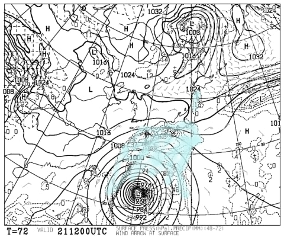
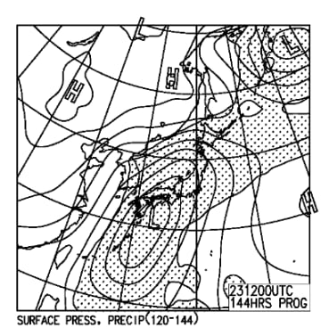
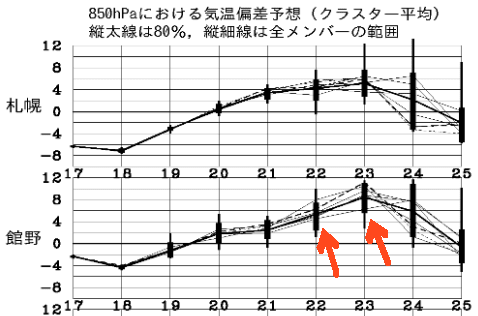

# 今週末のイエティの天気は…土日とも雨が降りそう（涙）．でも，土曜日の方がまだマシかな…

📅 投稿日時: 2017-10-19 02:37:59

🏷️ カテゴリ: [スキー天気予想](c6554f5c3c106093b511a8daae23757e8.md)

ということで．

無事，本日からYetiが再開したようです～！（ぱちぱちぱち）

…でも．

この週末にやってくる．

台風による強風＆雨＆高温

という試練に耐えられるのだろうか…

と，心配が尽きない今日この頃ですが．

とりあえず．

土曜日の天気図を見てみると…

あぁ…やはり台風が…（涙）

ただ．

水色の降水域．

ギリギリ静岡県にかかっているくらいなので．

Yetiは，土曜はそれほどザーザー降りにならないかな？？

そして，日曜の天気図は…

ちょっと台風が縦長に伸びてるみたいに見えるけど．

これは，台風の予想位置がばらついているため．

アンサンブル平均図ではばらつきの分

台風が広がって見えている…ということで．

日曜の台風位置の予想が，まだ正確に

予測しきれていないことが，この図からも読み取れます．

…ただ，台風がどこに来ても．

日曜日は，雨はしっかり降りそう…（涙）．

そして．

気温偏差図を見ると…

はうぁ．

ダメか…

ダメだ．

台風が接近する22日，日曜は．

左側の赤矢印で示すように，

平年比5度ほど気温が上がりそうで．

右側の矢印の23日，月曜は，平年より8℃ほど，

気温が高くなりそう…（泣）．

当然，平年比+8℃という，超高温の

月曜も激しい雨が降り続けるので…

これは…

日，月と続く高温の雨で．

またゲレンデが壊滅

してしまう可能性．

やっぱり高そうだなぁ…（激涙）．

とりあえず，まとめると．

土曜：終日，曇り～ガス．時折小雨がぱらつく．

気温は平年並みだけど…寒く感じるだろうから，

ウェアのジャケットを持っていくことをおススメ．

日曜：曇り時々雨，

…台風の接近速度によるけど…

早めに接近すると，時折強い雨になるかも．

台風がもたらす生暖かい南風が吹くので，

気温自体は高め．

月曜：ゲレンデがもってくれるかなぁ…

って感じですか．

あぁ…

ゲレンデが復活したこの週末．

せめて，土日のどちらかは晴れてほしかった…

でも．

天気は土曜の方がマシそうだし．

土曜から日曜にかけて，雪はかなり悪化していくと思うので．

まぁ，行くなら土曜ですかね．

雪が悪くなる前の，土曜の早いうちに滑っておくのが，

Skier_Sのおススメです…

## 💬 コメント一覧

### 💬 コメント by (ほっぽ)
**タイトル**: イエティ
**投稿日**: 2017-10-19 07:18:21

おはようございます。

昨夜イエティで滑ってきました。

幅はやや狭くなりましたが、雪に厚みを持たせて雨対策しているように見えました。

今週末、私も土曜日ナイターに参戦しようと思っています。

来週やってくる台風が心配です。(>_<)

### 💬 コメント by (Skier_S)
**タイトル**: ほっぽさま
**投稿日**: 2017-10-20 00:55:31

ゲレンデ，ちょっと幅が狭くなったんですね…

ちょっと残念ですが，滑れるようになっただけ

有り難いということで…

私も土曜日に滑る予定ですが，午後から雨に

なるようなので…

天気次第では，16時のコース整備の

タイミングで帰っちゃうかもしれません．

もし，天気がもつようなら，ナイターまで

参戦予定ですので，その際はお会いしましょう！

