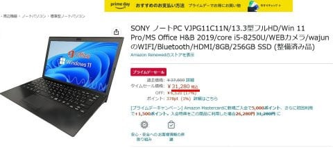
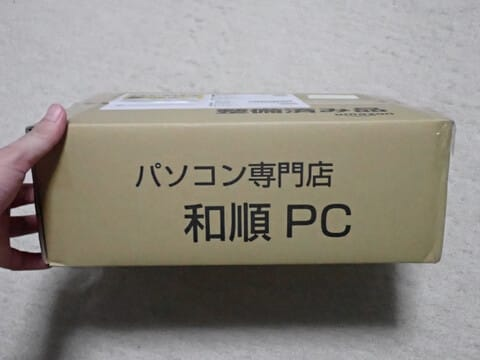
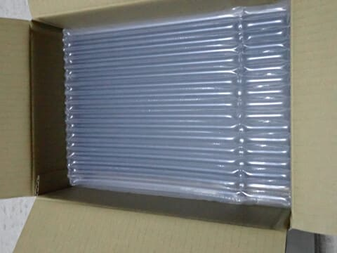
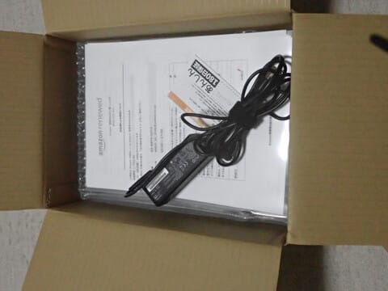
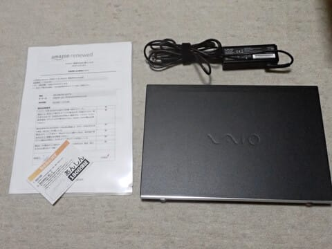
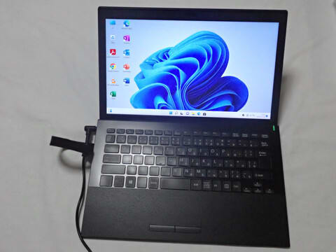

# 今度はリース落ち中古ノートパソコン，VAIO Pro PG 第8世代Core i5のPCを買ってみた

📅 投稿日時: 2023-10-31 02:45:58

🏷️ カテゴリ: [PC,カメラ&小物](c0d8caed13e597efe97b661a8ae56bed0.md)

今日も会社で宿題をいっぱいもらって

12時過ぎにようやく帰宅したという，

絵にかいたようなご無体サラリーマン

状態で．

やはり，土曜に滑りに行ってるどころじゃ

なかった…と思う今日この頃．

皆様いかがお過ごしでしょうか（時候の挨拶）

ということで．

まだこれから宿題をやっつけねばならないので，

今日は短め更新で…（涙）

えー．

以前，私のメインマシンのデスクトップPCを，

[リース落ちの格安中古マシンにしたという記事](e3f0a0b72f0d7d93821bf0ea0b33d3429.md)

を書きましたが…

今年，我が娘が高校に入学し．

最初はタブレットで宿題やら何やらを

こなしていたけど．

どうやらノートPCが必要な状況になって

きたようで…

どうせ娘の使い方は，ブラウザベースで

なんだかいろいろやるか，オフィス系ソフトで

書類を作るくらいしかしないだろうから，

そんなハイエンドなPCはいらないし．

こいつもリース落ちの中古PCで乗り越えてやれ

と．

娘の高校入学祝として新しいPCを買うとかいう

優しさは全くなく．

経済最優先

で，コストパフォーマンスが高そうな

中古PCを買うことにしたのでした…

娘にどんなPCが欲しいか聞いてみたところ．

15インチディスプレイの大型機はお気に召さない

とのことで，ざっと見積もって

・13インチディスプレイ

・メモリ8G以上

・HDDはダメ．SSDで容量256G以上

・Win11対応の第8世代以降のCPU

・Officeソフト付き

という条件で探してみたところ…

ありましたね．

こいつ．

VAIOのPro PGですか．

一般向けじゃないビジネスモデルのようですが．

要求通りの第8世代CPU，メモリ8G，SSD256Gで…

さらに．

OfficeもMicrosoft OfficeのHome & Business2019が

乗ってるというお買い得品が！

…これで31280円なら，かなりのお得…！！

ただ，ノートPCは，デスクトップと違って

バッテリーがヘタっているという可能性が

あるんだけど…

まぁ，娘は普段PCを持ち歩いて使うわけ

じゃないし．最悪バッテリーがヘタってても

いいか…と，こいつを購入してみました…！

注文後，発送まで1週間ほどかかりましたが．

無事到着！

取り扱い業者は，和順とかいう会社のようです…

段ボールをあけると，エアキャップの中に…

PC本体と電源アダプタ，180日保証の保証書と

amazon renewedの出荷チェックシートが

入ってました．

中身はこれですべて．

出荷チェックシートを見ると，バッテリー

容量は新品の80％が保証されることに

なってるようです…

電源を入れると，Win11の初期設定済み

らしく，アカウント設定すら必要なく

一発で起動しました…！！

…ただ．モノとしてはちょっとキーボードに

使用感がありますね…

でも，Officeもちゃんと正規品で，

アクティベーション済みですぐ使えるし．

バッテリーも確かにヘタっている感じは

なかったし…

SSDなのでHDDと違ってサクサク動くし．

とりあえず，娘が購入後3か月ほど使って

ますが，今のところ問題はなく使えていて，

軽くて薄いので気に入っているようです…

うん．

Office込みでこのPCが3万円なら，

かなりお買い得…！！

…今回も安く上がってよかった…

と．

胸をなでおろす父親なのだった…←自分は新品の

スキー道具を買うのに，娘のPCは中古品なのね

## 💬 コメント一覧

### 💬 コメント by (m&t m)
**タイトル**: Unknown
**投稿日**: 2023-10-31 19:15:22

再生ノートPC買いましたか。

自分もサブ機として12.5インチノートPC買ったばかりです。

この会社はAmazonでは和順、YahooショッピングではPC-Mで再生PCを売っています。自分はPC-Mで買いました。

破格に安いのにハードディスクをSSDに換装していたり、初期設定してあったり、ハイスペックな使い方をしないのであれば充分ですね。

ただし、バッテリーがすぐダメになったり、Microsoftのライセンスキーが付かない(付けられない！)等ちょっと問題があるみたいですが・・

### 💬 コメント by (Skier_S)
**タイトル**: ＞m&t mさま
**投稿日**: 2023-11-01 01:33:46

そうなんですよ…ヤバいんじゃないかと思うほど安いですよね．

Officeのライセンスキーがつかないのはちょっと微妙ですが，まぁ初期化しなきゃ大丈夫か…

と思って使ってます．

