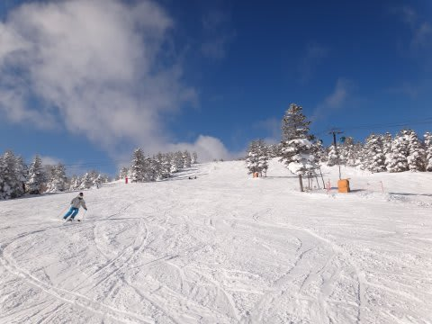

# 大晦日…今日も志賀高原焼額です

📅 投稿日時: 2011-12-31 21:58:33

🏷️ カテゴリ: [2012スキー滑走日記](cca3a0e9524e0203150f790b1fc3c71ad.md)

今日の焼額は…

朝方は曇って雪がちらつきましたが．

9時過ぎからおおむね晴天．

絶好のスキー日よりでしたね…

昨日からの新雪は15ｃｍ～20ｃｍかな．

朝イチの非圧雪コースは脛パフくらいのパウダーを

楽しめましたねー．

でも，まだところどころコースに浮石があるので

やっぱりもう一降り欲しいところではあるけど…

まぁ，天気がいい割に，大晦日だからかそれほど

混まなかったのがラッキー．

いや，第1ゴンドラ，1回だけ10分近く待ったかな．

でもｍ，なぜか次にきたときには2分待ちにまで短く

なっていたという…

昼間の平均ゴンドラ待ち時間は，体感的に3分程度

ですかねー．

あ，ゴンドラは多少待ちがありますが，

リフトは待ち時間まったくなしですので．

とりあえず，それほど待たなくて1日滑れました．

やわらかい新雪が上に乗っていたので，

昼過ぎにはところどころコブコブになっちゃって，

コブの谷間にところどころ固い下地が出たような

ところもありましたが…

なんにしろハイシーズンですね．

昼間もマイナス10度近くと，天気がいいのに冷え込み，

ゲレンデコンディションはそこそこでした．

ナイターはかなり寒かったよ～！

さて．こんな感じで終わった2011年ですが．

皆さん，このブログにお付き合いありがとうございました．

皆さん，良いお年を…
