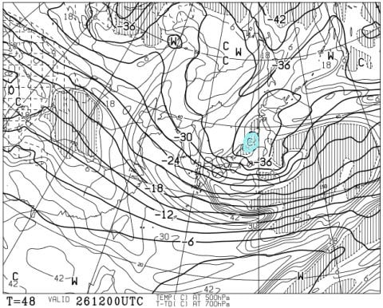
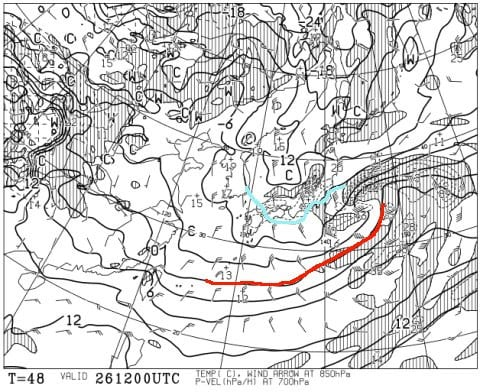
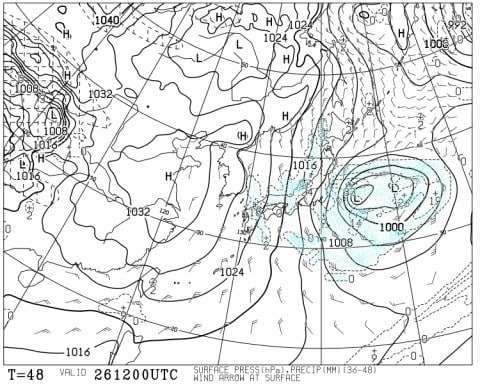
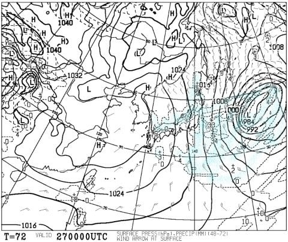
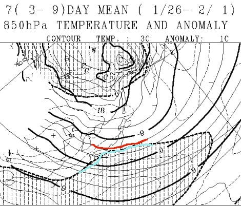
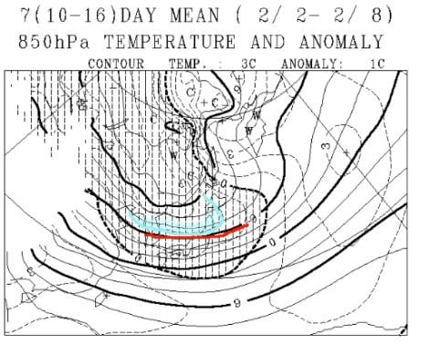
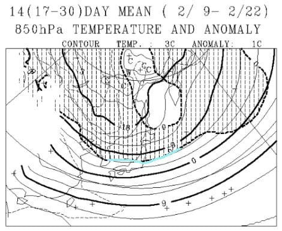
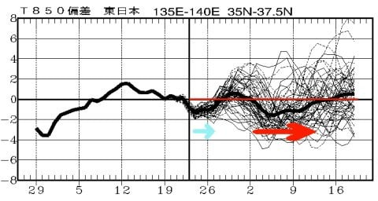

# 2月のスキー場は冷えるのか？1か月天気図を読み解いてみた…そして今週末の志賀高原は，日曜もドサドサ降りそうな感じになってきた！

📅 投稿日時: 2019-01-25 02:26:04

ということで．

昨日の天気予想では．

土曜はドサドサ降って，

日曜は曇り空，降っても小雪がぱらつく程度…

という感じの予想でしたが．

ええ．

変わりました．

27日，日曜の予想が…

まずは，26日夜9時の500hpa図を見てみると．

何じゃこりゃーーー！！！

水色で塗った，-40℃の寒気が志賀にかかってる！

-40℃の寒気が志賀にかかるってのは，

シーズンに1度あるかどうかというレベル．

…これは．降る．

26日は終日降るし．

夜も降り続けますよ…

そして，850hpa図を見ると．

…これも，強烈だわ…

水色の-9℃線が本州をすっぽり覆ってるし．

地上でも雪になる目安，-3℃線は沖縄

近辺まで下がってます．

そして，地上天気図を見ると…

関東を除く，かなり広い領域で降水があるので．

…これは，九州，山陰，四国，近畿でも．

26日は雪が降るってことですね…

で．

この冷えは，27日まで続いて．

さらに，27日朝9時の日曜の地上天気図は…

見事に等圧線は縦縞．

そして，日本海側にはかなりの降水量が

見込まれてますね…

これは，日曜も．

朝は脛パフくらいの，結構深いパウダーが

積もってるかも？？

そして，日曜も昼間はかなり降り続けそう…

だもんで．

土曜だけでなく，日曜も．

一日中パウダーが供給され続けそうです…！

この週末．

土日とも吹雪っぽい天気だし．

寒すぎてスキーには適さないかも…

あと，新雪が嫌いな人にはつらいかもしれないけど．

でも．

最高雪質のパウダーが楽しめそうな予感…！

今のところ．

月曜には雪は弱まりそうだけど…

でも，弱いながらも，火曜までは

雪が降り続けそうです．

月曜朝は，ブーツパフくらい積もるかどうか…

というところ．

うーむ．

先週日曜以降．

ほぼずっと雪が降り続けてますが．

もう少し降り続きそうです…

ってなところで．

暖冬予想にしては予想外の冷え冷えが

続いた，この1月でしたが．

さてさて．

この冷え冷えは，2月になっても続くのか？？

ってのが気になるところ．

だもんで．

月終わりが近づいた時の恒例になりつつある，

一か月予想の読み解き．

今回も，2月の予想を見てみましょうか…．

まずは，1月最終週，1/26～2/1の一週間の

850hpa予想図ですが．

赤色の-6℃線が志賀を横切ってますし．

そして，水色の平年並み気温の線が，

志賀高原のすぐ南にいます．

だもんで．

この一週間はほぼ平年並みの気温．

雨の心配とかはなさそうです…

そして，その次の週．2/2～2/8ですが．

この一週間は…

赤く印した-9℃線が志賀高原にかかってますよ！？？？

一週間平均で-9℃って…かなりの冷え冷えですね．

そして，水色で示したのは，

平年比-2℃の線．

これが志賀高原近辺にあるということは．

この一週間の志賀高原．平年より2℃冷える

ということで．

週平均で-2℃というのは…かなりの

冷え込みですよ…！？？

おそらく．

この週は，かなりの激冷え雪降りの

一週間になりそう…！！

で．

そのあと，2/9～2/22の2週間の予想ですが．

これは，水色で塗った平年並みの線が，

志賀にかかっているので．

平年並みの気温で推移しそうですね．

志賀近辺には-6℃線が通っているので．

この週も，雨の心配などはなさそうな．

志賀高原の2月らしい，平和な冷え冷え

期間になりそうです…

で．

これから一か月の850hpa気温傾向を見ると．

今週末にかけての，水色矢印で記した部分．

冷え冷え吹雪になりそうなこの週末が，

平年より気温が低くなるのが見てとれますが．

その後，2/2～13日ごろにかけて．

赤矢印で示したように，平年より

最大2度ほど低くなる，冷え冷え

祭りになりそうです…！！

という感じで．

2月はほぼ一か月を通じ．

平年並みか，それより低い気温が

続きそうな感じなので．

かなりパウダー率が高そうですよ～！！！

でも．

志賀高原の2月って．

ただでさえ冷えてるので．

これ以上冷えると寒いだけだから．

平年より冷えなくてもいいんだけどなぁ…（本音）

むしろ，3月や4月にこのくらい

冷えてくれれば，シーズンが長くなって

嬉しいんだけどなぁ…

まぁ，2月に何度も雨に見舞われるという，

3シーズン前の暖冬の悲劇を繰り返すよりは，

冷えてくれる方が嬉しいんだけど．

2月だけが意味もなく冷えて．

3月，4月に平年より気温が高くなるという，

意味のない冷え冷え期間の前倒し

という悲劇が起きないよう，

今から祈っておかねばなるまい…

## 💬 コメント一覧

### 💬 コメント by (若杉勲71)
**タイトル**: 志賀高原情報
**投稿日**: 2019-01-25 11:35:42

昨木曜日は40パウダーで、口にパウダーが何度も入ってきましたよ。オリンピック、イチゴン下非圧雪、ミドル。しっかり楽しんで、また虹、じゃなく２時きっかりに終わった規則正しいレインボークラブ員でした。

今日は昨日と全く別世界の圧雪バーン。オリンピックは圧雪の上にうっすら三センチ。三人目に入れたので、悪の心が働いて、幅広く雪に傷を付けてしまいました。ごめんなさい。

GSも整備完璧で、ウハウハ滑っていたのに、魔が差して奥志賀へいったらギャー10分待ち。大した強風でもないのにオモリ・間引き。

10時46分のバスでヤケビに逃げ帰ってきました。やっぱりヤケビはいい。

明日は奥ゴンやばそうですね。

### 💬 コメント by (若杉勲71)
**タイトル**: 志賀高原情報
**投稿日**: 2019-01-25 11:50:11

sさんら現役の人はいいですね。休暇があって。僕ら世間に必要とされなくなった老人には、休暇が全くないんですよ。来る日も来る日も毎日スキー。面白すぎるので、スキーには休暇がないんですよ。なんか他にやることないんだろうか。

ない！

### 💬 コメント by (Goku)
**タイトル**: そろそろ・・・
**投稿日**: 2019-01-25 22:11:11

なんだか今年は暖冬で、３年前の二の舞になるかと心配していましたが、年末からの寒波でほとんど心配なくなりました。

といっても、未だに丸池Ａコースは滑れないし、パーフェクター入口も雪が薄いままなので、いくらでも降ってくれて構わないです(笑)

でも、ちょっと不謹慎ですが、そろそろ一発雨が降ってくれると、硬ーい下地ができて春スキーでの持ちが良くなるのですが・・・

### 💬 コメント by (ほっぽ)
**タイトル**: 1/25　志賀高原
**投稿日**: 2019-01-25 22:52:53

今日はほぼ終日晴れて、絶好のスキー日和でした。

滑走距離や標高差では皆さんにとても敵いませんが、

今日は8:30から一の瀬ペアラストまで乗車して滑りました。

滑走レポートを上げておきました。

今、一の瀬は風が出てきて雪が降ってきたようですが、

まだ車に積もるまでではありません。

銀嶺の社長さんが、今回志賀高原は大雪にならないだろうと

話していたので、信じてみようと思います。

http://www2.tokai.or.jp/nana_hoppo/

### 💬 コメント by (Skier_S)
**タイトル**: 今週末は寒いよ
**投稿日**: 2019-01-25 23:34:45

＞若杉さま

現役の我々は休暇があるのです！

時には休暇が2週間にわたることもあるのです！（涙）

休みの時には，気分転換のために会社に行って，

リフレッシュしてくるのです！

…だから，スキー場で飽きずに朝から晩まで滑れるのです…

＞Gokuさま

今シーズン，意外と冷えましたよね…

でも．

昨シーズンのように．

冷えたけどまったく降らない2月，

異常に暖かい3，4月．

その結果，GWに志賀全滅…

という嫌な思い出があるので．

そうならないように祈っておかないと…

＞ほっぽさま

あぁ…

今日は晴れたいい天気だったんですね…

うらやましいです…

明日からまた雪降りになります．

土曜日の朝は，ニュースで言うほどの大雪には

ならないと思いますが，ブーツパフ～脛パフ

くらいは行くかと…

で．

日曜の朝はかなり積もると信じています！

…なぜなら．

私がディープなパフパフ滑りたいからです…（懇願）

