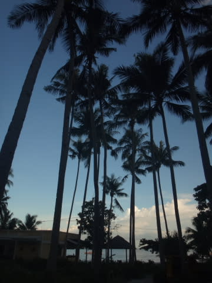

# 2014年8月　オスロブagain…再び，子連れでジンベエザメと泳ぐぞ！　その24

📅 投稿日時: 2014-10-08 02:29:20

🏷️ カテゴリ: [ダイビング日記](ce3a7a8d424d112fce83ee85c81a0e344.md)

えー．

我が家に，こんな感じで．

毎年恒例の，志賀高原のシーズン券

申込書が届きました…

これが届くと，そろそろシーズンインって

感じがしますね～！！！

うーむ．

しかし．

一人2000円値上げか…

夫婦で4000円は痛いっ！！！

なんだか．

来シーズンは，高速の休日割引も30％になったし．

ガソリンも昨シーズンより上がっているし．

いろいろじわじわお財布に効きそうな感じ…

って感じで．

スキーシーズンが近いのに，ダイビング日記へ，Go!

----

という感じで，

街中観光を終えて，ホテルへ戻ってきたら…

もう，日が暮れかける時間．

ホテルに着いて，レストランの前の

ビーチで海を眺めていると…

海の向こうにスコールでも降ったのか．

娘「あ，虹だ！」

沖に泊まっているボートの向こう．

ちょっとだけ，虹が出てました．

そして，虹を眺めていると，

日も暮れていきます…

ただ，砂浜に座って．

空がだんだんオレンジから群青色に

移り変わっていくのを見てるだけで．

なんだか，ゼイタクな気分になれますね～

んで．

日が暮れきったら，

夕食タイム！

今日のジンベエザメに，ビールで乾杯！

今日の夕食には，お魚のグリルと

中華風焼きそばを選んでみましたが…

＃統一感のない組み合わせだ…

中華風焼きそばはイケますね～．

でも，お魚はあまりお勧めできない感じ…

先日食べたスパゲティもゆですぎだったし．

このレストラン，中華が一番はずれが無いかな～．

で．

食後は．

今日も海辺に座り，星を見て過ごしたわが娘．

今日は，ジンベエザメも見て．

きれいなビーチに上陸してお弁当食べて，

お友達とビーチで遊んで．

延々ガイドに引っ張ってもらった，

お姫さまシュノーケリングに，

街中観光…と．

盛りだくさんだった一日．

この，満足の一日を．

ゆっくりと振り返りでもしているのか．

かなり長い時間，一人で静かに．

天の川がきれいに横切る空を眺め続けていたのでした…
