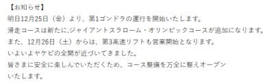
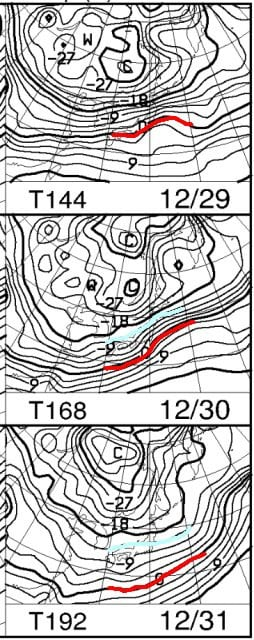

# 12月26，27日の週末の志賀高原スキー場の天気は…26日は朝パウダー＆雪降り，27日は曇りの絶好のスキー日和！

📅 投稿日時: 2020-12-25 01:48:50

🏷️ カテゴリ: [スキー天気予想](c6554f5c3c106093b511a8daae23757e8.md)

ということで．

本日から志賀高原は，西館山上部も

オープンし．

タンネの森のリフトも動き出した

ようですね…

そして，この週末からは

やっと山の神と蓮池も動き出します！

…が．

ただ，ジャイアントと東館，そして寺子屋は

まだいつオープンか案内が無いので．

今週末，まだ全面オープンとならないのかも…？

そして，わがホームゲレンデの焼額は，

ついに明日25日（金）から第1ゴンドラが

動きだし．オリンピックコースがオープン！

…そして，26日（土）からは第3高速が動き出し．

ついに全リフトが動き出します！

（[焼額山スキー場ホームページ](https://www.princehotels.co.jp/ski/shiga/winter/)より）

今晩，今はまだ雪が降ってませんが．

これから明日の朝にかけて20cmほど

積もりそうなので…

ちょいと重めの雪ながら，明日オープンの

オリンピックコースは，いきなり新雪が

楽しめそう…！

…ってなことで．

雪質もよく，積雪にも恵まれ．

期待にあふれる今週末．

果たして，天気はどうなるのか？？

いつも通り天気図を見てみましょうか…

まずは，25日のクリスマスの金曜日．

850hpa気温を見てみると…

志賀高原には，水色の-6℃線が

かかる程度．

激冷えとまではいかないまでも，

そこそこ冷えそう！

そして，地上天気図を見ると…

日本海側に見事に降水域が

かかっていて．

あと，朝鮮半島の付け根から

見事にJPCZに伴う雪雲が一本，

筋状に伸びてますね…

JPCZの伸びる向きを見ても，

極端な西風じゃないので，

志賀高原にも雪雲がかかりそう．

うむ．

26日は終日雪降りですね．

それも，山の上はそこそこ積もりそう…！

で．

26日の土曜ですが…

この日の850hpa図も，水色の-6℃線が

志賀高原にかかる程度なので，そこそこの

冷え込み！

で，地上天気図ではうっすらと日本海側に

水色の降水域がかかってます．

この日は25日ほどではないにしても，

終日雪がぱらつく一日になりそうかな…

続く27日の日曜．

この日の850hpa気温を見ると，

水色の-6℃線はちょい北に行き，

-3℃線が志賀高原にかかる程度なので．

26日よりは気温が上がるものの，

昼間もギリギリ0℃を下回りそうなので，

雪は悪くなる心配はないかな…

この日の地上天気図は…

日本海側にかすかに降水域がかかっているけど，

全体的に緩い高気圧に覆われているので．

曇り～晴れの天気かな…

この日は寒すぎず，時折日も射す

絶好のスキー日和！！

…ってなことで．

まとめると．

25日（金）：終日雪！朝までに積雪20cm．

　ただ，朝の雪は志賀高原にしてはちょいと

　重めかも…

　あさイチの気温は-9℃くらいかな．

　昼間の気温は-4℃程度まで上がるが，

　終日雪降りで風もあり，寒く感じる．

　昼間も雪は時折強く降り，ゲレンデに

　積もっていき，終日うっすらパウダーが

　乗っている感じか…

26日（土）：朝までに積雪15～20cmほど．

　志賀高原への登りは本格雪道なので

　気を付けて…

　非圧雪コースは朝はブーツパフ！

　圧雪コースはやわらか圧雪の上に

　新雪5cmほどかな？

　あさイチの気温は-10℃を下回らず．

　昼間は雪は弱まるものの，終日雪が

　ちらつく天気．

　昼間の気温も-5℃をちょっと上回る程度で

　終日雪質は良さそう…

　だけど雪が柔らかいので，午後のゲレンデは

　荒れて凸凹になっていく．

27日（日）：朝までにわずかに積雪あり．

　圧雪コースはピカピカ柔らか最高圧雪！

　あさイチの気温は-5℃程度．

　昼間は0℃近くまで上がり，寒すぎず，

　そして天気は曇り時々日が射す，

　スキー日和！

　この日も雪は柔らかいので，午後の

　ゲレンデはちょっと荒れ気味になりそう．

…ってな感じでしょうか．

今シーズン，雪の降り始めは遅かったけど．

昨シーズンまでちょくちょく悩まされた，

12月に謎の高温＆雨に襲われるという

悲しい現象はなさそうで．

ゲレンデコンディションは良い状態が

続きそうです…！

で．

週末以降，年末の天気を見てみると．

28日の月曜は，志賀高原には-3℃線が

かかる程度の，平年並みの冷え込みだけど．

…なんだ！？？

この，30日と31日の850hpa気温は…！！

志賀高原に，水色の-12℃線が！！

これ，志賀高原の朝は-15℃くらいの

凍死寸前気温になるってことですけど！？？

…そして，地上天気図を見ると…

30，31日はすごい強烈な冬型で．

むっちゃ降りそうです．

また交通がマヒしかねないレベルの

雪が降るかも…？？

とりあえず．

12月中旬までは，悲しいほど雪が

降らなかったのに．

降り始めるとハンパなく降り続き．

…そしてまた，年末に豪雪レベルの

雪が降りそうって…

繰り返し書くけど．

降り方が極端なんだよ

とりあえず．

今シーズンはしばらく例の踊りは

踊らなくて済みそうです…

## 💬 コメント一覧

### 💬 コメント by (レインボー73)
**タイトル**: Unknown
**投稿日**: 2020-12-25 08:54:41

速報

オリンピックシーズンファーストゲット。誰かの予報通り新雪20センチ。さらさらに底付き。

そのあと１ゴン下の非圧雪、完走ファーストゲット。先踏者はすべて途中でリタイア。へとへとでーす。

### 💬 コメント by (レインボー73)
**タイトル**: Unknown
**投稿日**: 2020-12-25 11:04:05

その後も滑りやすい雪質が維持されています。でも…連日暑かったので一枚薄着をした愚か者には寒さが限界。皆様明日は防寒対策をぜひ！

### 💬 コメント by (かず)
**タイトル**: Unknown
**投稿日**: 2020-12-25 14:34:57

いいですねーftうらやましい  年末のパウダーまでに体慣れればいいかなって感じですよ…

### 💬 コメント by (西舘)
**タイトル**: Unknown
**投稿日**: 2020-12-25 17:24:35

姉妹ゲレンデ（勝手に思ってる）東館と寺小屋もオープンしたのに肝心な山の神がまだ！やっぱり嫌がらせ？

30日から最強寒波襲来ですよね、再び根性の無いスキーヤーふるい落とし機能が働くのでしょうか。（その前に辿り着けるのかしら。しなの止まったらどうしよう。）

### 💬 コメント by (レインボー73)
**タイトル**: Unknown
**投稿日**: 2020-12-25 18:00:00

お借りします。

かずさん、早く出勤してください。都会より志賀高原の方が安全ですよ。誰もがフェイスマスクまたはマスクをしていますし、乗車制限もあります。早く安全な志賀においでやす。

私は28から05まで休場しますが、待ってますよ。

### 💬 コメント by (かず)
**タイトル**: Unknown
**投稿日**: 2020-12-25 21:38:04

今日の夜中出る予定でしたが 疲労で居眠り運転しそうなので明日にします  Sさんとは大違い  同じ年とは思えない…笑 レインボーファミリーみなさん揃ってます？

### 💬 コメント by (Skier_S)
**タイトル**: また明日，志賀高原で会いましょう！
**投稿日**: 2020-12-25 23:49:02

＞レインボー73さま

オリンピックコース，まさにシーズンのファーストトラック，うらやましい…

土曜日オープンだったら某H氏がトップだったと思いますが（笑）．

雪は重めという報告もありましたが，良かったのですね！

＞かずさま

あら…土曜は参戦せずですか．

日曜は新雪が無いのですが，シーズンインだからまぁいい感じの足慣らしかも（笑）．

＞西館さま

山の神，なんとか土曜からオープンのようです…

30日から激烈な寒波です．

あらゆるものが凍る寒波です．

根性が激烈にありすぎるごく一部の特殊体質のみ生き残る，

さらに激しい選択機能が働きそうです．

