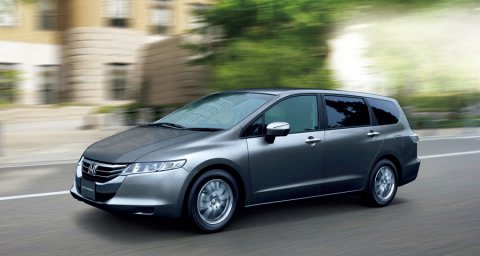

# プロジェクトX…あと2台ある候補車のうち，ひとつは…

📅 投稿日時: 2013-05-24 02:42:07

なんだか．

スキーヤーのブログだというのに．

スキーがメインの話題のはずなのに．

…なぜか，最近プロジェクトXネタの人気が高いようで…

ってことで．

今回もプロジェクトXネタです．

とりあえず．

現在までに候補車として上がったのは，レガシィとアテンザワゴン．

残念ながら，[アテンザワゴンは候補から落選](ebc1539d448d9ca6eccbae60ec5c23ef9.md)しそうですが…

で．

あとの候補車は2台ほどあるのですが．

何があるのかいな，と言いますと．

まず，ホンダのRB3/4オデッセイ．

(ホンダHPより借用)

この車．

7人乗りミニバンのくせに見た目・使い勝手・走り共に

ツーリングワゴンクラス．

意外とよく走ります…

ハイオク仕様のプレミアムグレード，「アブソルート」なら

結構走りますが，そうじゃないレギュラー仕様でも必要十分＋α

ぐらいのパワーですね～．

あと，重心も低く，ロールセンターも比較的高めに設定されているのか

ロールが驚くほど少なく，7人乗りミニバンで下りのコーナリングが楽しめるのは

こいつくらいじゃないでしょうか．

んで．

RB2オデッセイに乗った経験から言えば．

4WDでも高速ならリッター12～13kmは走るという，

意外な高速燃費のよさもメリット．

カタログ値のJC08モードが11km弱ということを考えると，高速なら

だいたいカタログ値以上の距離を走ってくれます…

あ，あと，いざとなったら7人乗れるってのはいろいろメリットがありますね～

＃まぁ，7人乗るのは年に数回程度ですが．

乗ってみると，ホンダが気合を入れて作ったことを感じさせる，

結構できの良い車です…

が．

んでも．

欠点を挙げると．

・結構お値段が高い(涙)…エコカー減税も効かない

・マニュアルシフトモードがついているのは高いグレードのみ

　（私はマニュアルシフトモードを多用するので，これは致命的…）

・デュアルポンプ4駆は，スタック脱出用としては有効だけど，

　雪道を速く走るという目的では…(？）が付く

・先代から車台はキャリーオーバーで，基本設計が10年前とちと古い車．

　今年9月にフルモデルチェンジする，モデル末期の車．

とかがあげられますが…

なによりかにより．

…7年間，RB2オデッセイに乗ってきたので．

ちょっと飽きてる

ってのが最大の欠点かも(笑）．

いい車なんだけど…

モデル末期ってのもあって．

あんまり有力候補ではないなぁ…

## 💬 コメント一覧

### 💬 コメント by (miya)
**タイトル**: Unknown
**投稿日**: 2013-05-24 13:49:27

7人乗りなら「エクシーガ」もありますねー。

トノカバーがつかないですけど。

最後の一つの車はなんでしょうね？？

ちなみに、プロジェクトXばかりコメントしてますが、

冬も夏も楽しんでますよー。

### 💬 コメント by (gokuraku skier)
**タイトル**: Unknown
**投稿日**: 2013-05-24 20:23:57

志賀の下り坂にはマニュアルモードが必須ですね。

できればパドルシフトならば最高かと。

私のは無いので毎回心臓バクバクさせながら下ってます。

### 💬 コメント by (Skier_S)
**タイトル**: 安心して志賀高原にいける車がいいなぁ…
**投稿日**: 2013-05-24 23:48:24

>miyaさま

オデッセイに乗りなれると，エクシーガの2列目，

3列目はちょいとオデッセイより狭く感じるんですよね…

あと，レガシィの60kg以上軽いボディーの

軽快な取り回しと完成度の高さと比べると

「やっぱりエクシーガよりレガシィかなぁ…」

って気になっちゃいます．

最後の一台は…

おそらく予想外だと思いますよ(笑）．

＞gokuraku skierさま

そうなんですよ！

志賀の下り坂，マニュアルモードが無かったら

かなりつらいです．

もう，マニュアルモード必須です．

マニュアルモードの無い車は，それだけで候補から

落ちちゃいます(笑）．

パドルシフトかどうかはあんまりこだわらないんですけどね～

### 💬 コメント by (ひろりん)
**タイトル**: Unknown
**投稿日**: 2013-05-25 00:41:58

ウチのクルマ、マニュアルモードあるんですけどね、Dにいれっぱでも勝手にシフトダウン（たぶん学習機能のせい）します。この辺で3に落としたいなとセレクターに手を伸ばすと勝手に1速落ちる感じ。なので伸ばした手がステアリングに戻ります（笑）

この機能、雪じゃなきゃいいんでしょ、雪じゃなきゃ。

雪道でも勝手にシフトダウンしてロック気味になるので、下りでスパンと後ろが（汗）

なので、アイスバーンが予想されるときはマニュアルモードじゃないと・・・（滝汗）

で、予想外・・・なんでしょ？？？

### 💬 コメント by (Skier_S)
**タイトル**: ひろりんさま
**投稿日**: 2013-05-25 01:15:07

あー．

オートマの過剰介入ですか(笑）．

予想外にシフトチェンジされると怖いかも…ですね(汗）．

雪道で過剰にエンブレが効いた日には，うひょひょ～

って感じかも．

＃FFだと即死？

予想外は…

まぁ，お楽しみに．

＃そんなにすごい予想外ではないかも…

