# 2019/3/24(日)のアサマ2000スキー場は…終日快晴なのに冷え冷え！夕方まで締まったバーンをキープ，とても3月下旬と思えないGoodコンディションっ！！

📅 投稿日時: 2019-03-26 07:43:17

ってなわけで．

昨日夜中に帰ってきて．

そのまま記事を書きかけで机に

突っ伏して寝てしまったので（涙）．

今日は朝に更新！

で．

日曜は，いつもの志賀高原ではなく．

アサマ2000に行ってきたわけですが．

…いや．

この時期にしては，すごいいいコンディション

でしたよ～！！！

まず．

前日はナイターストップまで滑り．

そこから移動する元気もなく，

志賀高原泊まりだったので．

朝6時ごろ志賀高原を出発したの

ですが…

志賀高原の朝6時ごろは．

かなり冷え冷えの雪が降り積もり．

10cmほどの積雪になってますよ…！

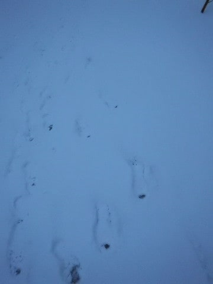

それも，かなり冷え冷えのいい雪なので．

今日の志賀高原．

昨日のアイスバーンから，ゲレンデコンディション

かなり改善しそう…

うーむ．

アサマはアイスバーンだろうから．

アサマに行くのは失敗かな…？？

と，思いながらも．

2時間ほどかけて，志賀からアサマ2000まで

移動したのですが…

アサマ2000の登り坂も，うっすら

積雪がありますね～…

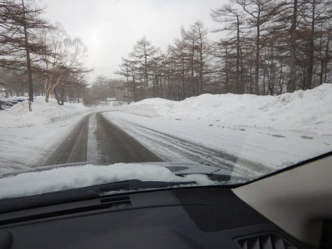

そして，ゲレンデにやってくると．

朝からすっきり晴天っ！！

あさイチの麓の温度計は-10℃を

指しており．

冷え冷えです！

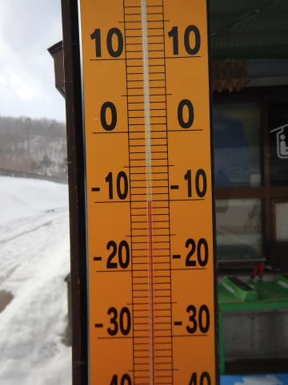

いや，昨晩のうちにうっすら雪が

積もってくれているので．

ゲレンデ状況はそれほど悪くなさそう…！

と．

営業開始前のリフト乗り場に並びますが．

どうやら，私がポールポジションのようで…

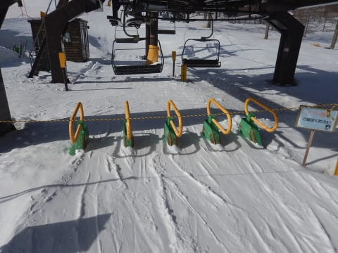

営業開始までに，後ろには結構な列が

並んでました…

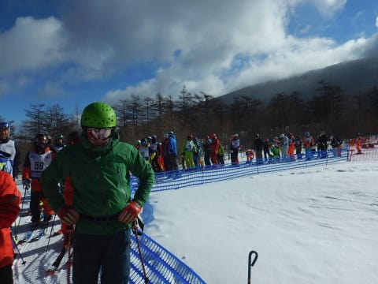

うーむ．

志賀高原の焼額第1ゴンドラなら，

10分前にもうかなりの人が並んでますが…

アサマ2000は，直前まで人が並ばない

ようですね…

ってことで．

前に誰も乗っていない1番搬器に乗ると…

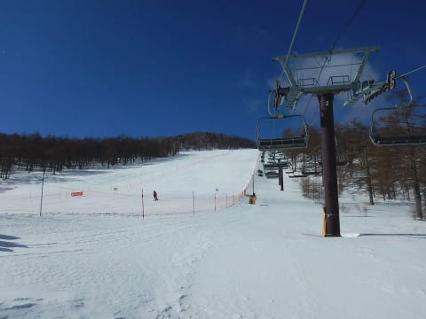

うはーーーー！

ピカピカシマシマのゲレンデ！

もう，早く滑りたい～！！

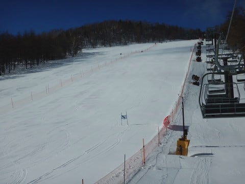

コースの半分が，アサマ技術選で

クローズされてるのが惜しいけど…

でも，すごく気持ちよさそうな

フラットバーンです！

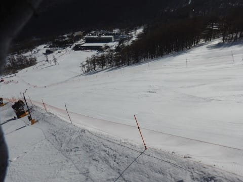

リフトを降りると…

そこはいい感じに締まった，

シマシマバーンがお出迎え！

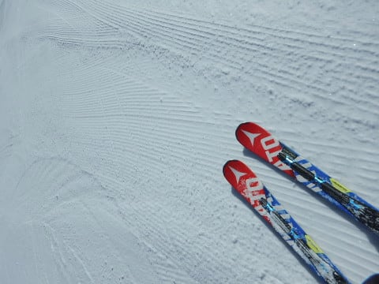

これは…

すごくいい感じに締まった，

硬めなのにエッジがガッツリ食い込む，

超絶快感ハイスピードバーンですよ！！！

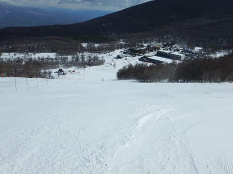

滑れるのはコース半分だけど，

それでもコースは十分な幅．

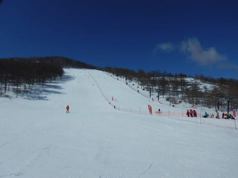

こんな晴天の中，これだけの快楽

バーンを滑れるとは…！

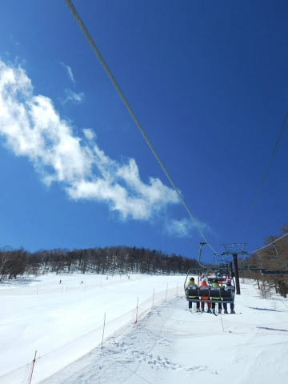

いや，これは気持ちいい！

超絶ハイスピード快楽バーン，

最高！

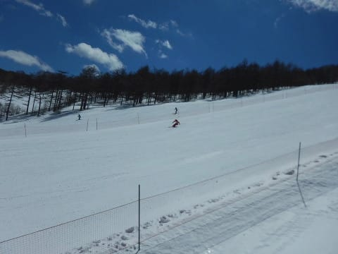

あぁ…気持ちいい．

今日は志賀高原は10cmの新雪だったようで．

それも圧雪後に降ったらしく，

全面パフパフだったようだけど…

パフパフもいいけど，

ガッチリ圧雪された，超絶ハイスピード

快楽バーンも，言葉を失う快感…っ！！！！

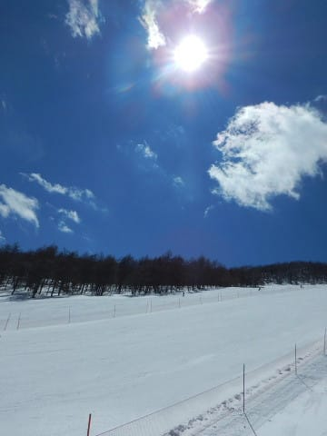

そして．

もう3月下旬なので．

ゲレンデの人も少なく．

貸し切りバーンに近いガラガラ具合！

だもんで．

昼近くになってもまだゲレンデは荒れず．

昼過ぎまで，好き放題大回り可能な

ガラガラフラットバーンを堪能！！

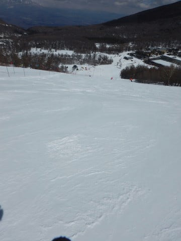

当然，リフトもそんなに待たずに済む，

この素晴らしさ…

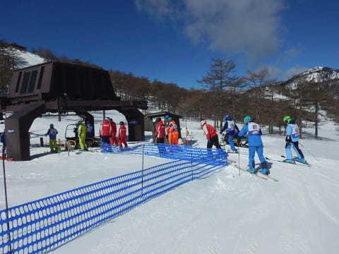

あぁ…

3月下旬で晴天だと．

普通は雪が緩むけど．

今日は昼間でもしっかり氷点下．

こんなに晴れてるのに，

午後になってもしっかり締まった

バーンを滑れる，このシアワセ…

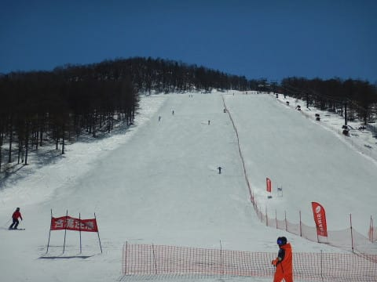

でも．

さすがに午後1時ごろになってくると．

バーンの一部が磨かれて，ちょっと

ツルツルした感じになるところも

出てきて…

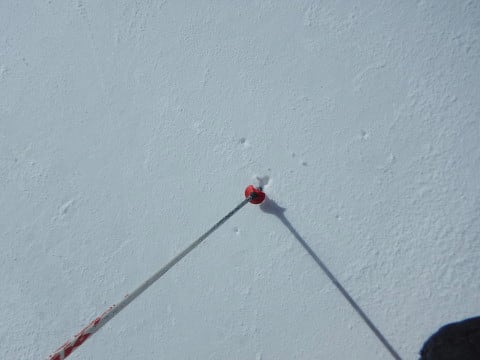

そして，ゲレンデも全般的に

わずかながら荒れ始めてきました．

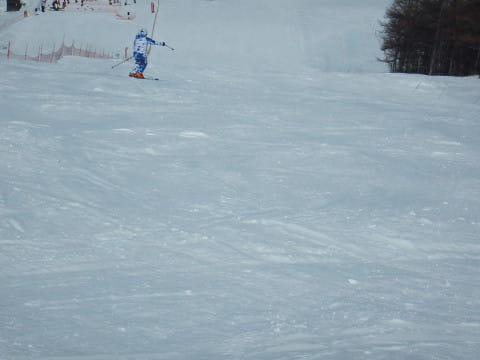

まぁ，まだ全然大回り可能なレベルですが．

ちょっと快感度は下がってきたかな～…

残念…

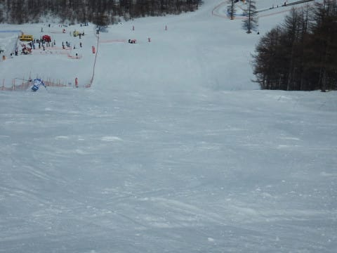

と，思っていた午後2時前．

アサマ技術選が終了し．

大会コートがオープン！！

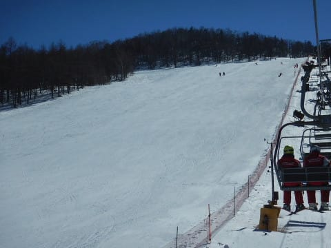

オープンされた半分は…

あさイチの，締まったピカピカ

圧雪バーンの状態をそのまま

キープしているじゃありませんかっ！！

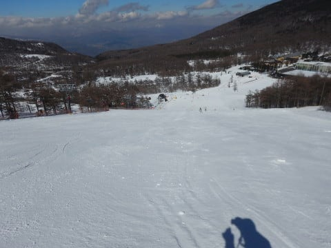

うひょ～！！

また，朝イチバーンと同じ，

最高フラット強烈エッジ食い込み

超快楽大回りバーンが味わえるとはっ！！

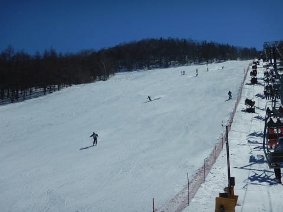

…いや．

朝からコース半分クローズしておいて，

午後の快楽のために取っておくってのも

ありなのでは？？

そして，午後3時ごろになると，

人もいなくなってきましたよ！？？

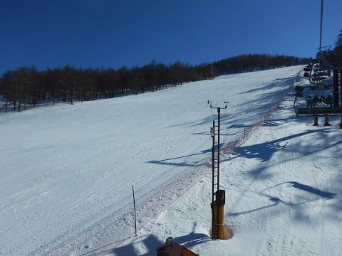

と，1時間半ばかり，快楽バーンアゲインを

満喫しましたが…

さすがに，夕方近くになると．

こちらのバーンも硬い下地が出てきて…

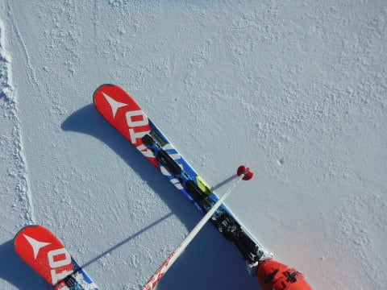

全体的に荒れてきちゃいました（涙）

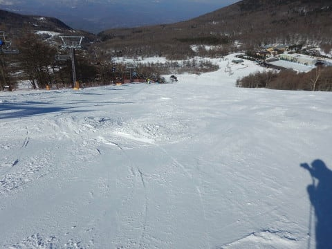

でも，ボーナスのような快楽バーンを

午後も滑れて．

超満足！！

荒れてきたSTAGE2を離れて，

STAGE3を滑ってみましたが…

こちらは滑る人が少なかったからか．

夕方になってもいい感じに締まった，

フラットバーン！

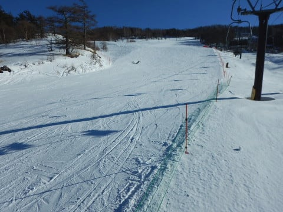

いや…

3月下旬の午後でこれだけいいバーンって…

それも，晴天ピカピカの中，終日こんな

いいバーンを滑れるって…

恵まれている．

今日は恵まれている…

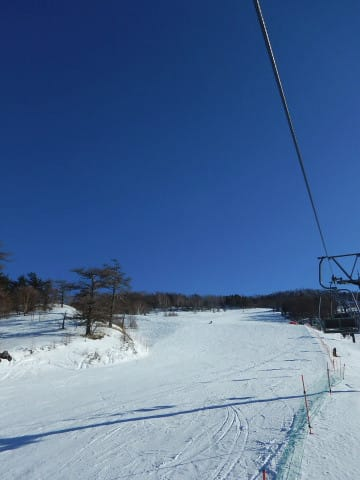

ってことで，最後は4:30まで営業の

STAGE2に戻ってきて．

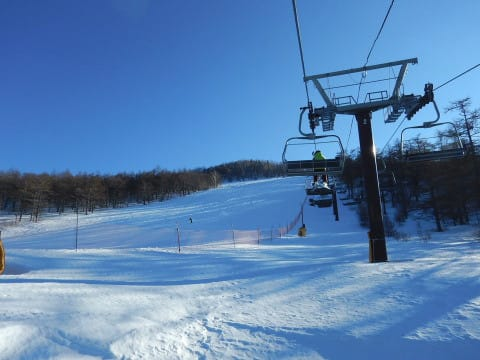

日が暮れるラストリフトまで，

しっかり滑り倒してきたのでした…

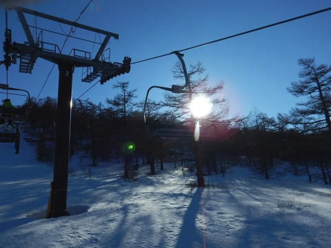

いやーーー．

良かった．

今日は良かった…

で．

今週末，30,31日も．

なんだか，平年よりかなり冷える

予想になってきてますね…

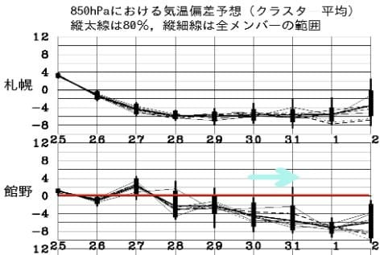

うむ．

意外とこの週末もいい感じかも！？？？

## 💬 コメント一覧

### 💬 コメント by (かず)
**タイトル**: Unknown
**投稿日**: 2019-03-26 10:52:57

Sさんすみません  こちら使わせて下さい   今週木曜日から検討中です  特派員の方にお聞きします先週のアイスバーン現在どんな状況でしょう？

### 💬 コメント by (Goku)
**タイトル**: 大好きです
**投稿日**: 2019-03-26 23:10:16

アサマ２０００の雪大好きです♪

めちゃくちゃ硬いんだけど、エッジはしっかり喰いつくんですよね～。

来シーズンは試乗会行こうかな。

### 💬 コメント by (しんちゃん)
**タイトル**: Unknown
**投稿日**: 2019-03-27 01:53:01

今年も試乗レポート楽しみにしています(^^)/

### 💬 コメント by (Skier_S)
**タイトル**: 火曜の志賀も良かったようです
**投稿日**: 2019-03-27 03:29:27

＞かずさま

私のLINEに入ってきた志賀高原特派員のレポートによると．

午前中は締まった圧雪で最高．

昼過ぎには，+5℃まで気温が上がり，

GSコースの下半分はかなり緩んだようです…

＞Gokuさま

アサマ2000，基本的に硬いんですが．

いいバーンですよね…

今シーズンは最高のコンディションで試乗できましたよ～！

…でも．

普通なら3月下旬なので，結構雪は緩んでますが…

＞しんちゃんさま

試乗レポート，来週くらいからスタート予定です！

しばしお待ちを…

