# 子連れコモドダイビングクルーズagain　その33　サザンスターのラストナイトは更けて行く…

📅 投稿日時: 2011-10-08 00:47:34

🏷️ カテゴリ: [ダイビング日記](ce3a7a8d424d112fce83ee85c81a0e344.md)

私のスキーシーズンインの予定も決まったことだし．

そろそろスキーシーズンへのモードチェンジをしなくちゃいかんなぁ，

…と思いつつ．

コモドクルーズレポートもあと3回ほどで(ようやく)終わりそう．

＃その50は行かずに済んだ…

＃でも．そのあと．石垣レポート書くのかな？？←誰も期待していないって…

ということで．

コモドレポート続きます．

-----------

さて．

コモドドラゴン見物を終えて．

本船に戻ると，おやつタイム！

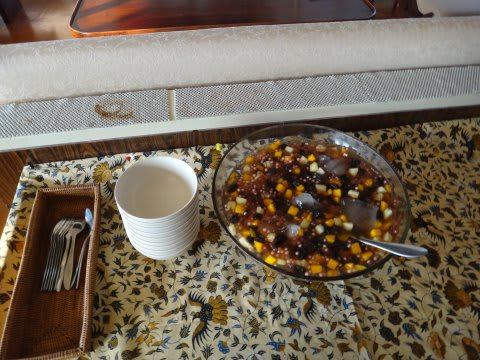

ナタデココですか．

結構おいしく，娘もバクバク食べてましたね～

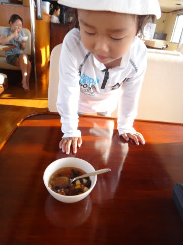

おやつを食べていると．

夕日が沈み…

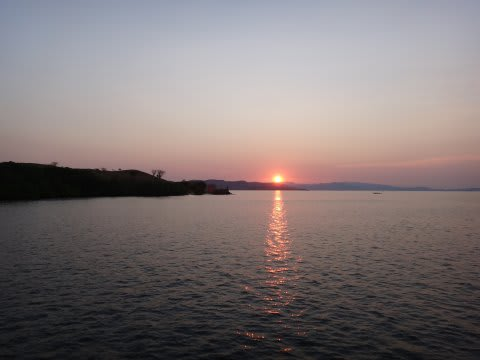

その夕日の横では…

そうです．

サザンスターラストナイト恒例．

船上バーベキューの準備が進んでます．

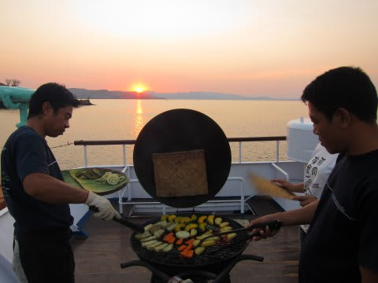

炭火で焼かれるおいしそうな食材たち…

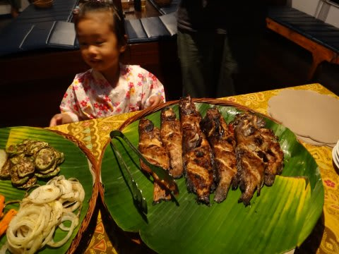

日が暮れたころ…

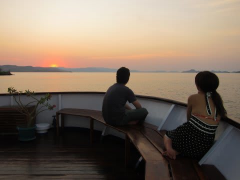

みんな集まって，バーベキューディナーの始まり～

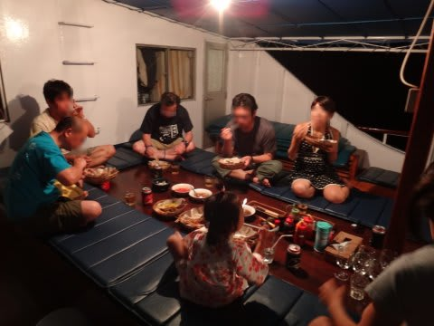

うーむ．

海の中で見たお魚さん．

こんな姿になってしまって…

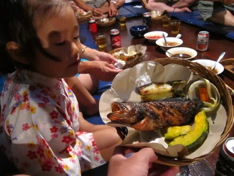

娘は相変わらず，なぜか両手にサテを持って交互に食べてます．

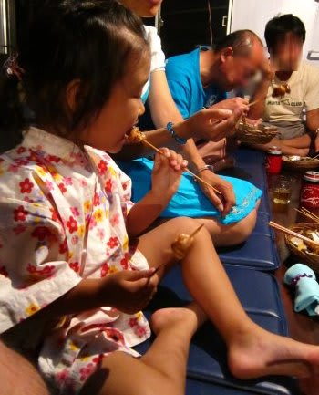

[去年と全く同じ](e501b475baea9ae9663424fd4c950b133.md)食べ方だね…君は．

んで．

食事がある程度進んだところで．

ボートスタッフがいっせいに現れて．

歌と音楽が！

あれ～

これ，去年やってなかったんだけどなぁ．

今年から復活したんだ…

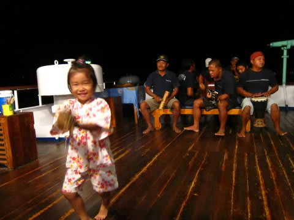

音楽を聞いて，我慢できない娘はたまらず踊りだしてます…

んで．

ボートスタッフの奏でる音楽と歌をBGMに．

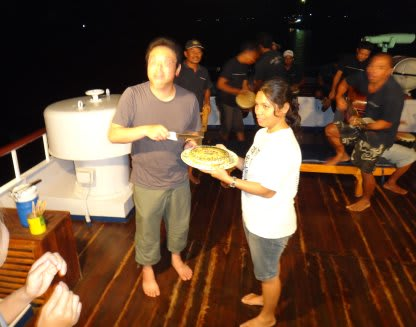

100本記念おめでとうケーキが登場！

みんなで記念ダイブを達成したゲストを祝います．

うーむ．記念ダイブ，祝ってもらえるなんてうらやましいなぁ…

私の100本記念ダイブは妻と二人きり，セルフで潜った1本

だったので，誰も祝ってくれなかったし．

300本記念ダイブをやったショップでは，

「すいません…うちではそういう記念イベントやってないんです」

って感じだったし．

唯一，200本記念でTシャツをもらった，っていうだけで．

みんなに祝ってもらった思い出ないんだよなぁ…

(遠くを見る目)

で．

ケーキが出た後も．

音楽とパーティーはしばらく続き．

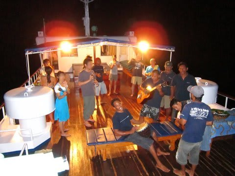

パーティーが終わっても．

明日はダイビングがないという気楽さからか，

ラストナイト恒例，リビングでくつろぎながらの

深夜までのだべりタイムが続いたのでした…

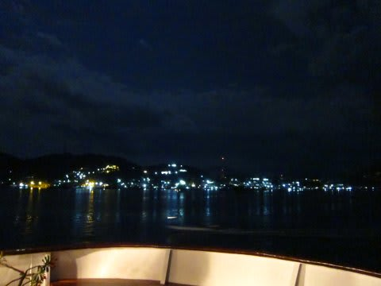

(深夜，帰港地のラブハンバジョーへ入港するサザンスター号）

## 💬 コメント一覧

### 💬 コメント by (KENKEN)
**タイトル**: 石垣島レポートも期待しております。
**投稿日**: 2011-10-09 22:44:42

＃座間味に続きコモドレポートを楽しみに拝読しております。

＃特にお子様に振り回されるSkier'S様の様子に和ませて貰ってます。

＃本当はコモドレポートが終わってからと思っておりましたが、石垣レポートが無くならない様、期待している旨をお伝えしたく早めにコメントさせて頂きました。

＃我が家は結局今年は西表しか行けませんでした。(まだあきらめていないのですが・・・難しそうです）

＃来年はSkier's様に負けぬ様２回程度は沖縄へ、1回の海外(出来ればコモド？)を目指すつもりです。

### 💬 コメント by (Skier_S)
**タイトル**: 石垣島レポートは…
**投稿日**: 2011-10-09 23:50:54

石垣レポートですが，おそらく簡易版になるかと…

実は，妻と子供を置いて一人で行ってしまったので（ひどい父親)．

私も今年はバブリーに沖縄2回も行ってしまいましたが，例年は沖縄1回，海外1回です．

ぜひ，また休みを取ってコモドに行ってください！

…でも，コモドは確か10月末～11月頭で終わりだった気が．

