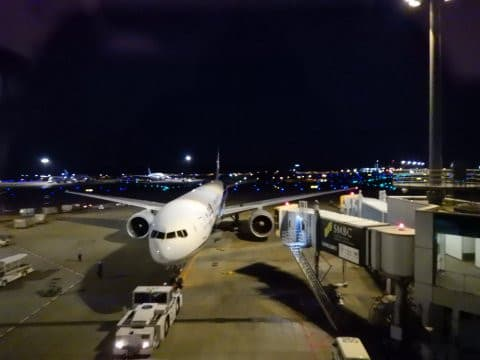

# またもや某国へ出張

📅 投稿日時: 2019-11-17 17:34:26

🏷️ カテゴリ: [日記](cc4b5682fb7b8b144980957a978653fb0.md)

えー。

日本滞在、中6日にして。

また某国へ海外出張です(涙）

現在、飛行機出発待ち中ですが。

これからフライト8時間+乗り継ぎフライト3時間(泣）

しばらく、更新時間がいつもと違ったり、

更新がなかったりするかもしれませんが、

「あぁ、忙しいんだなぁ」

とでも思って、許してやってください。

しかし。

日本滞在中6日で、

平日5日間仕事に行っているというのに。

ちゃんと2日スキーに行っている自分を

褒めてあげたい…

では、行ってきます

## 💬 コメント一覧

### 💬 コメント by (Goku)
**タイトル**: Unknown
**投稿日**: 2019-11-17 21:26:28

留守中に私が志賀に雪を降らしておきますので、帰国したら熊の湯で待っていますね。

お気を付けて行ってらっしゃい。

### 💬 コメント by (しんちゃん)
**タイトル**: お気をつけて
**投稿日**: 2019-11-17 22:16:35

過酷な毎日ですね。ホントに称賛致します。

某国から、スマホで寒波を引き寄せておいてください。

帰国したら、白い世界で心も体も癒せるように(笑)

### 💬 コメント by (naoちゃんねる)
**タイトル**: Unknown
**投稿日**: 2019-11-17 22:31:48

「日本滞在中6日で、平日5日間仕事に行って 2日スキー」

…って、計算合いませんから～😵

行ってらっしゃいませ！

### 💬 コメント by (Skier_S)
**タイトル**: 某国到着
**投稿日**: 2019-11-18 11:55:43

＞Gokuさま

残念ながら、帰国が23日の土曜夜で、24日は早めに

家に帰らなくてはならない用事が出来てしまい、

この週末に熊の湯にいけなくなりました…(涙）

24日にさっくりYetiで滑ってます

＞しんちゃんさま

もう、帰国したらスキーすることだけを心の支えに

こちらでの過密日程を乗り越えます…

明日からの日程を考えるとゲンナリします（涙）

＞naoちゃんねるさま

そのうえ、さらにタイヤ交換までしてますから(笑)

