# 2025/5/5(月・祝)，GW4連休3日目の志賀高原は…朝は結構冷え冷え！晴れ～薄曇り，緩斜面で多少滑りが悪いけど雪は比較的滑ったよ

📅 投稿日時: 2025-05-05 21:13:18

🏷️ カテゴリ: [2025スキー滑走日記](cacd3fbf84d4a679ee61a5894c3f95e14.md)

ってなわけで．

中2日で志賀高原へ舞い戻り．

今日も志賀で滑ってました～！！

…今日は結構楽しめた一日でしたよ～！

まず…

完全徹夜は避けたかったので，2時間弱ほど

寝てから家を出たものの．

寝たんだかなんだかわからない状態で

家を3時前に出て，何とか寝ずに頑張って

運転して，7時前には焼額のゴンドラに

乗ってました～！！

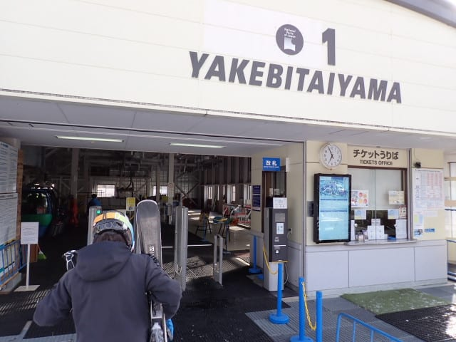

早朝営業開始から1時間近く経ってた

けど…

山頂の気温はマイナス！！

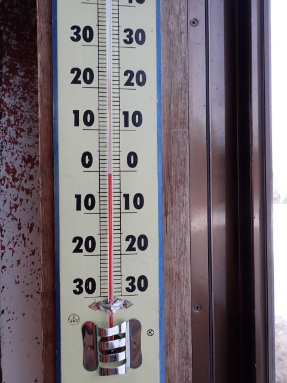

そして，天気はいい感じの晴れ！

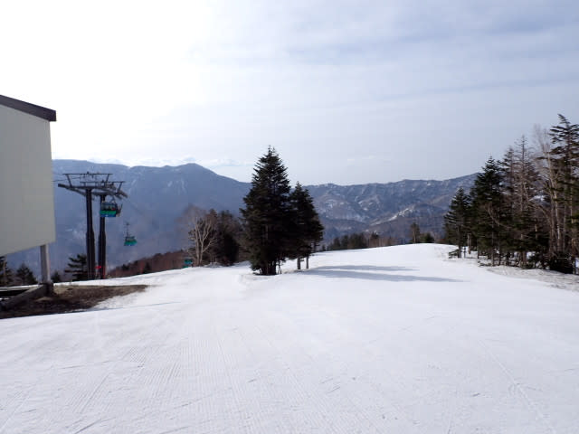

晴れてるのにバーンはかなり硬く締まって，

営業開始後1時間たっているのに，まだ

シマシマが残ってますよ…！！

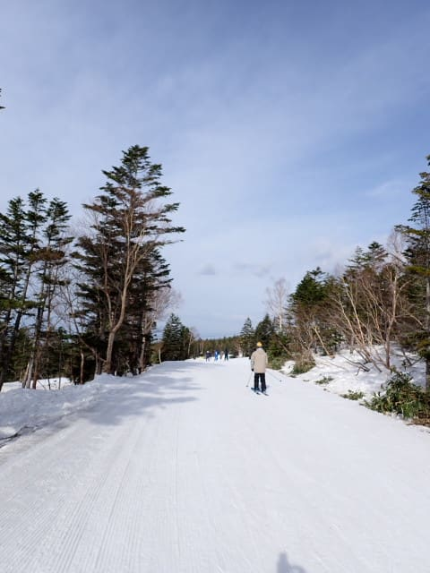

これ，朝イチは硬すぎてかなり手ごわ

かったんじゃないかな？？

7時ごろは硬いのにエッジが効いて，

ちょうど滑りやすくなってきたころで，

絶妙なタイミングでの到着だったのかも？

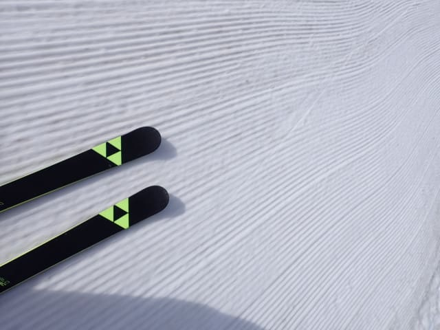

営業開始1時間でもこんなバーンを滑れるん

だから…

今日の早朝はかなりいい感じ！！

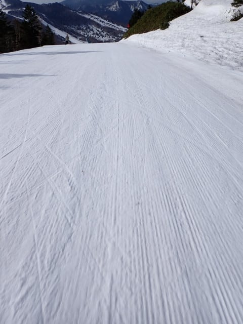

8時過ぎくらいまで，シマシマがところどころ

残る，いい感じに締まったバーンを滑れて．

いやーーー．今日は無理して朝早くに来た

甲斐があったというもの…（感動）

さすがに晴れの日差しがあったので，

朝9時ごろには，日差しが良いバーンは

ちょいと緩み始めてきたけど…

まだ下地はしっかりしていて．

5月の晴れの日で，9時ごろまで

ユルユルにならず，締まり気味のバーンを

滑れるってのは恵まれてますね…！！

今日は4連休なので，さすがにGWの谷間の

平日より人は多めだったけど…

でも，ゴンドラ待ちのピークでこの程度で，

相変わらずガラガラだし．

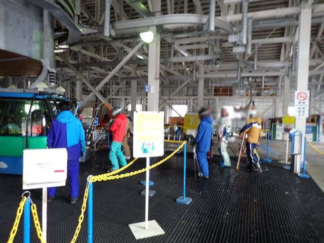

バーンは無人貸し切りではなかったけど，

それでも混雑はこの程度でしたね…

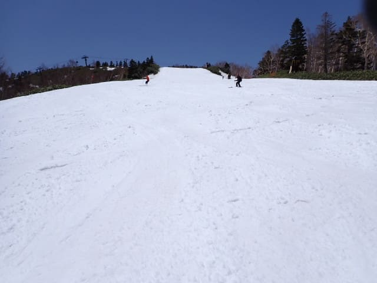

さすが11時ごろには雪は完全に緩み，

表面に汚れも浮き始め，緩斜面は結構

滑りが悪くなってきたけど…

ストップするほどの雪じゃないし，急斜面は

問題なく滑れる雪だったし．昨日滑った人に

よると，昨日よりずっと板は走る雪だと

いうことで，

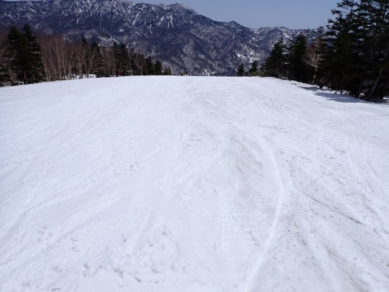

硬めのバーンが朝遅めの時間まで続いたので

バーンの荒れも遅く，昼頃まで大回り板で

滑れるレベルでしたよ～！！！

午前中は結構楽しめました…！！

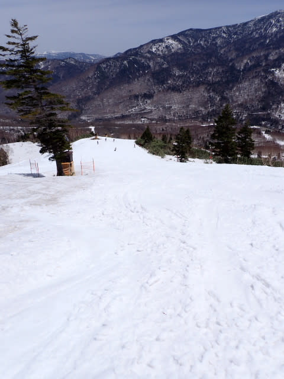

そういえば．

金曜日の雨や，その後の高温の影響で，

GSコースはかなり雪が薄くなってきた…

という特派員レポートがありましたが．

ゴンドラをくぐるあたりのコースの端に

こんな感じの土が1か所出てきている

程度で．

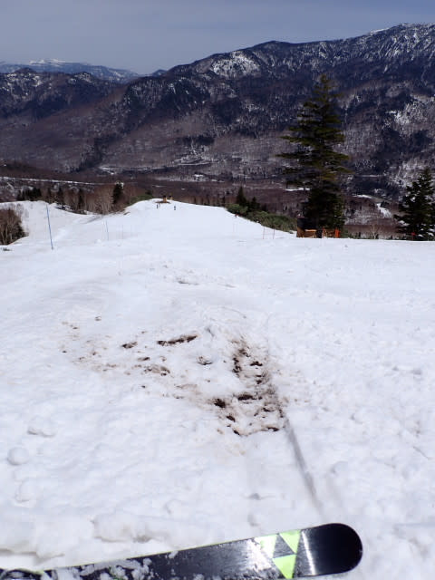

それ以外はかなりしっかりコース整備

されて復活したようで．

いつもならもう一部狭くなりはじめる

GSコースの上側も…

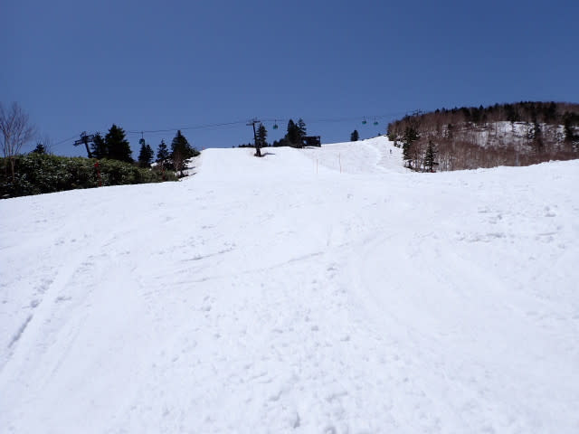

ところどころ地面が出てくるGSコースの

下側も．

見ての通り完全真っ白でした！！

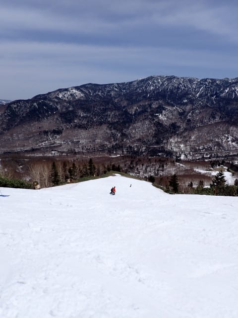

これで，明日営業終了というのが信じられない…

もったいなすぎる！！

そして．

パノラマコースの脇のコブライン2本も

まだ残っていて，コブ溝にもまったく

土が出てくる気配はないし．

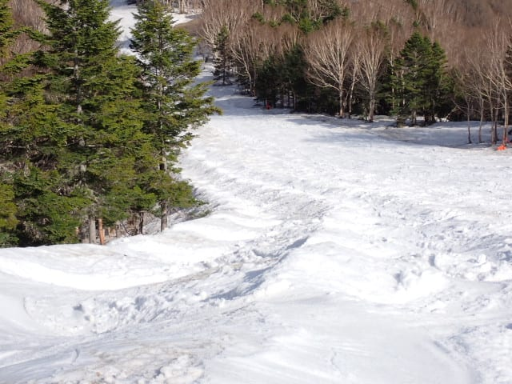

サウスコース脇のコブラインも健在で，

まだまだブッシュのかけらもなく

大丈夫でしたよ～！！

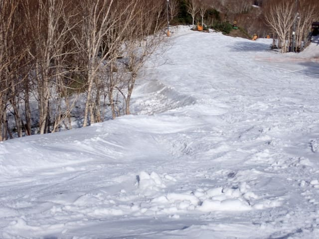

ってなことで．

明日営業終了と思えないほどまだ雪が

たっぷりある本日．

日差しが強かったわりに，気温が低かった

のか，午後になってもそこまでひどい

ストップ雪にならず，緩斜面の滑りが

多少悪いところがある程度で…

むしろ夕方近くに日が傾きだすと，

板の滑りは回復していく方向に！！

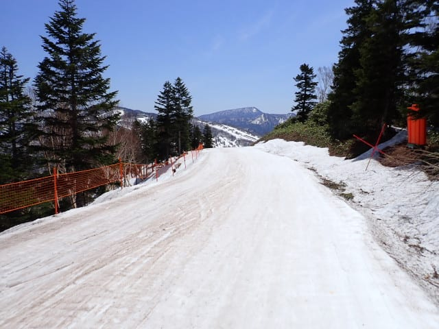

さすがに営業終了のころにはバーンも

かなり荒れてきたけど．

それでもひどいコブになったりせず，

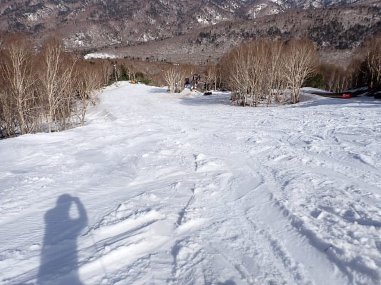

そして，板の滑りも5月の晴れの日とすれば，

夕方ラストまで結構良かったので…

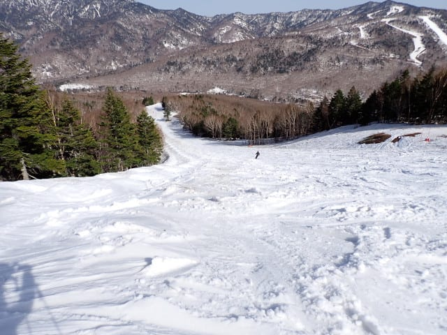

今日も朝7時前から15時半の営業終了まで，

また昼休みも全くとらず，ひたすら滑り

続けたのでした…

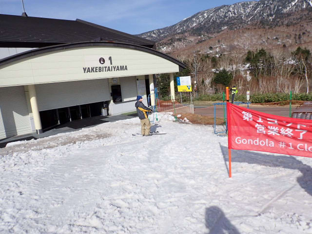

いやーーー．

GWの中でも結構いい一日だったんじゃ

ないかな…

こんな日があるから志賀高原はすごい！！

うん．

今日はいい日だったな．

…いい日だったし，朝7時といつもより

1時間滑り出しも遅かったから，

まだまだ滑りたいな…

…ってな場合は．

そうです！

16時半まで営業の一ノ瀬へ，ワーープ！

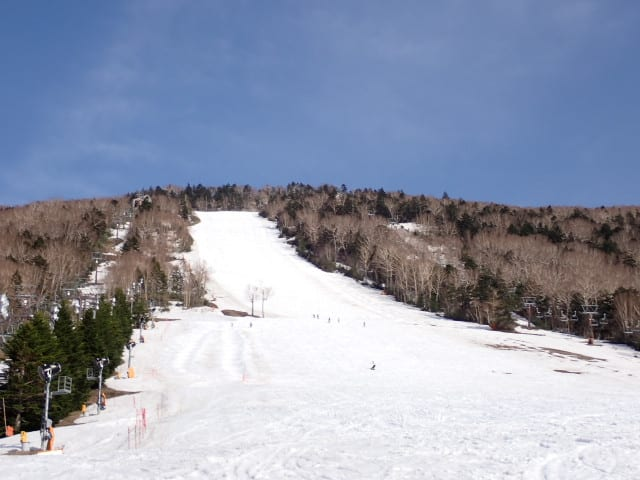

…しかし．

西向きで朝日が当たらない一ノ瀬正面バーンは，

昼頃までは焼額より雪がいいけど．

午後は逆に西日が当たって，雪がかなり

緩んで重くなっていて…

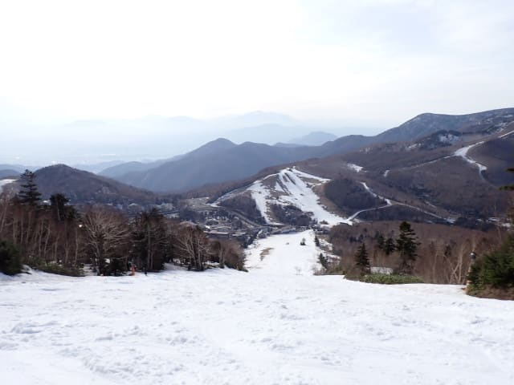

この雪の重さで，これだけあれた急斜面は，

かなり手ごわい…！！（泣）

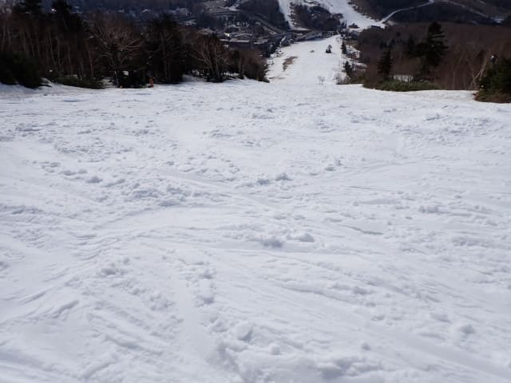

そして，途中に一部ブッシュが顔を出している

ところも数か所…（涙）

真っ白に見えて，まだまだいけそうに見える

正面バーンだけど．

実際は結構ぎりぎりだったのか…

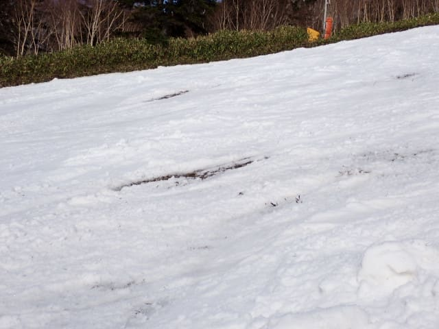

当然，パーフェクターコースは

もうクローズで滑れないし．

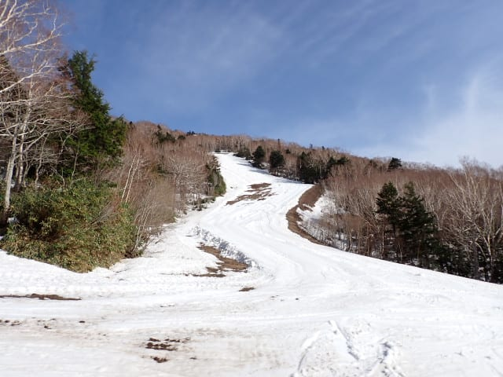

パノラマコースもあんまりおもしろく

ないので…

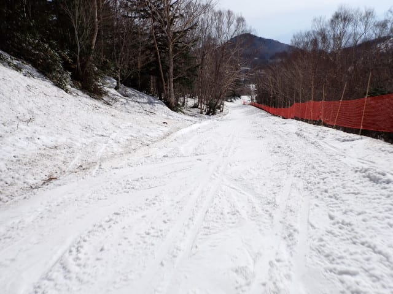

高天ヶ原に行ってみますが．

…一ノ瀬から高天ヶ原へ移動する

タンネの森のコース，一部ヤバい

ところが…（泣）

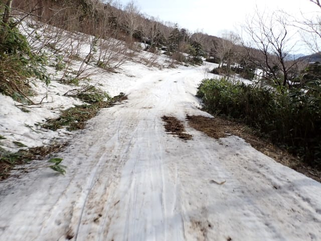

ってなことで，高天ヶ原に来ましたが…

先週まで真っ白だったモーグルバーン，

もう全然だめですね…（涙）

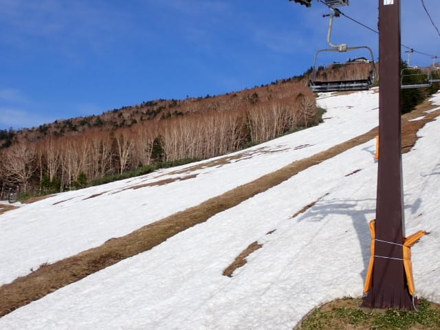

でも，高天ヶ原のメインバーンはまだまだ

いけますよ！！

さすがに午後4時半ともなると，かなり荒れて

ましたが…

ってな感じで．

今日は16時半の終了まで，一ノ瀬ファミリーと

高天ヶ原を滑ってました～！！

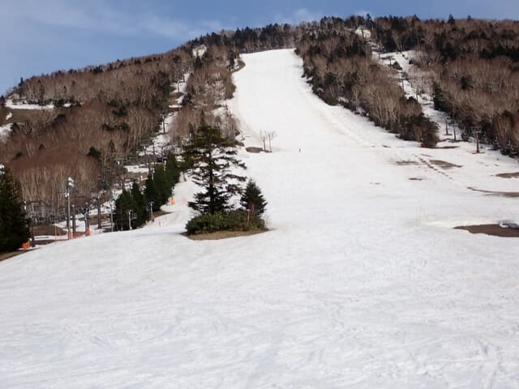

とりあえず．

GW4連休の3日目ですが．

焼額は明日で終了と思えないほどいいコンディション

ですよ～！！

…ただ．

やっぱり明日は，運が悪いほうの朝から

雨になりそうな予感…

運がいいほうの予想が当たって，昼過ぎまで

雨が降りませんように…（祈）
