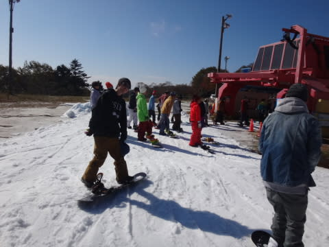

# 2016シーズンオープンの翌週のイエティは…午後は曇ったけど，空いてたよ

📅 投稿日時: 2015-10-24 22:30:17

ということで．

本日も，予定通りYetiに行ってきたわけですが．

すごくいい天気で始まった本日．

いやー！

快晴っ！

うーむ．

昨日，「土曜は雲が出るかも…」と書いた予想，外したか…

まぁ，うれしい方向に外れているから，いいか！

って感じで，快晴の下，滑り始めますが．

晴天にもかかわらず，人はかなり少なく．

うむ．

今日も，先週と同じく．

午前10時を過ぎても，リフト待ちは少なく．

快適ですね～．

ただ…

日差しが強くて．

雪がちょいと緩み気味なのが，ちと残念かな．

でも，快晴の中，コースは人も少なく．

朝のうちはかなり快適！

富士山もすっきり見えて．

リフトからは紅葉も眺められ．

いや～．

これ，半そでTシャツでもいいくらい，

ポカポカ陽気で．

富士山眺めながら日向ぼっこしたら，

気持ちいいだろうなぁ～…

って感じの，かなり恵まれた午前中をすごし．

んで．

昼になっても，コース上の人は少なく…

リフト待ちも，せいぜいこんな感じ．

それなのに，クワッドと平行にかかっているペアリフトまで

動かしてます…

スキーを脱ぎ履きしないと乗れないペアリフトには，

誰も乗ってません（笑）．

いやー，快適じゃ…っ！！！

と，喜んでいたけど．

さすがにポカポカ陽気と強い日差しで．

昼頃には，ちょいと雪がヤバ目の場所も…

そして．

昼を過ぎたあたりで．

昨日

土曜は雲が多少出るかも知れませんが

と，私が書いた通り，←ちょっと強調しておくところ

午後はちょいと雲が増えていき…

あれれれ？

なんだか，気温が急降下したような気が？？

Tシャツでも十分だったけど，ジャケットを着ないと寒いかも？

ってくらい，一気に気温は急降下し．

そして，コース上には時折ガスが流れるような状況に…

結局，この日は午後3時ごろまで，リフト待ちはそれほど

長くはならなかったものの．

午後は時折ガスも出るような，曇り空の寒い状況となり．

…暖かくてすっきり晴れの午前中と，寒くてガスっぽい

午後という．

午前と午後で全く天気がコロッと変わってしまった

一日だったのでした…

明日はすっきり晴れるはず！

ってことで，明日も滑ってます～
