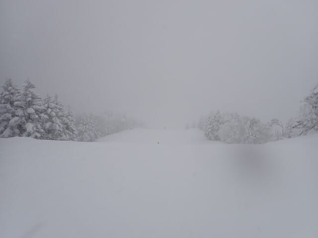
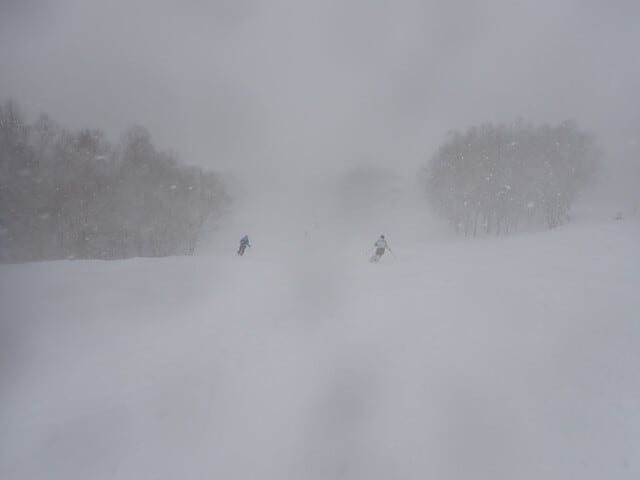
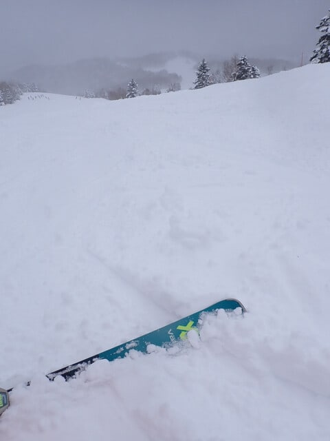
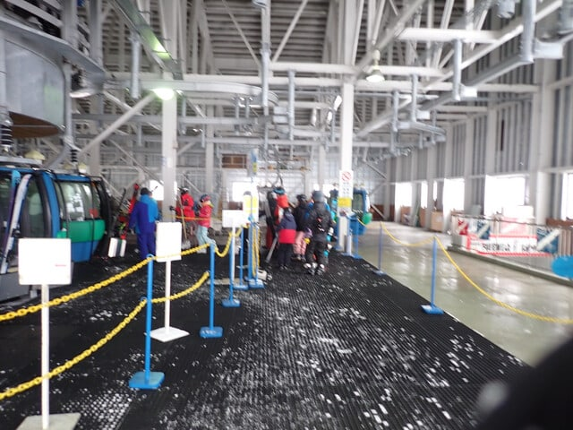
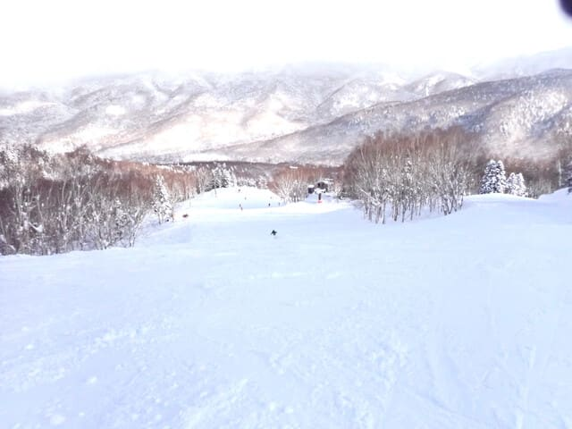
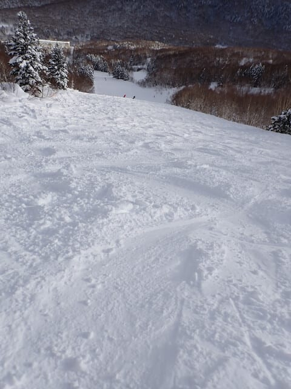
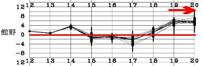

# 2025/1/13(月・祝)，3連休最終日の志賀高原スキー場速報レポート！…朝はかなり激しい雪．午後は晴れていったけどバーンはボコボコ．

📅 投稿日時: 2025-01-14 01:52:42

ということで．

3連休最終日も，しっかりラストリフト

まで滑ってきました…

だもんで，今日も帰宅が23時ごろで，

スキー板手入れだとかお風呂だとか

やっていると，いつも通り深夜1時

過ぎ…(泣)

だもんで．

今日も速報モードにて，本日の

志賀高原レポートです！

えー．

まず．

朝はかなり気合の入った本格雪降りで

スタートですね…

はい．

予想外しました．

外しました．

ええ，外しましたよ～！！（やけくそ）

朝は晴れているかも

というところも、

しっかり圧雪されたシマシマバーン

というところも、見事に外してますね…（涙）

だって…金曜の予想天気図だと，朝は

西風だと思ったんだもん．

…でも、土日の2日間は予言レベルで

当てたし、金曜段階の天気図から

今日の天気図は変わったので、

許して…←言い訳してる

でも，見事に北風になったらしく…

それもリフト開始直前くらいから

ガン降りの雪でしたね（泣）

もう，朝の1-2時間であっという間に

雪が積もっていくほどの激しい降りで，

午前中だけでコース上は20cm近い

新雪が積もりました…！！

天気が悪く，視界も悪いというのと，

3連休最終日ということもあり…

今日は帰っちゃった人が多いのか，

ゴンドラもリフトもほとんど混まず，

終日ガラガラでした…！！

で．

昼頃には雪もやみ．

午後2時近くには晴れ間も出て，

天気は回復していきましたが…

でも．

コース全面，午前に20cm積もった雪が

蹴散らされたボコボコバーン（涙）

ホントにどこに行ってもボコボコです…

ってなことで．

天気予想も外すし．

午前は視界が悪いガン降りの雪，

午後は天気が回復したけど全面

ボコボコ荒れ荒れの疲れるバーンと，

ちょっと残念な感じの3連休最終日

だったのでした…

でも．

まぁ，雪質は良かったし．

全く混まなかったし．

午後は日も射したし．

最悪というわけではなく，

それなりに楽しめましたよ～！！！

そして．

これから15日の水曜と17日の金曜は

雪が降りそうですが…

その後…

うむむむむ！！？？？

なんだこれは…っ！？？

うーん．

今のところ19日の日曜は晴れそうなので，

気温が高くても雨が降る心配は

なさそうだけど…

20日は何か降るかも．

まぁ，今のところ，志賀の標高なら

固体でいてくれそうだけど．

あまりこれ以上気温が上がる予想に

ならないことを祈っておいた方が

良さそう…

まぁ，大丈夫だとは思いますが…

うん．たぶん大丈夫なはず…

ってなことで．

明日元気があれば，また今日の志賀高原の

詳細レポートやります～！

## 💬 コメント一覧

### 💬 コメント by (富山県民)
**タイトル**: Unknown
**投稿日**: 2025-01-14 06:37:51

こんにちは。

三連休は志賀高原を堪能されたのですね。

1月13日の志賀高原は雪だったのですね。

私は1月13日には地元のイオックスアローザに行きました。

イオックスアローザは朝は雪でしたが昼前から晴れてきました。

イオックスアローザは晴れた日は砺波平野の散居村の景色が美しいです。

運が良ければ遠くに立山連峰も見えます。

またイオックスアローザはナイターの規模が大きくナイターでゴンドラが使えます。

日本でナイターでゴンドラが使えるスキー場は私が知ってる中ではイオックスアローザとみやき蔵王えぼしとニセコグランヒラフです。

ちなみにイオックスアローザは富山県南西部の南砺市の医王山の東側に位置していて石川県との県境近くにある富山県最西端のスキー場です。

富山県では立山山麓スキー場に次ぐ規模で富山県で唯一ゴンドラがあるスキー場です。

過去には立山山麓スキー場にもゴンドラはありましたが廃止されてしまいました。

### 💬 コメント by (愛読者)
**タイトル**: Unknown
**投稿日**: 2025-01-14 18:11:36

質問があります。Ｓさんは、志賀高原への行き帰り休めていますか?食事を抜いていませんか?土曜日は、早朝3時半にお家を出て8時半に、1ゴン前に出現。日曜日は、ラストまでいて自動車も洗って23時には、お家に着いている。すごい。どこかで時空を越えないと無理に思えるのですが、、、。

### 💬 コメント by (地元民)
**タイトル**: Unknown
**投稿日**: 2025-01-14 21:28:39

13日の午前中の雪、里もすごい降りでした。でも、小布施まで。須坂、長野はほとんど降らなかったみたいです。小布施は除雪車出たらしいですよ。

信濃町、飯綱町方面から雪雲が進入したみたいですね。

そういえば、信濃町、飯綱町、小布施町、中野市が大雪警報。飯山、野沢温泉はたいしたことないっていう降雪パターンが、過去にもあったな🤔

### 💬 コメント by (Skier_S)
**タイトル**: 3連休後の仕事が辛い
**投稿日**: 2025-01-15 02:08:03

＞富山県民さま

12日に糸魚川シーサイドバレー，13日はイオックスアローザですか…

ナイターの規模がでかいという話なので，行ってみたいのですが一度も行ったことがないです．

行ってみたい…

ちなみに，立山山麓のらいちょうバレーのゴンドラが廃止になった際に余った搬器が，

今は志賀高原の東舘山とブナ平ゴンドラの搬器になってます…

＞愛読者さま

今回は車に複数人で乗り会っていったので，運転を交代しながら

行けたので楽でした～！

…でも，一人で行くときも途中で休みは取らないです…

家から志賀まで4時間休みなしで走り切ります．

帰りは中野の街中のツルヤで買い物をして，ご飯を食べてから帰ってますが，

23時～0時には帰宅できます！

＞地元民さま

中野の街中でも積もっていたので，結構中野市街でも降ったんだなと思ってましたが…

小布施も降ってたんですね．

ここまで北風になると思っておらず，思ったより内陸まで雪雲が入ってたんですね…

