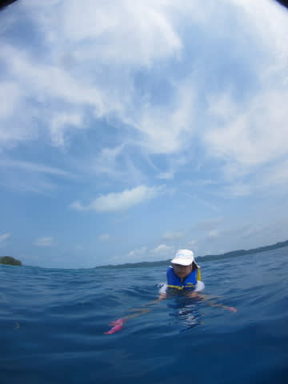
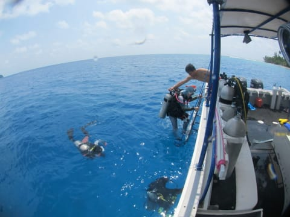
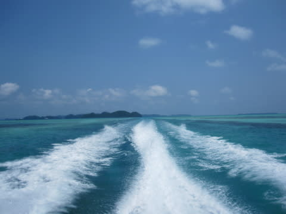
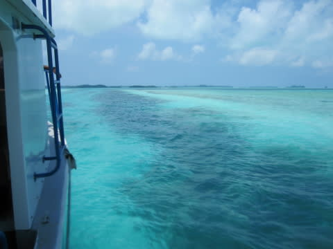
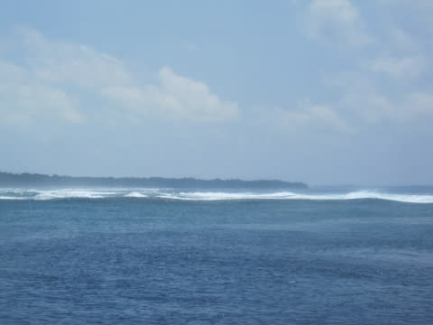
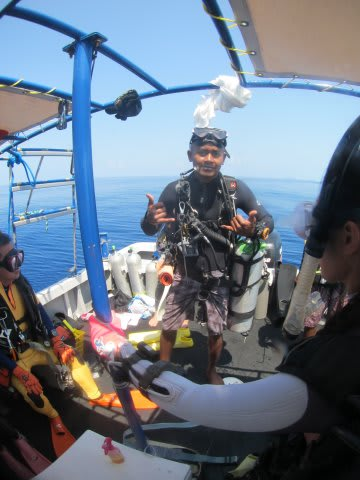
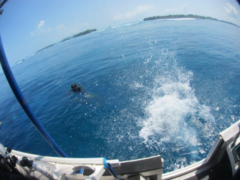

# 2014年10月，小学生の子連れでパラオへダイビングに行ってみた，その6…2本目はブルーコーナー！

📅 投稿日時: 2015-07-24 00:53:38

…スキーシーズンが終わって．

かれこれ一か月以上…

いろいろと終わってしまっているスキーヤーの皆さんは，

禁断症状に苦しめられているであろう今日この頃，

いかがお過ごしでしょうか．

早くスキーシーズンが来ないと，死んでしまう…っ！！

…せめて，ダイビングでごまかしに行かないといけないのだけど…

今シーズンの初潜りまでは，まだあと2週間…

それまで．

なんとかダイビング日記を書いて，心を鎮めるのだ…

ということで，パラオ旅行記，続きます．

----

という感じで．

全く想定外に，娘と一緒に海に漂うこと，しばらく．

ダイビングチームが帰ってきました…

だもんで．

浮かんでいた娘も撤収．

ダイビングを終えた妻．

妻「え？娘，泳いだ？なに？それ？？泳げたの？あの顔で」

私（「あの顔で泳げたの」って…顔が悪くて泳げないみたいだけど）

　「本人がむちゃくちゃ泳ぎたがったんで」

妻「大丈夫だったの？」

私「泳いだというより，ライフジャケットで浮かんでただけだし．

　　顔を水につけなくても浮いてられるんで，

　　問題なかったよ」

妻「そう…やっぱり，泳ぎたがったのね」

私「むちゃくちゃ喜んでたよ」

妻「そりゃ，そうでしょうねぇ…あなたの子だから」

…あ，そうですか．

…たぶん，そうですね．

はい．そうでしょう．

否定はしません．

＃でも…半分はあなたの血では？？というツッコミをしたいところだが，そこはぐっと飲み込んだSkier_S

という感じで．

船は1本目終了後に移動を開始し，2本目のポイントへ向かいます．

移動する船は，ジャーマンチャネルを抜けますねぇ…

ってことは，次のポイントは，

ニュードロップオフか，ブルーコーナー方面ですなっ！！（期待）

って感じで．

外洋側へ出ますが…

…

…なんだか，すごい荒れてるんですけどっ！！

…でも．どうやら，この荒れている状態でも，

なんとかここに潜れるようです…

とりあえず．

次のポイントは．

パラオと言えば．

そう．

ブルーコーナーですっ！！

ふははははは．

さっきは妻が潜ったから．

今度は私が潜る番だなっ！！

いやー．

最後にパラオに来て，約10年．

「あー．パラオ行きたい．

　ブルーコーナーでガンガン大物見たいっ！」

と，思い続けてきた．

コーナーにやってきましたよっ！

久しぶりのブルーコーナーだよっ！！

パラオ復活ダイビングが，いきなりのブルーコーナーだよっ！！

ってことで．

ブリーフィングを終えて…

いざ行かん，

夢にまで出てきた，ブルーコーナーへ！

