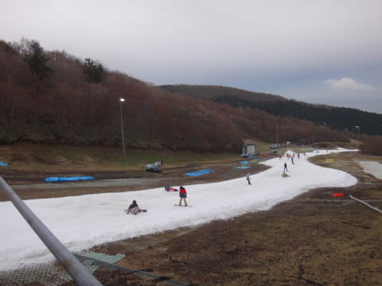

# 11月9日のイエティの詳細レポート…雨のち曇り，ガラガラでした

📅 投稿日時: 2014-11-11 02:42:26

ってことで．

昨日速報した，イエティの状況．

今日は詳細レポートをば…

まず．

朝7時過ぎの段階で．

御殿場市内は雨が降っておらず．

「うむ．これは…うまくいくと，降らないでいてくれるか？？」

と，期待したわけですが．

…Yetiに登っていく途中で．

Yetiまで残りあとわずか…というところで．

何か，ぽつぽつ降りだしてきましたよ…（泣）．

朝8時のゲレンデオープン直前に，駐車場に到着すると…

ふむ．

完全に，雨ですね（悲）．

さすがに駐車場はがらがらですな～

気温はプラス11度と，そんなに寒くないのですが．

雨が降ってて肌寒く，ジャケットは必須！

って感じで．

ゲレンデに出てみますが…

雨に打たれる雪だるまのオブジェが悲しさを誘います（涙）．

でも．

さすがこんな悪天候な日に滑ろうって人は少ないらしく…

うは．

完全クリアラップだっ！！

誰も滑ってないよ！

…でも．

雪はちょっと荒れ気味で，凸凹してましたけど…

人が少ないので，リフト待ちゼロで

ガンガン回していけます！

んでも．

パラパラと降っていた雨は．

開始30分たった，午前8時半ごろには結構強くなり…

午前9時には，かなりの本降りになってきました…（激涙）．

でも．

そのかわり．

開始後1時間たっても．

リフトには誰も乗ってないんですが！！

10時を過ぎても，見ての通りリフト乗り場に

人がいないんですが！

うーむ．

かなり本降りの雨はいやだけど．

これだけガラガラなコースを好き勝手

滑れるのも，良いかも？？

…と，思っていたら．

10時半ごろに．

ふむ．

ガスが出てきたなぁ…

と思った直後．

ガスが上がると，雨が上がって，

空も少し明るくなってきましたね～！！

…って感じで．

11時からは，雨が上がりましたよっ！

いやー．

これもひとえに，私の日ごろの行いのおかげですね！←それまでひどい雨が降っていたのは他の人のせいということか？？

雲は多いものの，それ以降，雨は「あれ？降ったかな？」

って思う程度のぽつぽつが2-3回来る程度で．

そのあとは午後4時まで，濡れることなく

滑ることができました！

ごく一瞬，空が明るくなることも…

ただ．

その代り．

雨が止んでからは，多少ゲレンデの人が増えて来て…

ちょっと出てきてほしくないものも出てきたりしましたが…

それでも，いつものYetiに比べれば，

リフト待ちもすごく少なく…

一番こんだ時でも，せいぜいこの程度．

おかげで，ガシガシリフトを回すことができますね～．

午後は，ちょっと富士山も見えはじめ，

それなのに，ゲレンデは時折かなりのクリアラップが

取れる程度の混雑で．

＃運が悪いと集団に巻き込まれたりしましたが…

午後3時過ぎにはまた人が減って，

再びガラガラになりましたね～．

…って感じで．

朝のうちは悲惨な天気だったけど．

10時半には雨も上がってくれて．

さらに，いつものYetiではありえないペースで

かなりおなか一杯滑ることができて．

まぁ，満足の一日だったかな！！

## 💬 コメント一覧

### 💬 コメント by (komu)
**タイトル**: イエティラスト
**投稿日**: 2014-11-14 21:50:35

今週も日曜日に出撃します(´・Д・)」

多分イエティラストです。

### 💬 コメント by (Skier_S)
**タイトル**: 私は土曜に…
**投稿日**: 2014-11-14 23:18:04

こちらは今週末は土曜出撃です．

日曜はタイヤ交換やら洗車やらの

予定です…

私も明日がイエティラストの予定！

＃来週までに，ちゃんとアサマ2000に

＃雪が積もってくれれば…

