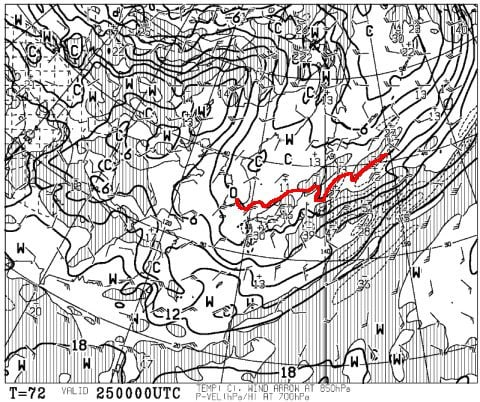
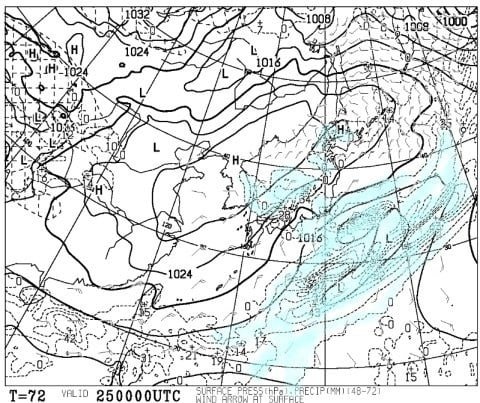
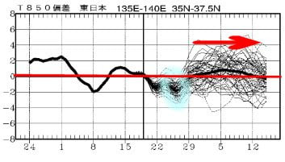

# 明日23日，ついに2022/2023シーズン初滑りに行きます～！Yetiは終日晴れ，結構暖かそう．

📅 投稿日時: 2022-10-23 00:29:39

ってなことで．

明日，ついにイエティへ初滑りに行ってきます～！！

最新の天気図を見ると…

水曜段階で予想された低気圧，当初の

予想ほど太平洋側に影響を与えない

予想に変わってきて．

23日の日曜は時折雲が増えそうなものの，

終日日が射して，晴れそうな天気です！

日が射すと，結構暖かく感じるんじゃ

ないかな～…

とりあえず，帰ってきたらレポートします！

で．

今日，天気図を見ていると．

なんだか，25日の850hpa天気図．

11月下旬並みで．

赤い0℃線が，志賀高原に近づいてます！

そして，地上天気図でも，長野県の山域に

降水域がかかっているので…

これ，24日の夕方から25日の午前中に

かけて，志賀高原を初めとした標高2000m

近いスキー場では雪が降る天気になりそう…！！

これで横手山も人工雪が積み増せるかも

しれないけど…

でも．そのあとの気温を見てみると．

水色で囲った，24，25日近辺は冷えるものの．

赤矢印で示したそれ以降，だいたい

平年並みかそれよりちょっと高い程度で，

11月上旬は，それほど冷えない感じ…

うーん．

冷えるなら今じゃない．

10月に冷えるのは，ちょいと早いのだ．

今冷えちゃうと，その反動かスキー場

オープン直前の11月に冷えなくなる

パターンがよくあるので．

冷えるのは今じゃない．

11月に冷えてほしい…

と願う，Skier_Sなのだった…

ってなことで．

あと4時間ちょい後に，今シーズン初の

スキーに出発です！

…今日も睡眠時間は少な目だな（涙）

## 💬 コメント一覧

### 💬 コメント by (なるなる)
**タイトル**: Unknown
**投稿日**: 2022-10-23 20:45:16

長岡行ってきました。

行って正解でした。2時間以上かけて色々やってもらいました。

誰から聞いたのと言われて、Sさんの名前出しちゃいましたw

使えるのは、2ヵ月後ですけど…

### 💬 コメント by (Skier_S)
**タイトル**: ＞なるなるさま
**投稿日**: 2022-10-24 03:19:08

をを！！

長岡まで行ってこられましたか…

行って後悔はないと思います．私が行くべし！と言った意味がご理解いただけたかと…

私の名前を出していただいてOKですよ～！

ってか，むしろ言ってもらった方がいろいろ話が早いかと思います（笑）．

