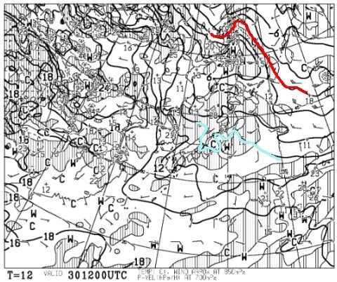
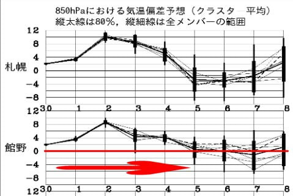
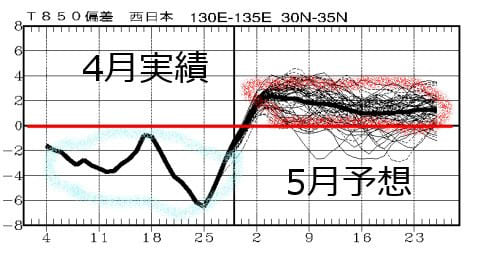
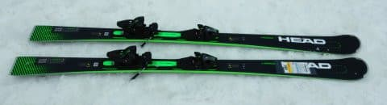
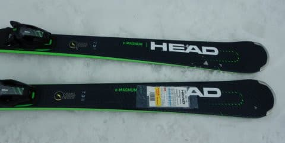
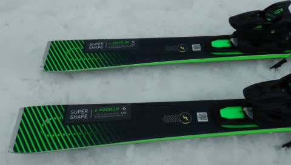
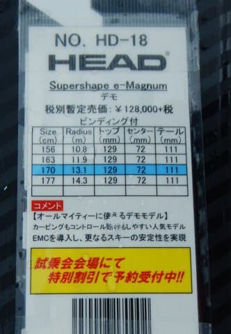
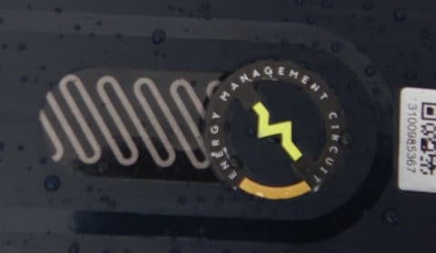

# 2021シーズンモデルのスキー板，試乗レポート…HEAD Supershape e-MAGNUM

📅 投稿日時: 2020-05-01 05:24:07

えー．

志賀高原がクローズしているというのに．

未だに志賀高原の天気が気になるSkier_Sです．

…しかし．

本日30日（というか，もう昨日か…）の志賀高原．

すごい気温が上がったみたいですね…

昼間は余裕で10℃を超えたようですが，

30日の850hpa気温図を見ると，

赤い0℃線はもう天気図からはみ出しそうなほど

北まで行っちゃってて，

志賀高原には水色の+9℃線！がかかってます…

これはまぁ，余裕で10℃を超えますね…（涙）

今日はスキー場がオープンしてても，

朝から雪はザブザブで，午前中には

滑らない雪になっちゃってる感じでしょうか…

で．

このGWの気温予想を見てみると．

赤矢印で示したように，5月5日までは

平年より高い予想が続きます…

とくに，2日は平年比＋8℃！！！

もう，「夏か？？」と思う気温まで

上がりそうです…

ってなことで．

さらに1か月長期予想を見てみると，

この4月が，一日たりとも平年より気温が

高くならなかった，奇跡の4月だったことが

水色で囲った部分からわかりますね…

それに対して5月は，赤く括ったように

平年比+2℃くらい気温が高い日が続きそう…

いやー．

この4月，ホントに奇跡の4月だったんだなぁ…

…ってなことで，本題へ．

今回は，2021シーズンモデルのスキー板の

試乗レポート，HEAD編です．

では，どうぞ～！

○HEAD  Supershape e-MAGNUM 170cm

基礎オールラウンド

日本ではHEADの基礎用モデルとしての

位置づけとなっているSupershapeシリーズ．

その中でセンター幅がわりと太めで，

いろいろオールラウンドに使える万能板が，

このMagnumになりますが．

来シーズンモデルからHEADのREBELSと

Supershapeシリーズに着いた，

EMC（Energy Management Circuit)とかいうのが

こいつにもついてます…

こいつはピエゾ素子を使って，板の振動エネルギーを

電気エネルギーに変換してコントロールするっていう，

昨シーズンまでのIntelligenceと同じ機能に

見えるんですけど…

なんか違うのかな？

…そして，Intelligence のころは，

i-Supershape Magnumと言ってたのが，

EMCになったので，iがeに変わっただけでなく，

Supershapeの前にiが着いていたものが，

Magnumの前にeが着く

Supershape e-Magnum

に変わったようです…．

って，細かい前置きはこの程度にして．

実際履いてみると…

うむ．

長さは170cmと，大回り，小回りどちらでも

イケそうな長さの試乗板だったのですが．

滑り始めて，角づけをすると，

するするとサイドカーブなりに

楽に曲がり始めます．

谷回りで板を動かしていったり，

圧をかけていかなくとも，

角づけだけでオートマチックに

ターンが始動する，楽な板です．

R=13と比較的小さめなので，

サイドカーブだけでも結構

小さめな半径で回ってくれて，

レールターン的にターンしていくだけで，

そこそこ小さい回転弧で回って行くので，

板の上に乗ってエッジを切り替えていく

だけでも，ゲレンデのほとんどが滑れて

しまいそうな感じの，かなり楽な板です…

角づけだけでもターンが始動するけど，

板自体はそれほど重くなく，かなり軽快さを

感じるので，谷回りで板を動かしていく

こともできます．

で，軽快だから安定感が無いのでは…？

と，ちょっと心配したけど．

スピードを出していった安定感が

予想以上に高いです．

春の荒れた雪でスピードを出して行っても，

思ったほど板が叩かれることは無く，

結構なハイスピードでもそれほど

不安感を感じることなく滑って行けます．

荒れた斜面での安定感は，

センター幅が広いってのもありますが，

EMCの効果なのかな？

低速だと柔らかく感じる板が，

スピードを出すと硬くなっていくような，

不思議な感覚を感じます…

スピードを出すと，踏み始めはちょっと

硬さを感じるけど，そこからいい感じで

たわんでいきます．

そして，ハイスピード山回りでも安定感が

ある，ズレのない適度なグリップがありながらも，

どうしようもなくガッツリ捉えていく

強すぎる板ではなく，山回りで板を

動かしていく自由度もあります．

とりあえず．

板の上に乗って角づけしていくだけで，

板のサイドカーブなりに滑り降りていけば，

ゲレンデのほとんどが滑れてしまいそう…

ってほど，体力を必要とせず，

かなり楽に滑り降りれちゃいそうな

板なのに．

そこそこのスピードで攻めて行っても，

板がスピードに負けてしまうとか，

雪面に叩かれるとかいう事が無く，

物足りなさや不安定感を感じることは

無い…

という感じで．

日本のゲレンデで履くには，かなり

いい感じの板なのではないでしょうか…

## 💬 コメント一覧

### 💬 コメント by (炎の北海道民)
**タイトル**: Unknown
**投稿日**: 2020-05-01 20:46:16

本日をもって北海道の全てのスキー場がクローズになりました。家から 30分の手稲ハイランドは連休中も営業する予定だったのですが、首長からの強い外出自粛要請を受けて流石にクローズする判断に至った様です。

もう日本で営業しているスキー場は無くなったかな。

### 💬 コメント by (Skier_S)
**タイトル**: ＞炎の北海道民さま
**投稿日**: 2020-05-01 23:52:54

ええええ！！

最後の望み，岩手県ももう終わっちゃったし．

北海道がやってないとなると…

もう，日本中のスキー場，すべてクローズですね…（涙）

そして，緊急事態宣言が5月いっぱいまで伸びそうなので．

GW後の復活もなさそうですね…

本州は月山に期待するのみです（泣）

### 💬 コメント by (Hide)
**タイトル**: Gaman Week
**投稿日**: 2020-05-02 07:41:23

S 様

おひさしぶりです。

ガマン週間いかがお過ごしでしょうか？（笑）

この板気になってるんですよね。

私、2016年モデルですが、これ気になってたんですよね。

でもなんとなく現在の状況だと物欲が萎えてしまい、何となく自粛モードになってしまうんですよねえ。

体調管理にお気をつけ下さい。

巣ごもりガマン週間長いなあ～

### 💬 コメント by (Skier_S)
**タイトル**: ＞Hideさま
**投稿日**: 2020-05-03 02:07:55

ガマン週間，仕事したりして過ごしてます…（涙）

しかし，自粛モードで物欲が萎えるとは，ある意味うらやましいです．

私は自粛がむしろ物欲増強に向かっている気が…（笑）．

