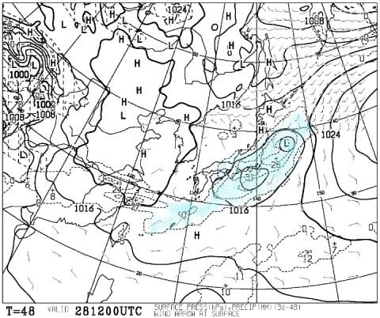

# 28日木曜日に降る．何かが降る．果たして液体か，固体か…？？

📅 投稿日時: 2019-02-27 03:10:01

🏷️ カテゴリ: [スキー天気予想](c6554f5c3c106093b511a8daae23757e8.md)

えー．

昨日，志賀高原でも28日は液体が降ってくるかも…

と，書きましたが．

28日の詳細天気図が出てきたので，

ちょっと見てみましょうか…

朝9時の段階では．

…きわどい．

極めてきわどい．

ギリギリのところで，志賀高原に

赤い0℃線がかかるかどうか

というところ…

そして，降水域は…

ギリギリ志賀にかかってる感じ（涙）

うーむ．

おそらく．

朝は地表近くが冷えているので．

このままなら，28日朝の降りはじめは，

個体の可能性が高そうだけど…

夜9時の天気図を見ると．

…これもまたきわどい．

0℃線は，またちょうど志賀の真上か…

降水域を見てみると．

うーむ．

志賀高原にも，降水域がしっかりかかっていますね…

…これは．

28日の昼間は．

山頂付近では固体でいてくれるかもしれないけど．

それでも，ウエアに着くとびしょ濡れになる感じ．

…標高が低い麓付近は，おそらく液体でしょう…（涙）

せめてもの救いは．

降水量がそれほどなくて．

ザーザーぶりの雨ではなさそう…

ってところですか．

ただし．

この予想より，わずかにでも低気圧が

南に下がってくれれば．

0℃線は志賀より南に下がるので．

…28日，空から降ってくるのは，

液体にならずに済むかも…

で．

そのあと．

1日はそこそこ冷え込みそうで．

志賀高原には水色の-3℃線がかかっています．

そして，わずかに降水もありそうな感じなので…

28日夜から1日朝にかけてうっすら

積雪があり．

1日の朝は，硬い雪の上にうっすら

新雪かな…

1日に少しでも雪が積もってくれれば．

2日はそれほどひどいアイスバーンに

ならずに済むんだけど…

さらに．

2日の土曜は，これもまた-3℃線が

志賀にかかってくれるレベルなので．

すごい気温が上がることもなく．

そして，高気圧に覆われて晴れそうなので…

雪さえ良ければ．

ガチガチアイスバーンでなければ，

結構楽しめそうな天気なんですが…

現時点の28日の予想は．

今のままの天気図だと，

28日（木）：朝から雪がちらつき始める．

　山頂では雪のままっぽいけど，

　ウエアに着くとびしょ濡れになる湿った雪．

　山麓付近では，午前中から雨に変わり．

　そのまま夕方まで，ポツポツパラパラと

　時折雨がぱらつく感じの天気となる．

　夜になって，雨は雪に変わって．

　1日朝まで，1-2cm程度のうっすら積雪．

って感じなんですが．

…果たして．28日に

降るのは，液体か，固体か？？

そして，1日朝にかけて，積雪はあるのか？？？

…また明日，週末の詳細天気図が出るので．

信心深い皆様におかれましては，

明日水曜深夜定番の，週末の天気予想を

必死にいつもの踊りを踊りながら，お待ちください…

しかし．

何で冬真っ盛りの2月に，

こんなに何度も雨の心配を

しなくちゃならないのか…

今年も春スキー，ダメかなぁ（涙）

## 💬 コメント一覧

### 💬 コメント by (地元民)
**タイトル**: Unknown
**投稿日**: 2019-02-27 07:31:35

春スキー・・・・。今年もやばいかも😅

野沢温泉も既に積雪1m切りました。この時期だと2m以上ある年も、かなり多いんですが・・・・。

戸狩や野沢、白馬の山麓など、里のスキー場は、三月中に雪がなくなるかも。特に白馬は危険。

志賀高原で５月連休に雪がないって、この３年間の2回以外、子供の頃から記憶にないです。ちなみに春の回数は50回近いのだった。

### 💬 コメント by (若杉勲71)
**タイトル**: Unknown
**投稿日**: 2019-02-27 21:56:34

志賀高原情報

本水曜日は前日より硬めのバーンで、昼過ぎまで、と言ってもレインボー（２時）までしか関知しませんが、ずっと気持ちよく滑れました。天気も晴れ気味の曇りでもんだいなし。南西の風が強く、奥志賀ゴンドラは間引きアンド小休止で、ダウンヒルは滑る勇気がわきませんでした。

エキスパートは完璧な整地で楽しめましたよ。でも、目の調子が悪くなって13時にリタイア。レインボーの偉大さを感じました。（低いレベルの話でごめんなさい）

明日は正月以来の帰宅。6日から復活です。（私でも家庭に必要とされる時があるんですよ《高飛車》）

### 💬 コメント by (cedar164)
**タイトル**: 初コメ失礼いたします
**投稿日**: 2019-02-28 00:03:05

Skier Sさま

2/23のダイヤモンドナイターで声をかけさせていただいたものです。

お楽しみ(修行？)中に失礼いたしました。

Sさんのダンスのような滑りに｢これが冷えひえ降れ降れ踊りか！｣と得心いたしました。

Sさんの滑りに刺激を受けたのか、子供たちがあの夜から、追いつくのがやっとのスピードで滑るようになってしまいました・・・

またお札がいただけるようにどこかで声をかけさせていただきたいです。

ありがとうございました！

### 💬 コメント by (ほっぽ)
**タイトル**: 27日は近場で修行
**投稿日**: 2019-02-28 00:40:36

昨日、27日は休暇を取れたので近場で修行してきました。

短いながらもアイシーなコブ斜面30本は疲れました。

しかし、平日のローカルなスキー場もいいですね。

昼になってもゲレンデはシマシマのままです。

１５時過ぎたらリフト乗っているの、私だけになってしまいました。

今週末の天気が心配です。週末は志賀ではなく標高の低いスキー場へ行く予定ですが、

雨だったらキャンセルして志賀高原へ進路変更するかもしれません。

http://www2.tokai.or.jp/nana_hoppo/

### 💬 コメント by (Skier_S)
**タイトル**: 月曜はまた雨っぽい（涙）
**投稿日**: 2019-02-28 02:07:59

＞地元民さま

このままいくと，志賀もGWはヤバそうな感じです．

ホントに，GWまでもたなかったら，2シーズン連続．

これは，温暖化が進んだと思わずにいられないですね…（泣）．

＞若杉さま

今日もゲレンデは硬かったんですね…

しかし，雪が降りませんね…

で，しばらくご帰宅ですか！？？

今週末はお会いできないのですね…

しっかり家族サービス（？）してきてください！

＞cedar164さま

あ，ダイヤナイターではお世話になりました～！

…しかし，お子さんたちも暴走するようになってきちゃいましたか（笑）．

まだまだシーズンは長いので，また志賀高原にお越しの際は

声をかけてください～！

こんどこそ，銀のお札をお渡しします…

＞ほっぽさま

八千穂高原に行かれたんですね…

私も10年近く前に行ったことがあります…

さすがに平日はガラガラですよね（笑）．

今週末は，土曜はいい天気ですよ！

日曜も，リフト営業中は志賀は降らなさそうです．

もう少し南だと，夕方に降り始めちゃうかもしれません…

標高が低いと液体になりかねないので，ご注意ください！

