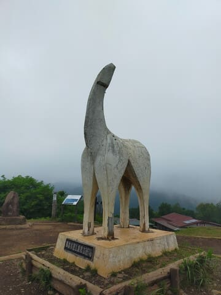
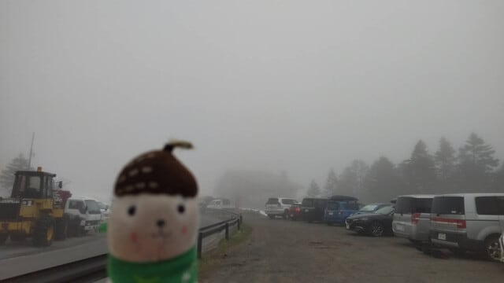
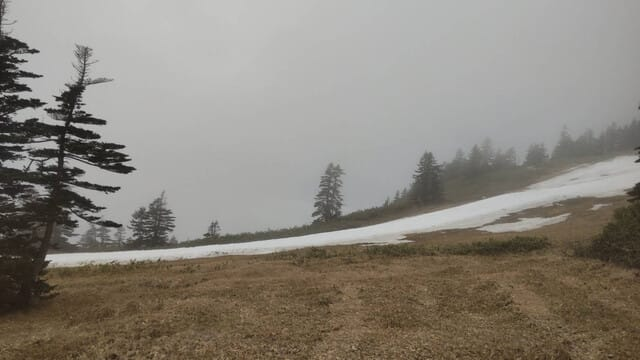
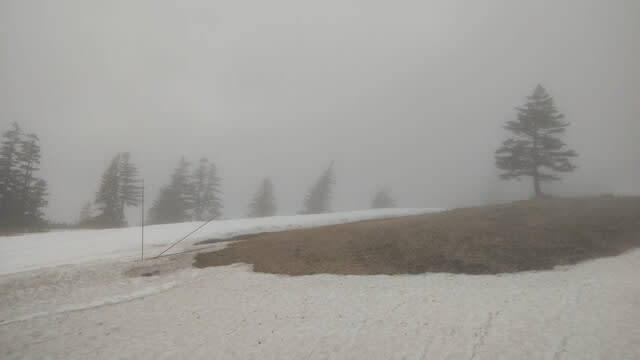
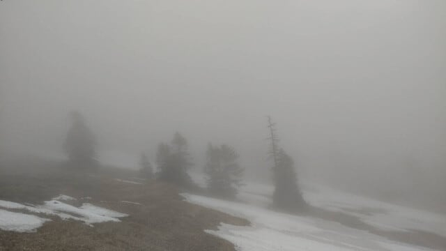
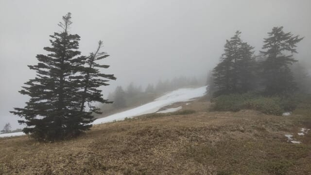

# 今日はいろいろバタバタしていた…そして5/24(土)の渋峠特派員レポート

📅 投稿日時: 2025-05-25 04:33:02

🏷️ カテゴリ: [日記](cc4b5682fb7b8b144980957a978653fb0.md)

ちょっと今日はいろいろバタバタしてました…

まず．

予告通り，2時間弱睡眠で，朝4時起きで

今年初の山歩きに向かい．

朝5時スタートで小仏Pから陣馬山へ！

16kmほどの山道を3時間で往復し…

行き1時間40分，帰り1時間20分という，

まぁ自分にとっては行き帰りとも

ベストから7-8分落ちという，

シーズン最初で睡眠2時間弱のタイムと

しては，

うーん…こんなもんかという微妙な

タイムで下山して，10時ごろ帰宅．

その後，妻と約束していたので車で

買い物に出かけ…

午後3時ごろに帰宅．

それから一仕事やっつけて，

3時間ほど昼寝して←夜の睡眠より昼寝の方が長い…

夕食後に娘に勉強を教えて．

さらに夜中に，とある作業をしていると

もうこんな時間…

え？？？

もう午前4時半！！！？？？

…3時間昼寝したけど，

朝起きてから24時間経っちゃったよ(泣)

ということなので．

今日はあまり長い記事を書く時間と余裕が無く．

いつものおこみん特派員からの写真に頼ります～！

まず．

本日土曜は朝は霧で始まったようですが…

朝の気温はかなり低く，3℃くらいだったようです．

土曜なので，さすがに駐車場の車も多いです

ね…

とはいえ，天気が悪いからか土日にしては

混まず，コースの人も少なく…

リフト待ちもほとんどなかったようです！

そして天気は朝は霧，

その後10時くらいからポツポツ雨が

降り出したようですが…

うーん．土曜は降らないだろうと

踏んでいたのに…

でも，天気があまりよくなかったせいで

人も少なく，板も滑ったようですが．

でも，午前中には雪が荒れてきていた

ようです…

ってなことで．

ついに明日は渋峠ファイナルデー！

明日はちょっと風も出そうだし，雨も

降る悪天候になりそうだけど…

明日渋峠に行く人は，楽しんできて

ください！！

…って言っても，このBlogの読者で

明日渋峠に行く方は，おこみん特派員だけで，

他には誰にもいなかったりして…

とりあえず，もう眠いので寝ます．

おやすみなさい…

## 💬 コメント一覧

### 💬 コメント by (ねも)
**タイトル**: Unknown
**投稿日**: 2025-05-25 06:29:19

Ｓさん　お久しぶり！

こんな時季に陣馬山なんか登っても楽しいことなさそうだから、家で身体を休めては？と思うのは私だけ⁉️(韋駄天ぶりには拍手！)

お嬢さんに勉強って、何を教えたのか、とっても気になります😅

### 💬 コメント by (Skier_S)
**タイトル**: ＞ねもさま
**投稿日**: 2025-05-25 20:07:09

いや…体を動かさないとストレスで死ぬんです(笑)．

精神的に疲れていると，身体を休ませようにも眠りが浅くなるので，

強引に体を疲れさせるとぐっすり眠れるんです…

精神と肉体の疲労をバランスさせないと上手くいかないというのが，

私がコンディションを整えるために実践しているテクニックです（ほかの人にはあんまり進められないかも)

ちなみに，今回の景信山→陣馬山間の移動時間は1時間3分でした…

そこまで速くないです（涙）

