# スマートウォッチ，Amazfit GTRとPACEのGPXファイルを，スマホのGPXviewerアプリで見る…すごい細かいデータが見れるよ！

📅 投稿日時: 2020-06-05 01:41:36

最後にスキーに行ってから，もう

2か月以上経つというのに．

…スキーに全くいかないまま，

2か月毎日スキーネタを書いている

自分を褒めてあげたい…

と，自分を誉めたところで．

今回もまた，私がスキー用に購入した

スマートウォッチ，

Amazfit PACEとAmazfit GTRのネタ

が続くのですが．

今回は，GPS軌跡をスマホで見るアプリ，

GPX viewerを使ってみたところ．

こいつがかなりいい感じのイケてるアプリ

だったので，その詳細レポートです！

とりあえず，[前回](e8ecb713cae6d59127adb9caa4875fa96.md)は，Amazfit GTRとAmazfit PACEの

GPS精度を，GPXファイルをPCで見て比較して

みたわけですが．

でも，PCのブラウザ版GPX Vieweで見れるのは

位置精度のみ．

残念ながら，高度データなどを詳しく

見ることはできません…

今回，高度や速度のデータも細かく

見ることができるスマホアプリ，

GPX viewerで，GPXファイルを

さらに細かく見てみましょう…

GPX ViewerはGoogle Playから

無料でダウンロードできます．

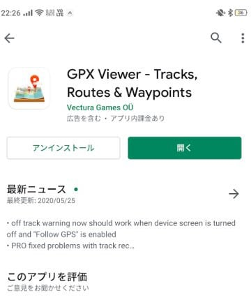

このGPX viewer，インストールすると，

こんな感じでGPSの軌跡が見られるわけですが…

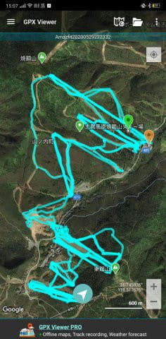

この縮尺だと，Amazfitアプリの

GPS軌跡とほとんど変わらないように

感じますが．

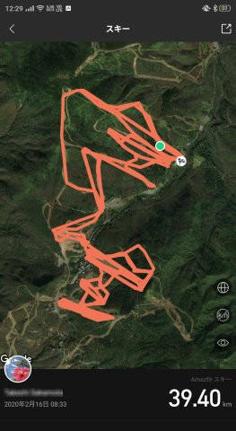

拡大すると，スマホのAmazfitアプリが

こうだったのに対し…

このGPX viewerだと，こんな感じで．

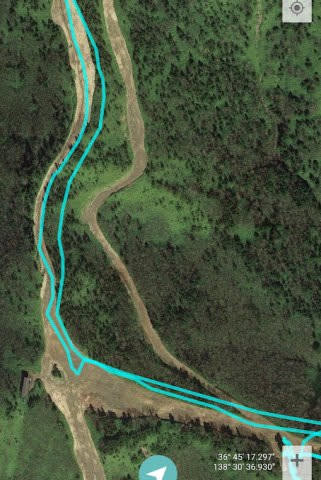

前回，PCでGPXファイルを確認したのと

同じ精度の，精細なGPS軌跡を

確認できることが分かります…

このアプリのさらにすごいのは，

高度表示．

こんな感じで，横軸を移動距離に

取った高度表示や…

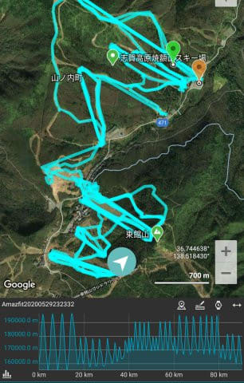

横軸を測定開始からの時間にした高度表示や…

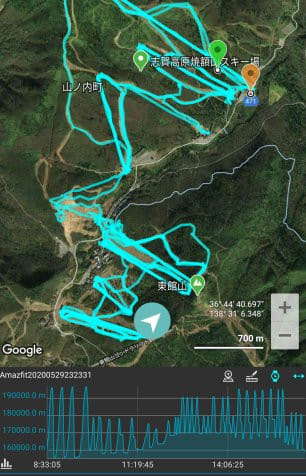

横軸を，何時何分で表示した高度表示に

切り替えることが可能です！

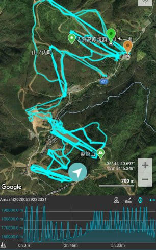

それだけじゃなく．

この高度グラフをタップすると，

その時にどこにいたかが表示されるので…

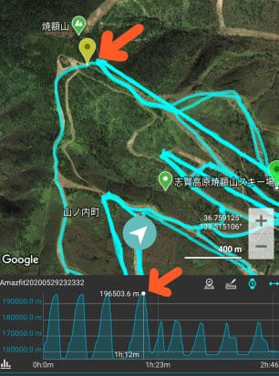

高度グラフの上で指をスライドさせて

いくと，アニメーションのようにマーカーが

動いて，時間を追ってどう移動したかが

追っかけることができて，

すごい面白いです…！！

さらに．

データ表示画面ってのがあって…

データ表示画面を見てみると．

登った標高差7566.41m

下った標高差7581.45ｍ

（この画面では756641.4mと表示されてるけど，

　実際756641.4cmです…）

平均速度や最大速度，移動距離も

出ています…

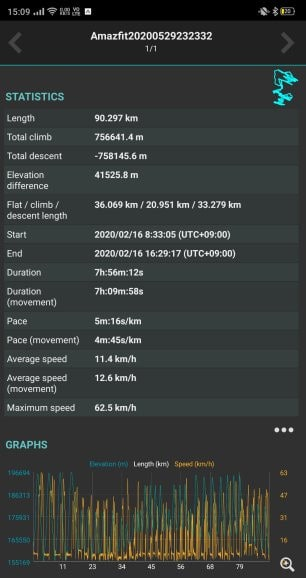

これ，同じ記録をAmazfitアプリで見ると，

滑走標高差が7311mとなってて．

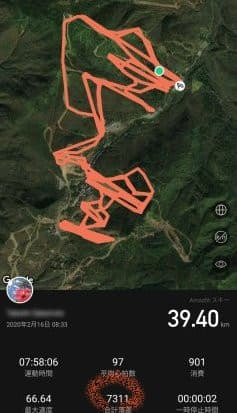

GPXViewerの方が，標高差が5%ほど多めに

出てますね…

AmazfitアプリでAmazfit GTRの標高差を見ると，

いつも実際の標高より10%~5%少なく出るなぁ…

と，思ってましたが．

このGPX viewerでみたAmazfit GTRの

滑走標高差，リフトの標高差と

比べると，誤差は5%以下で，結構正確

でした…！

そして．

このデータ画面の下の

グラフ部分をタッチすると…

なんと．

標高差＆速度グラフが拡大表示

されます！

これも，横軸が距離でも…

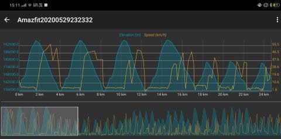

横軸が時間でも表示できて…

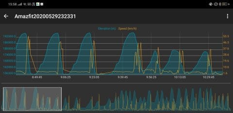

標高差だけじゃなく，速度も出るって

凄すぎる！

細かいところまで拡大すると…

リフトで登っているところ．

赤く括ったように，時速5km程度の

リフトの移動速度もしっかり見えてるし．

水色で示したところをみると，

リフト1本を5回に分けて滑っている

のが分かります…

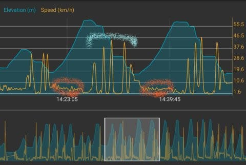

5回に分けて滑っている間，立ち止まって

いるところでは，標高が変化してないので，

滑ってないことが分かりますね…

ってことで．

このGPX viewerを使えば．

何時何分にどこを滑って，リフト1本

滑るのに，何度立ち止まったかが

分かるほど，細かいデータが読み取れます！！

すごい…すごいよ！

GPX viewer！！

…でも．

これまで見た記録は，Amazfit GTRで

取ったGPXファイルを見たもの．

Amazfit PACEで取ったGPXファイルを

見ると．

位置の軌跡は正確なんだけど…

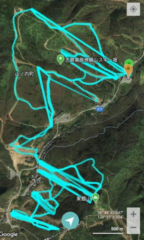

高度計が不正確なので，

高度グラフを見るとこんな感じに

なって，全然高度が確認できなかったり…

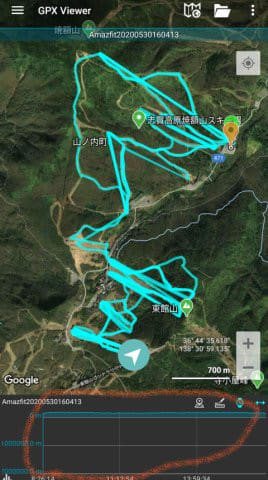

高度＆速度グラフを見ても，

滑っているとき以外の，

リフトに乗って登っている時なんかは

GPS記録を止めてしまう，

Amazfit PACEでは．

グラフを見ても，あんまり面白く

無いですね…

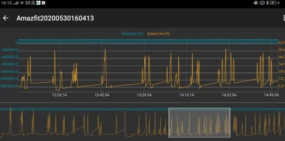

ちょいと残念…

ってな感じで．

GPX viewerは結構面白いアプリですが．

GPSの位置精度は誤差1m程度で，

ものすごい正確だけど．

高度計がかなり不正確で，滑っている

時以外GPS記録を止めてしまう，

Amazfit PACEか．

GPSの位置精度は10m程度で低めだけど，

高度計が正確で，滑っている時以外の

記録もすべて残っている，Amazfit GTRか．

うーむ．

どちらがいいのか…

GPSの位置精度が高いAmazfit GTRが

出れば完璧な気がするんですが…

どうも，どちらを買っても一長一短が

あるのが，惜しいところ…
