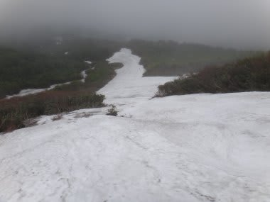
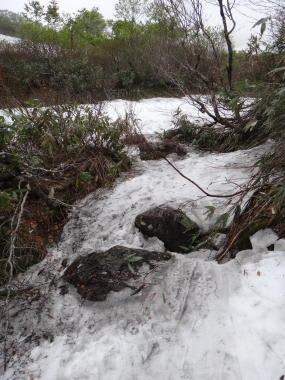

# さすがにシーズンラストだよ…7月1日の月山詳細レポート

📅 投稿日時: 2012-07-03 00:29:29

🏷️ カテゴリ: [2012スキー滑走日記](cca3a0e9524e0203150f790b1fc3c71ad.md)

で．

お約束の月山の詳細をば．

ありえない神奈川南部からの日帰り月山を強行した日曜日でしたが．

さすがの私も，7月にスキーしたのは人生2回目です．

過去に1回しかないんですよね…

…いやー．

もうシーズン終わりだっ！

もう，今シーズンは思い残すことはないっ！

って感じで．シーズンが終わったことを痛感しましたよ～．

なんていうか．決して楽しいものじゃないですね．

「スキーを履いて斜面を降りてこれる」

という以外の何物でもないです．

それも，リフト降り場，乗り場でそれぞれかなりの距離を

ひいこらひいこら歩かなきゃいけませんし．

こんな時に滑ってるのはアホです．

あー否定しません．否定しませんよ．

私はアホです．

そうそう，7月に入ったので．

駐車場代1000円は取られません．

姥沢小屋前で，一人200円の環境協力金を支払います．

リフト代も割引になってますね～．

半日券3300円→2600円，

一日券4600円→3300円

になってます．

…まぁ，この時期，一日券で滑るツワモノはいないと思いますが(笑）．

で．

ゲレンデはどんな感じだったかというと，ですね．

あー．

リフトが，かろうじて滑れます．

で，リフト降り場から上のTバーは，かなり上に移動してます．

真ん中近辺の人が並んでるところがTバー乗り場ですが．

リフト降りてから，かな～り登らないと，乗り場までたどり着けません…

で．リフトはというと．

リフト乗り場は，当然もうスキーを履いて滑り込むことなんていう

軟弱スキーヤー仕様ではありません．

リフト乗り場よりかなり下にたどり着いて…

そこからひいこら足場の悪いところをよじ登って…

さらにリフト乗り場まで数分．

リフト降り場も，娯楽スキー仕様ではなく，スキー修行者向けになっています．

降りたところがこんな感じで…

こーゆーところをかなり登って（3分くらいかかる…（涙)）

やっとゲレンデに出れます．

雪質は，もう．

なんていうか．

おそらく，月山を知らない人には

「これが雪？ここ滑るの？」

という，圧雪なぞまったくしていない，まさにナチュラルバーン．

天然自然100％のゲレンデがお迎えしてくれます．

まぁ，人が滑って踏まれると何とか滑れますが．

大斜面は…

7月ということを考えれば，上出来かな．

コブラインは数本あります．

一番細いところも途切れずにラインが1本つながってます．

…が．

大斜面が終わって，だらだらつながった廊下の後，リフト前に落ち込んでいく場所．

ここが藪こぎ入ってます．

さっきのリフト乗り場近辺の写真で「藪こぎ」と書いてある部分です．

距離にして15mくらいかな～

足場の悪いごろごろした岩場に雪解け水が流れるところを，

バランスをとりつつ草を掻き分け進んでいかなくてはなりません．

スキーを担ぎ，ストックを片手にしつつ．

水でぬれた石の上を滑らないように．

草を掻き分け進んでいるときに．

「ああ．自分はいったい何をやっているのだろう…」

「自分はどうしてここまでして滑っているのだろう…」

と，かなり寂しい感情が湧き上がってきます．

むしろ．コースとしては，沢コースのほうがいいですね～．

ちょいと幅が狭いですが，整地を結構なスピードで飛ばせます．

沢コースの終わり部分，2箇所ほど途切れてますが．

一箇所は，おそらく昨日までは滑って通れたんじゃないかな～．

もう一箇所は，土手を乗り越える感じ．

この土手を乗り越えるだけなので，大斜面の藪こぎより，数百倍ましです．

という感じで．

降り場，途中の藪こぎ，乗り場と．

ひたすら歩くのにトータル15分以上．リフトに10分．

…で．滑るのが5分．

こんな状況ですから，当然リフトはがら空きでしたね～

いやー．

なんか．

もう，滑らないと死んじゃう，って人以外は

この時期はやめたほうがいいですね．

…でも．

7月にリフトが滑れるってのは．

かなり珍しい気がする．

それも，沢コースが滑れるってのは奇跡か？

とりあえず．

7月というのにリフトが滑れたので．

私的には満足でした！

＃こんな状況で満足したんかい！！

＃リフト下に満開だったニッコウキスゲ
