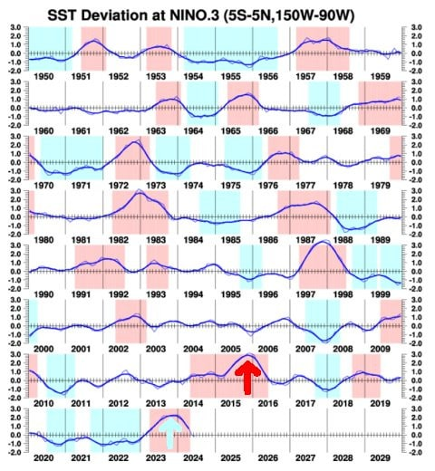
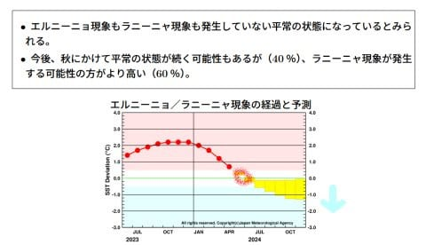
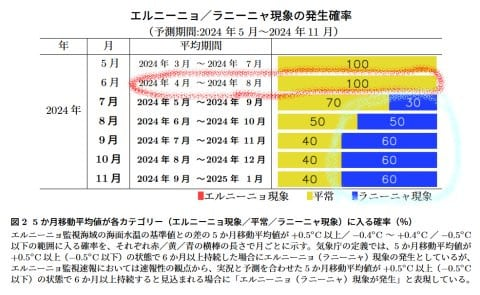
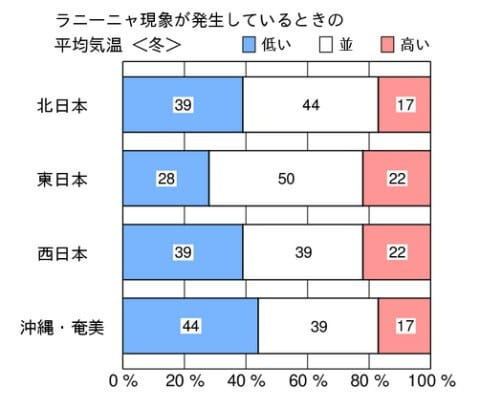
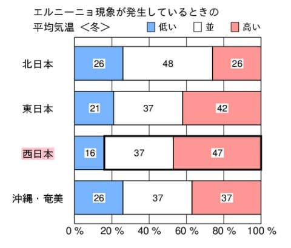
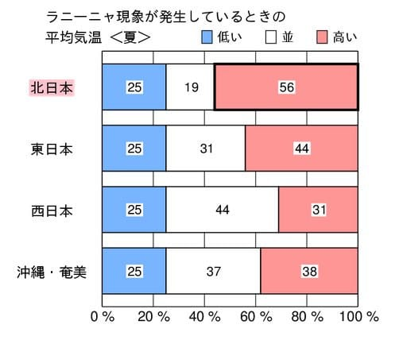
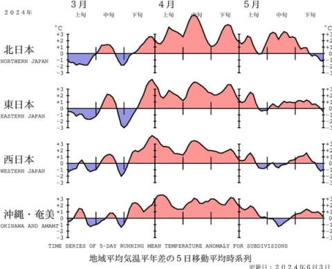
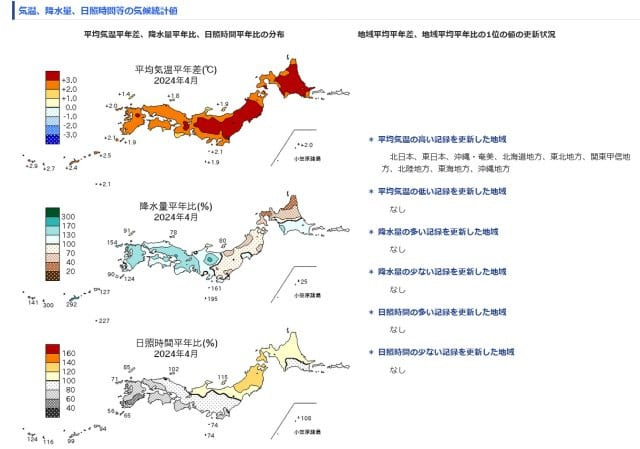
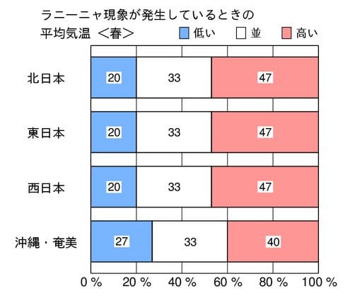
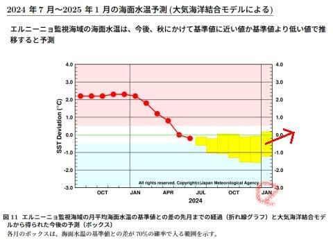

# 7月の気象庁エルニーニョ監視速報が出たけど…エルニーニョ終了，この秋からラニーニャ突入の確率大！スキー場にとって朗報か？

📅 投稿日時: 2024-07-12 03:50:15

えー．

この冬は，ここ数年ないレベルの強烈な

エルニーニョ現象に襲われて．

そのせいか，ひどい暖冬にやられた

感じの2024シーズンでしたが…

果たしてこのエルニーニョはどうなったのか？

ってことで．

毎月気象庁から10日前後に発表される

エルニーニョ監視速報．

7月分の速報が出たので，見てみました～！

（[気象庁エルニーニョ監視速報ページ](https://www.data.jma.go.jp/gmd/cpd/data/elnino/houdou/pdf/elnino202407.pdf)より）

とりあえず．

この資料を読み解く前に．

過去のエルニーニョの観測記録から，

この冬のエルニーニョの状況を振り返って

みると…

赤矢印の2015~16年ほどではないにしろ，

海水温+2℃という，1950年からの74年間で

これを越えるのは1972年，1982年，1997年，

2015年の4回しかないレベルのエルニーニョ

だったことがわかりますね…

（気象庁，[エルニーニョ現象及びラニーニャ現象の発生期間（季節単位）ページ](https://www.data.jma.go.jp/gmd/cpd/data/elnino/learning/faq/elnino_table.html)より）

2015-16年というと，思い出すも忌まわしき

雪不足の年だったわけですが…

今年の正月ごろまでの雪不足は，この2016

シーズンに並ぶレベルだったので，

さもありなんという感じ…

で．

7月のエルニーニョ監視速報をじっくり

見てみると．

どうやら赤丸で記したように，ほぼ

平年並みの海水温に戻ったようで．

現在は，エルニーニョでもラニーニャでも

無い状態に戻っているようです…！

これからあとは，上の図の右側の黄色い箱で

示される予想のように，今後水温が低い

ラニーニャに移っていくようですが…

とりあえず，現時点では下図で赤くくくったように，

エルニーニョでもラニーニャでもなく．

そのあとは，ラニーニャになる確率は

60％に上がっていくので…まだ確実とは

言えないまでも，この冬はラニーニャに

なっている確率が高そうです…！

ご存じのように．

ラニーニャになれば，冬は冷えて

積雪も増える傾向にあるので．

1月に入っても志賀高原が全面オープン

できなかった今シーズンのような悲劇が

繰り返される可能性は低くなります！！

過去の気象庁の統計を見ても，ラニーニャの

冬は，平年より気温が低くなる率の方が，

高くなる率より大きくなってます！

ちなみに，エルニーニョの年は，

こんな感じで気温が高い割合が高いので…

大きな差ではないですが，エルニーニョの冬は

暖かいというのが統計的有意な差で出ています．

ただ．

ラニーニャになると，夏は暑くなるので…

この夏は，酷暑にやられる年になるのかも（涙）

ということで．

ラニーニャになれば，夏は暑いけど

冬は冷えてくれそうなので，

スキーヤーとしては安心…

…と言えないのが恐ろしいところ．

この3月，4月の気温を振り返ってみると．

まだエルニーニョが終わってない

3月は，割と気温が低い奇跡の3月だった

のは記憶に新しいですが．

逆にエルニーニョがほぼ終わった4月は

過去の記録を塗り替える高温続きで，

平年より気温が低い日がほとんどなかった

という，異常な4月だったので．

エルニーニョが来たから・ラニーニャが

来たから確実に暖かい・冷える…

というのではないのが怖いところ．

…しかし．

今年の4月は異常すぎたよな…（涙）

東日本のほとんどで，月平均+3℃越え．

普通の5月の平均気温より，この4月の

方が平均気温が高かった可能性があると

いうことか…（恐怖）

そして．

ラニーニャでもう一つ怖いのは…

ラニーニャは冬は冷えるけど．

ラニーニャの春は，こんな感じで

実は気温が平年より上がるのだ！！

つまり…

ラニーニャは，12，1，2月の冬は冷えるけど．

3，4，5の春スキー時期になると，早く気温が

上がって雪がやられていく…

という，春スキーにとってつらい状況に

なるのだ…！！（涙）

…ってな感じで．

ラニーニャになるのもよし悪し…という感じですが．

ちょっと期待が持てるのは．

今の予想傾向なら，下図の赤矢印で書いたように，

来年1月以降はラニーニャが終わりそうな

温度予測になってるってことですね…

うん．

冬にかけてラニーニャになって．

春が来る前にラニーニャが終わってくれれば．

統計的には一番望ましいパターンになって

くれるはず…！！！

ということで．

来シーズンのエルニーニョ・ラニーニャ状況は．

スキーヤーにとって一番望ましい，

冬はちゃんと冷えて，

春も異常高温にならないでいてくれそうな

感じだな！！！

…と，

自分に都合の良くなるように必死に読み解き，

この冬への期待を高めるSkier_Sなのでした…

いや．

ホントに．

次のシーズンこそ，スキー場に11月ごろから

たっぷり冷え冷え雪が積もって，

GWまで安心して滑れるシーズンになって

ほしい…
