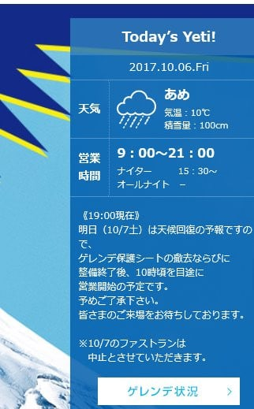

# 明日はYetiで2018シーズン初滑りの予定！…やっぱりオープン時間は遅れるようで…

📅 投稿日時: 2017-10-07 01:11:30

はいはいはいはいはいはい．

ついに．

ついに明日．

私のスキーシーズンが始まります！！！

ふはははははは！

そうです．

Yetiで初滑りの日ですっ！！！

…でも．

今晩はすごい雨なんですが…（涙）

Yetiも，今日は21時まで営業予定のところ．

17時に営業を終えたようです（泣）．

で．

Yetiのホームページを見ると，

（[Yetiのホームページ](http://www.yeti-resort.com/)より）

明日の営業開始時間ですが…

昨日予想した通り，

ええ．そう．

やはり，[昨日予想した](e2ef4ed35eb2e7f60590c5f8c6e743f97.md)通り．

営業開始，遅れるようですね…

…朝10時ごろ営業開始ですか…（ちょっと涙）．

ということで．

明日，朝10時ごろからYetiを滑っている予定です…

ええ．

明日，穴の開いたスキーパンツをはいて

Yetiを滑っている人がいたら．

…それは私です．

では，明日Yetiに来る方は，Yetiでお会いしましょう～！

＃あ，雨が降っててレインウェアで滑っていたら，

＃レインウェアのズボンには穴は開いてませんので（笑）
