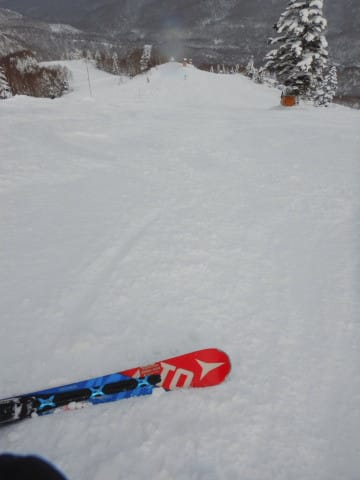

# 2021/1/4(月)の志賀高原・焼額山スキー場，速報レポート！…平日なのに人は多かったよ．雪は最高！朝は雪降り，午後は曇り～晴れ！

📅 投稿日時: 2021-01-05 02:53:45

ってなわけで．

なんと．冬休みを一日延長して，

平日のはずの本日1月4日も，

志賀高原で滑ってました～！

…そして．

たったいま，自宅に帰ってきました…

それも．

あまりもの眠さに，途中爆睡をかましながら

帰宅したので，帰宅時間は日付変更線突破(涙）

なので．

今回も帰宅日恒例の速報モードにて，

本日の志賀高原レポートです！

…って．

今日のレポートも実質，

「冷え冷え最高雪質の一日でした！」

で終わるのですが…

とりあえず．

それでも速報レポート！

まず．

あさイチの気温は-10℃と，相変わらず

冷え冷え！

あさイチの天気は，うっすら雪降り．

コース上は…

うひょーー！

今日も最高雪質！

柔らかいながらも，いい感じのグリップがある

快楽圧雪バーン！

…この正月休み，雪には恵まれてる…

新雪コースのオリンピックコースは，

5～10cmの薄っすらパウダー！

これもまた，軽い雪で．

下地の圧雪をしっかりグリップしながらも，

パウダーを巻き上げられる快楽度が

高いバーン！

午前中は時折雪が降ったり止んだりの天気で，

一瞬，写真のように強く降るタイミングもあったけど．

全体的に雲はそれほど厚くなく，空は明るめで．

バーン状況は結構良く見えたので，良かったかな…

でも．

正月3が日が終わった平日というのに，

ゴンドラ待ちは最大5分弱まで伸びたのが

想定外…（ちょい残念）

とはいえ．

コース上はガラガラで．

雪質は夕方まで最高＆フラットのまま！

この正月休み，ずっと柔らかめの最高雪質なのに，

コースの人が少なかったからか，午後になっても

コースがそんなひどい凸凹にならないですね…

さらに，今日も午後2時ごろからは

日が射しはじめ．

太陽に照らされた最高雪質のゲレンデを，

ラストリフトまで楽しみまくったのでした…

いや，ホントにこの正月休みは，

去年は数回しかなかったような

「あれ？上手くなったかな？」

と勘違いするレベルの最高雪質が

ずっと続いてくれて．

いい正月休みだった…

ということで．

10日間のうち，9日間志賀で滑り倒したという

私のシアワセ冬休み，これにて終了です…

明日から，社会復帰できるのかな…

## 💬 コメント一覧

### 💬 コメント by (Unknown)
**タイトル**: Unknown
**投稿日**: 2021-01-05 04:00:00

地元では自分の子供にすら帰省の自粛をさせているのにあなたみたいな頭お花畑の人がいると意味ないですね！

### 💬 コメント by (いちと)
**タイトル**: Unknown
**投稿日**: 2021-01-05 09:23:09

お疲れ様でした

私は、岐阜の飛騨の別荘（ただの小屋ですが）に籠もり、テレワークと称して一人スキーにいそしんでいます

飛騨地域は、少し不便なので元々お客が少なく、コロナもあり快適です

来月には志賀に行きたいと願っています

あと、つまらないコメントは、無視してください下さいね

### 💬 コメント by (アリス)
**タイトル**: 9日間の滑走お疲れ様でした
**投稿日**: 2021-01-05 09:39:30

Skier_S様

10連休中の9日間をスキー三昧、羨ましい限りです。

しかも極上の雪質で美味しいバーンをいただけて。

やはりＳさんはサイボーグなんですね♪

一日中滑って、移動して車、板の手入れしてブログへのこの時間の投稿ですから驚きです。

志賀高原のお仲間も驚いていますよね♪

今年の志賀高原の雪質が忘れられず、1/7から会社をズル休みして、ヤケビとオクシーのパウダーをいただきに行く予定です。

それと1ゴンのFT初体験しようと思っています・・・

### 💬 コメント by (Northfox)
**タイトル**: Unknown
**投稿日**: 2021-01-05 12:24:32

天気に恵まれた日が多くて良かったですね。

日頃から激務に対するご褒美だったのかも^_^

しかしこれだけの日数を滑り続ける体力が凄いです。。。。

### 💬 コメント by (michi)
**タイトル**: Unknown
**投稿日**: 2021-01-05 13:11:43

お疲れ様でした😊

2〜4日まで夕方になるとバーンが良くなりやめられなくなるパターンでした😅

昨日Sさんのブログを見てるというご家族３人に１ゴン降り場で声をかけて頂きました。

20000m倶楽部のステッカーをお渡ししました。お名前を聞き忘れました…

### 💬 コメント by (レインボー73)
**タイトル**: Unknown
**投稿日**: 2021-01-05 15:08:24

火曜日の志賀高原情報

昨日の野沢ゴンドラは、定員制限もなく、マスクをせずに談笑するグループもいて、とても嫌な思いをしましたが、１週間ぶりのヤケビは、乗車半数制限もしていて、一人乗車が続いても誰も文句を言わず、完璧な対応でした。

凸凹が一切ないヤケビの完璧な圧雪を満喫したあと、シーズン初の奥志賀へ。気持ちいいけど圧雪が。

驚いたのは寺子屋です。昨シーズンはブッシュが完全に消えることはなかったのですが、今日はきえていましたよ。

### 💬 コメント by (かず)
**タイトル**: Unknown
**投稿日**: 2021-01-05 15:37:27

若Sさんあけましておめでとうございます！昨日から復活ですか！今シーズンも特派員情報よろしくお願いします！

### 💬 コメント by (レインボー73)
**タイトル**: Unknown
**投稿日**: 2021-01-05 18:08:01

お借りします。かずさん、ただいま湯田中にヒロさんが参上しました。明日から楽しくなりそうです。

ヤケビは安全地帯です。またお会いしましょう！

### 💬 コメント by (かず)
**タイトル**: Unknown
**投稿日**: 2021-01-05 20:07:02

またヒロさんのスーパースピード見たいです！若Sさんお気に入りの1GSITAで今回埋もれてもがいてるところSさんに偶然見られてしまいました笑笑

### 💬 コメント by (Skier_S)
**タイトル**: 社会復帰できない…
**投稿日**: 2021-01-06 02:16:23

＞Unknownさま

私も実家への帰省は諦めましたが，スキーに行っていると意味ないのかも…

ちなみに，私の頭の中がスキーに関しては他に比するものが無いレベルの

世界最高級のお花畑であることは，このBlogの読者の皆さんは十分知ってるはずです（笑）．

＞いちとさま

飛騨の別荘，素晴らしいですね～！

私も志賀高原移住計画を実行したくなってきました…

＞アリスさま

今年の正月休みは，ここ数年なかったレベルの恵まれたコンディションでした．

でも，昔の志賀高原はこんなだった気がする…

ここ数年の，雨が降ったりガチガチになったりという

志賀高原が異常だったのかも．

＞Northfoxさま

9日間も，滑ってみると短く感じました（涙）

もっと滑っていたかった…

＞michiさま

いやーー．

コンディションいい正月休みでしたね！

20000m普及活動，お疲れ様でした（笑）．

＞レインボー73さま

野沢より志賀が良かったようですね…

今年の正月の志賀は，ホントにここ数年無い恵まれたコンディションでした！

これからもいいコンディションが続きそうで，パウダーも来そうなので，

これからの志賀高原楽しんで下さい！

逆に私は非常事態宣言が出たら志賀は諦めますので，私の分も楽しんできてください…

＞かずさま

ふふふ．

埋もれてるところ，見ちゃいました…

### 💬 コメント by (yuri)
**タイトル**: Unknown
**投稿日**: 2021-01-07 00:02:46

S様

はじめまして。michi様からステッカーを頂いた者です。

ひょんな事からS様のブログに辿り着き、初心者同然なのに愛読者になり、気が付いたら板を買っていて、初めて志賀高原にやってきました。今までのスキーで一番楽しかったです！

20000mはまだ雲の上ですが、S様のブログから垣間見えるモットーをいつも日々の励みにしています。

いつになるか分からない状況ですが、次回はお会いできることを楽しみにしています。

michi様

先日はありがとうございました。ゴールドステッカーをお見かけし、声を掛けさせていただきました。

ご親切に対応して下さって嬉しかったです。

初めての志賀高原、最高でした！

### 💬 コメント by (michi)
**タイトル**: Unknown
**投稿日**: 2021-01-07 07:29:00

yuri様

先日はお声かけいただきありがとうございました。

初の志賀高原だったんですね。

今までで1番楽しかったということで良かったです。

今年の志賀高原の雪質は最高だと思います。

是非またお越しください。

