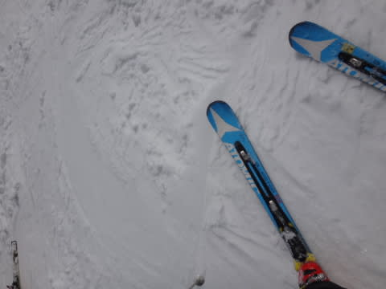
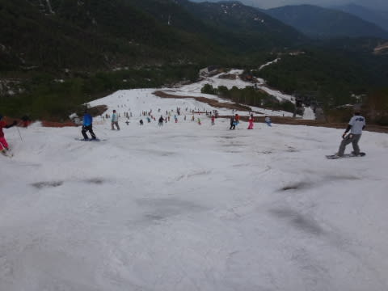

# 5月23日土曜のかぐら詳細レポート…はっきり言って，今週で終わりかな…

📅 投稿日時: 2015-05-24 22:45:54

🏷️ カテゴリ: [2015スキー滑走日記](c09ea645cfc085f86dfcd80f49599dd89.md)

ということで．

昨日速報した，かぐらスキー場．

本日は，詳細モードをば…

えーと．

まず，朝．

7時半に駐車場に到着した段階では．

駐車場も半分ちょい位しか埋まっておらず．

ロープウェーもそれほど待たず．

…晴天なのに，意外と人が少ないようだなぁ…

で．

まだ，みつまたエリアは，スキーを履いて

移動できたのが素晴らしい…！

（みつまた高速リフト乗り場）

高速リフトを降りてから，ゴンドラ乗り場に

向かうまでのコース．

気合いの硫安攻撃で固めた廊下ですが．

でも，ゴンドラ乗り場まで滑っていけるだけ，ありがたい…

で．

ゴンドラに乗ってやってきました，かぐらエリア．

和田小屋前から高速リフト乗り場へのコースは…

…

幅が狭くなったなぁ…（涙）．

で．

リフトから見るテクニカルコースは…

ああ．

もう，完全終了ですね．

で．

メインバーンですが．

…ここも，雪が減ってるよ…（泣）．

でも．

朝イチはまだ雪もコブコブになっておらず．

結構フラットな雪で．

…人は多いけど，まだ石ころを踏む心配なく，

中回りが楽しめます…

コース端っこには，朝早くからコブラインができてましたが．

午前9時過ぎまでは，このラインもそれ以外のフラット部分も，

まだ石やブッシュを気にすることなく滑れたところ…

…なんですが．

午前10時には．

すごい人口密度になってきて．

あっという間にコブ化が進行していきます…

むむ？？

コブ溝に，何か．

何かが出てきた…っ！！

一旦出てきた危険ゾーンは．

その後，あっという間にその領域を拡大していき．

11時には…

あれれ…（涙）．

これは，ダメだ．

メインバーン，危険だ…

と，ジャイアントに逃げてみたわけだ．

ところが．

なんだか，必死に雪つけをするスタッフの姿が…

なんとかひたすら雪付けを続けて，この廊下状の

ボトルネックポイントをつなぎ続けて，

ジャイアントへのエントリーができるように維持しています…

す，素晴らしい…

が．

エントリーした先のコースは…

ふむ．

ああ…

ちょっと残念な感じ…（泣）．

…ここは，残念ながら．

もう一回来ようとは思わんな…

ってことで．

メインバーンに戻るわけですが．

午後のコンディションは，午前より良くなるわけがなく．

全面コブコブ化は，さらに進化し…

…はうぅ．

あふぅ…

ダメか…（とめどなくあふれる涙）

もう，コブ溝は地雷原です…（泣）．

一番最後の落ち込みも．

一見マシに見えますが．

ここもかなりの地雷が埋まってます…

ってことで．

さすがの私も，この日はリフトストップまで滑る根性は無く．

午後3時ごろには退散…

下山コースは．

…ゴンドラコースも，もう廊下になりましたね…．

先週から廊下状態だった，みつまたコース．

ここが，まだ滑れるのは驚き．

かぐらスタッフの気合いと根性に，脱帽！

ってことで．

何とかロープウェーまでは，滑ってこれました…

という感じで．

今週は．

何とか滑れたものの．

うーーーん．

楽しい～っ！！…って感じじゃなかったなぁ…（残念）．

…でも．

かぐら．来週まで営業するはずなんだけど．

来週，滑れるのかな？

まあ．

ロープウェー～ゴンドラはバス移動になるかな…

そして．

かぐらクワッドは動くかどうかきわどいところ…

ペアのみになる可能性も高いな～．

でも．

それでも当然，

来週も，行くのだ…っ！！！

## 💬 コメント一覧

### 💬 コメント by (Goku)
**タイトル**: 凄い！
**投稿日**: 2015-05-25 19:22:26

なんか、すんごい執念を感じます。

私なんか、すっかりゴルフモードになりました。

それにしても、雪ってある所にはあるもんなんですね。

日本って素晴らしい！

### 💬 コメント by (いか)
**タイトル**: Unknown
**投稿日**: 2015-05-25 22:54:36

まだ雪があるんですね…

来週までに1メートルくらい降らないとコブが楽しくないのではないでしょうか…笑

### 💬 コメント by (Skier_S)
**タイトル**: スキーヤーの執念を感じる
**投稿日**: 2015-05-26 00:27:32

＞Gokuさま

私だけじゃなく，これだけ大量のスキーヤーで

すごく混むんですから．

もう，執念をもったスキーヤーが大量にいるということで…

しかし，雪はあるものの．

去年より少なくてちょっと残念です…

かぐらはまだ来週まで行けますよ！

＞いかさま

まだ行けますよ～！！

…しかし，ホントに今週末滑れるのか

心配な感じですが…

これから1mと言わず，2mくらい積もってくれないかな～←それは何かの天変地異では？

