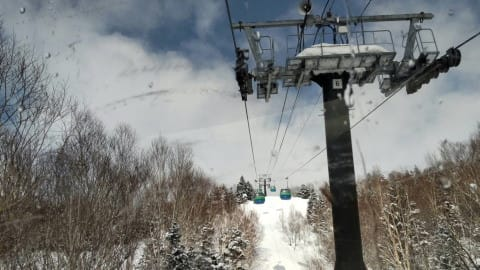
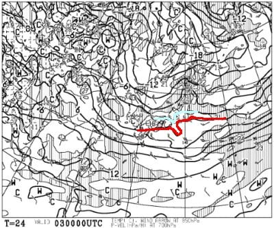
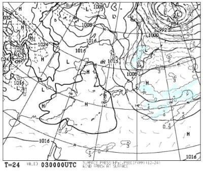
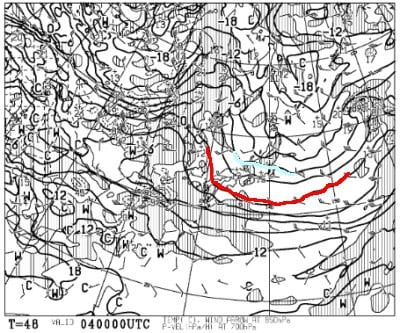
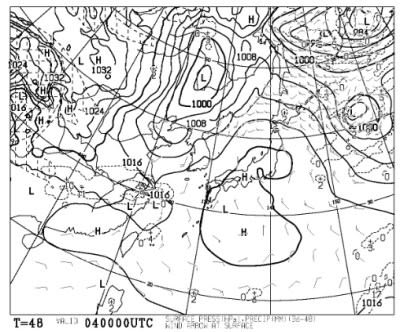
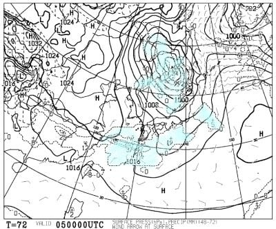
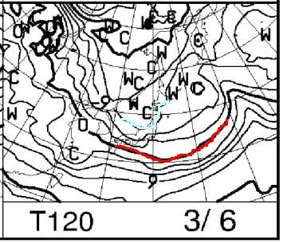
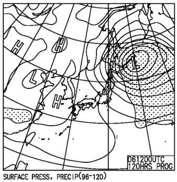

# 3月5，6日の週末の志賀高原スキー場の天気は？…土曜は気温が高い曇り空，日曜は一気に冷えて雪が降りそう！

📅 投稿日時: 2022-03-03 02:10:42

ってなことで．

昨晩から今朝にかけての志賀高原．

液体が降る危機は回避でき，気温が高かった

ものの，湿った雪で済んだようで…

そして，昨日の夜のうちに，

湿った重めの雪が7-8cm積もったようですね．

圧雪コースは締まった圧雪だったようですが，

非圧雪コースはかなり重めで滑りにくかった

ようです…

そして，朝のうちは雲が多いものの日も射す，

良い天気だったようですが．

西舘のあたりとかの標高が低めなところは，

冷えて湿った雪が固まってちょっとコロコロが

出始めてきたようです…

あ，一の瀬エリアから上はコロコロとかもなく，

大丈夫みたいです！

いやー．

今シーズン，新雪がガンガン積もって，一度も

気温が上がってないので．

コロコロとは無縁のまま3月まで来れたという，

恵まれたシーズンでしたが…

果たして，今週末の天気やいかに？

4日夜から気温が上がりそうな予想だったけど…

この週末も，無事液体に降られることなく

乗り越えられるのか？？

とりあえず，天気図を見てみましょう…

まずは3日(木)の850hpa図を見てみると．

まぁ，赤い0℃線は本州太平洋岸．

志賀高原には水色の-3℃線がかかってるので…

激冷えとまでは行かないけど，この日は

そんなに気温は上がらなさそう．

地上天気図を見ても．

水色の降水域は志賀にかかってないから，

まぁ，この日は晴れ時々曇り，

午後は雪がぱらつくときもあるかな？

…ってくらいでしょうか．

そして，4日(金)の850hpa図を見てみると．

この日の志賀には，水色の-6℃線が近づいて

いるので．

まぁ，3月と考えればボチボチの冷え込み．

そして，この日の地上天気図を見ると…

高気圧に覆われているので，

基本的に晴れそうな感じ．

で，肝心な週末，5日(土)の850hpa図を見ると．

うわ．

この日は，赤い0℃線がギリギリ志賀高原

にかかってるくらいです…！

これは，4日夜から5日朝にかけて，

気温がかなり上がりそうな感じ(涙)

でも，西側から-6℃線が迫ってるので，

午後に向けて気温が冷えていきますね．

でも，5日の地上天気図を見ると．

志賀高原はちょうど二つの低気圧に

挟まれた間の，降水域が無いエリアに

なってます！！

ラッキー！！

朝まで気温が上がるけど，その時は液体や

湿った雪は降らずに済みそう！

降るとしても，午後，気温が冷えてからですね．

で，6日(日)の850hpa気温を見ると…

ををを！この日は水色の-9℃線が志賀に

かかってます！

結構冷えた空気が入ってますよ！

そして，地上天気図は…

冬型になってます！

ちょっと西風になる等圧線パターン

なので，それほどは積もらなさそうだけど…

志賀は曇り～雪の天気になるかな．

ってなことで，まとめると．

3日(木)：朝は曇り～雲が多めの晴れ．

　あさイチの気温は-5℃程度．

　朝のバーンはしっかり締まった

　シマシマ！午後は雪がまうタイミングも．

4日(金)：終日晴れ！

　あさイチの気温は-5～6℃．

　朝はしっかり締まった冷え冷えバーン．

　昼間の気温は0℃近くまで上がるかな？

　暖かくて雪もそこそこの良い一日．

　夕方から風が強まり雲が増える．

5日(土)：昨晩から気温が上がり強風．

　あさイチの気温は-2～3℃と高い．

　標高が低いところは0℃くらいかな．

　朝は強めの南風なので，焼額第2ゴンドラは

　減速運転になるかも？

　朝の圧雪バーンはちょっと表面が

　カリカリした感じになってるかも…

　天気は曇り時々日が射す感じ．

　夕方に気温がぐんぐん冷えて，

　リフト営業終了前後から雪が降りそう．

　

6日(日)：曇り～雪がぱらつく一日．

　時折日が射すタイミングもあるかも？

　朝は-7～8℃，昼間もそんなに気温が

　上がらない．

　あさイチバーンは，締まり気味の

　良いバーン！

　バーンの下地が結構しっかり

　しているので，たぶん終日

　バーンはそんなに荒れずに

　済みそう．

…ってな感じでしょうか…

とりあえず，液体が降ったり

強烈な吹雪になったりはなさそうなので．

冷え冷え晴天とはいかないまでも，

当初予想よりはいい感じの，

割と穏やかな週末になってくれそうです…！

## 💬 コメント一覧

### 💬 コメント by (レインボー74)
**タイトル**: Unknown
**投稿日**: 2022-03-03 14:04:25

木曜日の志賀高原情報

朝の上林-2℃　蓮池-5℃。暖かい。そろそろ春用のウエアの出番かなあ。

ニゴンは今日も運休。イチゴンは故障。結局18分遅れだったようだけど、私はバスでニ高に移動。でも、ゲレンデが混んでて得した感なし。

カラマツは硬め。白樺は相も変わらす天国。

オリンピックがめっちゃ快適。GSも然り。

他へ移動する必要性を感じないので、ヤケビ一筋でしたよ(誰かみたい)。

昼は中野イオン近くの、人気一位の食道「じょうや」でトンカツ。めちゃ美味で雰囲気もよかったです。だけど信州プレミアム食事券割り引き適用外が残念。

とにかく今日はよく滑る雪で、大満足の一日でした。

### 💬 コメント by (西舘)
**タイトル**: Unknown
**投稿日**: 2022-03-03 15:38:49

昨シーズンは2月2週目から毎週末雨、

しかも結構な本降りだったので、

なんと幸せな今シーズンかと思うのでした。

### 💬 コメント by (アリス)
**タイトル**: Unknown
**投稿日**: 2022-03-03 15:43:51

S様こんにちは

本日も二高スタート❗

唐松を一番滑走して、1ゴンへ😱アレッ　まだ運転してない⁉20分遅れで乗車開始❗

4番機でしたが、前のお客さんが白樺方面へ滑り出しと写真撮影している間に、GSコースも

一番滑走です🙋

青空の下、全面シマシマを一気に下まで好き放題☀

なんと爽快な気分でしょう🎵１日で白樺とGSを一番滑走できるなんて初めてです🎵

オリンピックも白樺も文句無しです🙆

奥志賀DHもエキスパもコンディション良です🙆

今日もいい１日でした☺

### 💬 コメント by (新米パパ)
**タイトル**: Unknown
**投稿日**: 2022-03-03 19:38:28

今週末は久びさの志賀高原予定です。

土曜の朝は南風強風予想との事ですが、奥志賀リフトも朝から動かない可能性もありますね。

焼額スタートが無難でしょうか、、

迷いますねー。

### 💬 コメント by (Skier_S)
**タイトル**: 日曜はそこそこ雪が積もるかも
**投稿日**: 2022-03-04 01:18:45

＞レインボー74さま

今日は暖かいですが，明日の朝はまた冷えますよ！

土曜に朝にまた暖かくなって，日曜は激冷えです．

＞西舘さま

あら？意外とコメントは久しぶりではないでしょうか…

今シーズンはホントに恵まれてますよね！

明日は最高の一日だと思いますよ…！

＞アリスさま

イチゴン，故障か何かで運転遅れたみたいですね．

しかし，唐松とGSのどちらも一番滑走とは羨ましいです…

明日も最高ですよ！！

＞新米パパさま

土曜は南風なので，北向きの奥志賀より南向きの焼額第2がヤバそう…

そして，日曜は北風が結構強くなりそうな予想になってきたので．

日曜は奥志賀ゴンドラがヤバそうです．

焼額第1ゴンドラが風に一番強いので，無難なのは焼額ですが…

奥志賀ゴンドラと焼額第1は近いので，奥ゴンまで行って

動いてなさそうなら焼額に戻ってくるのもありかと．

