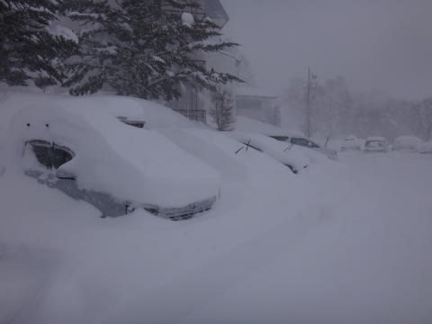
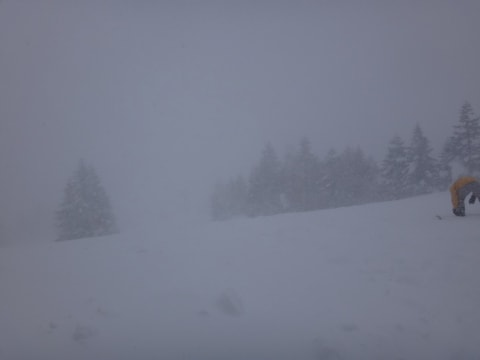
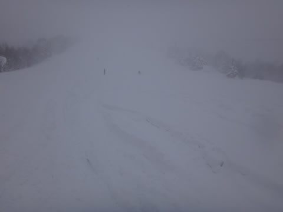
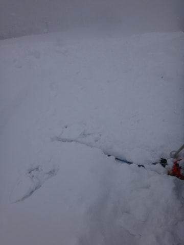
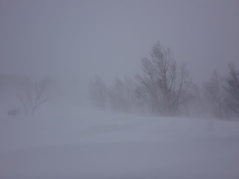

# 2月15日の志賀高原，速報モード…終日吹雪の一日（涙）．

📅 投稿日時: 2015-02-16 01:30:37

🏷️ カテゴリ: [2015スキー滑走日記](c09ea645cfc085f86dfcd80f49599dd89.md)

というわけで．

今日も帰宅は深夜になっちゃったので．

…本日の志賀高原の状況，速報モードで…

えー．

朝，宿の前に出ると…

な，なんだ，これはっ！

とりあえず，すさまじい積雪で始まった一日で．

朝から，ひたすら吹雪．

…げ，ゲレンデが見えない…

第1，第2ゴンドラとも減速運転．

…止まらなかっただけ，まだましか…

で．

オリンピックコースに出ると…

よっしゃ～っ！

太ももパフ！

喜び勇んで太ももパフの斜面に飛び込みますが…

なんだか，重い．重いよ，雪が…（涙）

この写真を見ると，

フワフワさらさらではなく，重く固まる感じに

なっているのが分かるかと…

2月の志賀高原にしては，重い…（残念）

で．

この日の焼額．

圧雪斜面にも重い雪が10cmほど積もっており．

さらに，昼になっても視界は悪く…

何が何だか，ゲレンデが見えないんですが（泣）．

そして．

夕方まで．ものすごい風で雪が巻き上げられて．

死ぬほど寒い一日だったのでした…

せめて，夕方は晴れると思ったんだけどな～（涙）．

リフトストップまで，激しい吹雪で滑る意欲を

奪われていく一日でしたよ…←でも，リフトストップまで滑ったんじゃないかっ！（ツッコミどころ）

## 💬 コメント一覧

### 💬 コメント by (komu)
**タイトル**: 木島平もでした
**投稿日**: 2015-02-16 01:34:20

ふぶき

### 💬 コメント by (komu)
**タイトル**: 木島平も吹雪でした
**投稿日**: 2015-02-16 01:36:18

いやー北信州って雪国なんですね

吹雪の中滑ってましたよ

パフパフも楽しいですね

### 💬 コメント by (aqura)
**タイトル**: Unknown
**投稿日**: 2015-02-16 05:47:53

久しぶりに志賀高原、日帰りで行きましたU+1F3B5

スキー中の雪にも、閉口しましたが、行き帰りの地吹雪(@_@)、ホワイトアウトU+203C

怖かったぁ～。

### 💬 コメント by (Skier_S)
**タイトル**: 吹雪きましたね～
**投稿日**: 2015-02-16 23:57:50

＞komuさま

焼額も，すごい地吹雪でしたよ…（涙）

新雪でしたが，重くてそんなに楽しめませんでした…

…でも，娘はリフトストップまで滑ってましたが（汗）．

＞aquraさま

お，久々の志賀高原ですか！

…しかし，よりによってこんな日に当たらなくても…

って感じですね（＾＾；

もう，前は見えないし寒いし…

今度はいい天気に当たる日に来てください！

### 💬 コメント by (aqura)
**タイトル**: 天気予報
**投稿日**: 2015-02-17 19:41:43

Sさま

その為に、Sさまの天気予報、あてにしています

午後から止むという予報を信じて出かけたのですがU+27B0U+27B0

### 💬 コメント by (Skier_S)
**タイトル**: aquraさま
**投稿日**: 2015-02-17 23:37:54

うぐぐぐぐ．

…日曜の天気は…

いや，午後遅くの夕方くらいに

晴れるはずだったんですよ．ホントは．

天気予想が外れて，晴れなかったのは…

きっと．

たぶん．

誰か，日ごろの行いが悪すぎる人がいたせいに

違いないんです…

