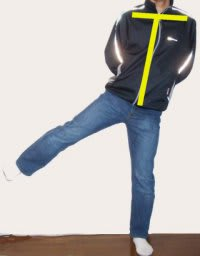
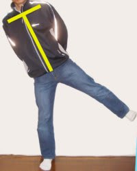
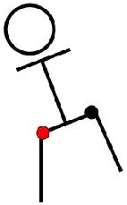

# なつかしのネタ…あなたのターン左右対称ですか？

📅 投稿日時: 2012-04-05 01:34:38

🏷️ カテゴリ: [スキー雑談](c1f9d2cb7478308da16419928ea3945e9.md)

えー．

私は基本的にレジャースキーヤーですので．

あんまりスキー技術は良くわからず．カッコいい技術論が

できないのですが．

昔，とあるところで書いた記事，最近久しぶりに自分で見返してみて

「…結構面白い…」

と思ったので．

再掲してみます．

一度見たことのある方，同じネタですいません…

------

「左右のターンがぜんぜん違うよ」

「左ターンはいいけど，右ターンが踏めてないね…」

そんなふうに言われたこと，ないですか？

そう言われて一生懸命左足を踏もうと努力してみたり，左右のターンが均等になるように練習したりしたことがあるんじゃないでしょうか．

…しかし，ターンを左右均等にするには，それ以前にもっと基本的なところを見直したほうがいいのかもしれません．

ここでとあるモデルさんに，片足を横に上げてもらいました．

では，まず右足から．

で，次は左足．

これだけ基本的な動きですが，見事なまでに左右が違いますね．わかりますでしょうか．

分かりやすくするために，ちょっと写真に線を上書きしてみましょう．

右足を上げた場合は，上体が比較的真っ直ぐなまま足だけが上がっていますし，肩のラインも地面と平行に近いですね．

それに対して左足を上げた場合は，上体が左足につられて傾いていますし，肩のラインもそれに伴って傾いてしまってます．

なぜこのようなことが起こるのでしょうか？

普通の人は軸足と利き足を持っています．

あなたはどちらから靴を履きますか？

どちらの足から階段を上りますか？

どちらの足でボールを蹴りますか？

そう．その足が利き足です．

それと反対の足，ボールを蹴ったりするときに体を支える足，それが軸足です．

たぶん多くの人が，右足が利き足，左足が軸足だと思います．

バレエやダンスをしている人など，左右対称に動かせるようにトレーニングした人以外は

必ず軸足と利き足の役割分担がはっきりしています．

特に，野球やテニスなどの球技をやっている人は極端に左右が違っちゃいます．

え？自分はそんな左右非対称性はない？

じゃ，モデルと同じように片足を上げてみてください．

鏡で見てみましょう．左右対称ですか？

鏡がない場合は，縦線を目の前に見て片足を思いっきり上げてみてください．

例えば，壁のタイルの目地や，ふすまの縦桟などを真正面に見て立ちましょう．

こんな感じです．

では，右足を上げてみましょう．

よいしょ．

それ．

はい．ほとんど視線が動かないまま上げられましたね．

では，今度は左足を上げてみてください．

上げたぞ．

もう少し高く…ん？？

ん？んんん？壁の線が横にずれていく！！頭が動いている！！

そんな馬鹿な．ちゃんと意識すれば頭を動かさないまま左足が上げれるはず．よいしょっ…．

ほら．意識すれば頭を動かさずに左足を上げられた…んん？でも左のわき腹がちょっと苦しい気がする…．

右足だとわき腹が苦しくなるなんてことないのに…．

…と，多少の個人差はあるものの，おそらく多くの人がこんな感じになると思います．

この原因は，利き足と軸足の股関節の動かしやすさに差があるからなんです．

普通の人は，利き足の股関節のほうがずっと動かしやすいんです．

だって，軸足って体を固定する足だから，普段あまり細かく動かしませんよね．

それに対して利き足は，いろいろ大きく動かすことが多いので，自然と可動範囲が広くなります．

例えば，自転車にまたがるときを考えてください．ママチャリじゃない，フレームがしっかり高くて足を高く上げなきゃいけない自転車．どちらから乗りますか？

左側から，右足を上げて乗る人が多いと思います．

反対側から，左足を高く上げて乗ろうとすると，わき腹が苦しかったりしませんか？

足がなんだか上げにくくないですか？なにか不自然な感じがしませんか？

このように，利き足の股関節のほうが可動範囲が広いということは，無意識のうちに日常の行動に影響を与えているんです．

つまり，利き足の股関節の方が動かしやすいので，人間は自然と利き足の股関節ばかり動かしてしまうようになっちゃうんです．

ちょっと図示してみましょう．

まず，これが真っ直ぐ立った状態です．これから利き足を上げてみます．

利き足である右足の股関節（赤丸）を動かして，足を上げるのは楽です．

では，逆に軸足を上げてみましょう．

おやおや，利き足の股関節を動かして軸足を上げてしまいます．

さっきの「縦線を目の前に見つめて軸足を上げる」動作では，視線を動かさないように

というふうに，背骨（腰）を曲げて上体を真っ直ぐにキープしようとしているので，わき腹が苦しくなったのです．

…いかがでしょう．

このモデルの例では，軸足の股関節をあまり使えてないことが分かりますね．

では，これがスキーにどのような影響を与えるのかというと…

（続く）

## 💬 コメント一覧

### 💬 コメント by (のび太)
**タイトル**: Unknown
**投稿日**: 2012-04-05 12:48:53

ありましたね。このネタ。

僕も大好きです。

さて、僕は当時どんな風に語っていたんだろう？？

そして、今はどんな風に感じるんだろう？？

当時も、そして今は当時よりも更に強くこの辺りを意識してますが、年々ひどくなっているような気がする。やはり年のせいか？？

続きを楽しみにしてます。

### 💬 コメント by (Skier_S)
**タイトル**: なつかしのネタです～
**投稿日**: 2012-04-06 00:12:55

いやー．

このネタ，2006年の初出だったんですね…

あれからもう6年です．

私はこのネタ発見以来，

「左右同じ意識で動かすと左右均等に動かない」

ことを強く意識し，

「左右均等に見えるためにはどの程度左右不均等に意識して動かせばいいか」

を体にしみこませてきました…

無意識に左右均等に動かすのはやっぱり無理ですが，

左右均等に動かすために，どの程度左右不均等に動かせばいいかは分かるようになって来ました(笑）．

