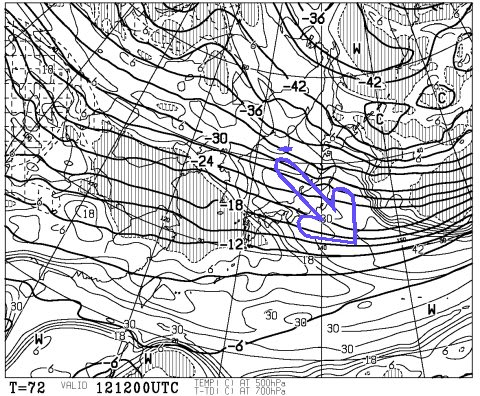
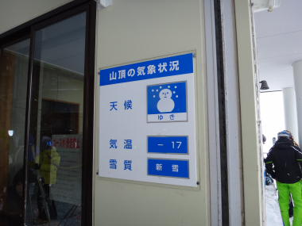
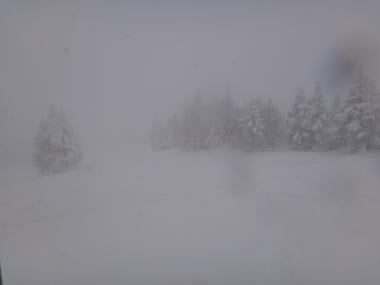
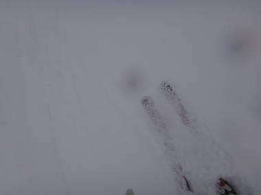
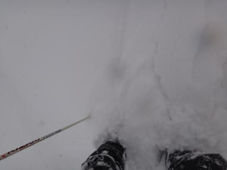
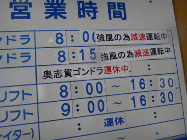
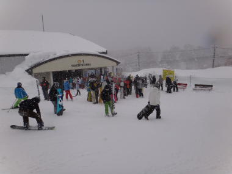
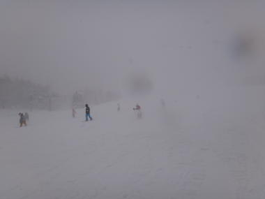

# 2月１2日　日曜日の志賀高原は…大雪！

📅 投稿日時: 2012-02-13 23:53:38

🏷️ カテゴリ: [2012スキー滑走日記](cca3a0e9524e0203150f790b1fc3c71ad.md)

…

昨日はちと疲れてたのか．

帰宅後，娘と一緒にぐっすり寝てしまったので．

遅くなりましたが，日曜のレポートです…

あー．

[ここに](e0054981d7408e282c722b40f36972e93.md)書いたように．

この日曜12日．

今シーズン初といってもいいくらい，久しぶりに

信州に雪雲が流れる典型的なパターンになったわけですが．

…やっぱり天気図がこのパターンになると．

すげー降りますね．

志賀高原．

という感じで…

ドカ雪でした．

この日曜．

終日すごい勢いで雪が降り続けました．

…ただ．

雪が降り始めたのは朝になってからだったので，

残念ながら，腰パフとかの深い新雪ではなかったですが…

とりあえず．

朝はマイナス17度という結構な冷え込み．

雪はむちゃくちゃ降っていて．

前がよく見えないくらい…

雪の深さは，圧雪コースで10cm～20cm．

非圧雪コースだと，脛くらいですか…．

浮遊感のある新雪ではなく，下地に足が着く新雪ですな．

でも，久しぶりの新雪！！

＃この大雪の年に，日ごろの行いが悪いのかなぁ…

気持ちよく新雪パフパフを自由落下！

…だけど．

ゴンドラが強風で減速．

あんまり本数が滑れない…

天気が悪かったので，人はそれほど多くなく，

ゴンドラ待ちも最高2-3分．

こんくらいの列が2-3回あったかな，って感じで．

あとはほとんど待ちなし．

ゲレンデ自体も，天気が悪いからか昨日より人が少なかったなぁ…

いやー．

志賀高原では今シーズン初めての，終日雪の一日でしたな～．

＃朝にどかした車の雪が，夕方にはまた30cm以上積もってたか？

…視界が悪かったし．寒かったし．

コース途中の新雪で足をとられてパトロールのお世話に

なっている人もいたりと．

「ごくたまにスキーに来る人」

がこんな天気に出会ったら，ちょっと不幸かも知れませんが．

昼前くらいまでは，結構コースのいろんなところで

ぱふぱふが楽しめ．

昼を過ぎてもずーーーっと雪が積もり続けているので

コブになるというより，シュプールがいっぱいついた新雪…

って感じの状態が続いて．

新雪好きにはよだれじゅるじゅる，

もうたまらん～っ！！！って感じの一日でしたね～．
